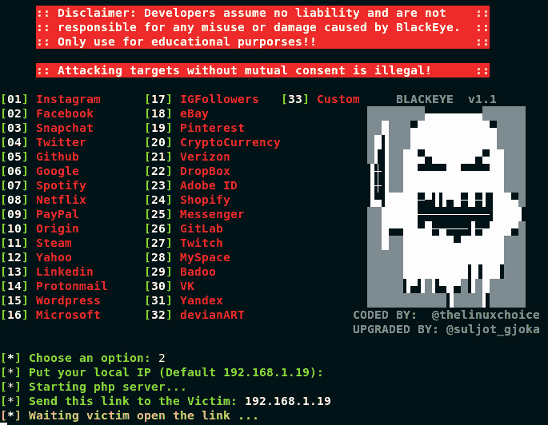

# black eye–完整的网络钓鱼工具，包含 32 个模板+1 个可定制模板

> 原文：<https://kalilinuxtutorials.com/blackeye-complete-phishing-tool/>

BLACKEYE 是由 linuxchoice 在 GNU 许可下从原始 ShellPhish 工具升级而来的。BLACKEYE 是最完整的钓鱼工具，有 32 个模板+1 个可定制的，它只在局域网上工作。

## **黑眼圈用法**

```
git clone https://github.com/thelinuxchoice/blackeye
cd blackeye
bash blackeye.sh
```



**也可解读为[screen uests——利用 HTTP-Flood](https://kalilinuxtutorials.com/wreckuests-ddos-atacks/)** 运行 DDoS 攻击的工具

## **免责声明**

这个工具是为教育目的而制作的！未经双方同意使用黑眼攻击目标是非法的。最终用户有责任遵守所有适用的地方、州和联邦法律。

[ ](https://github.com/thelinuxchoice/blackeye) **编码依据:** [ **非选择**](https://github.com/thelinuxchoice/blackeye)