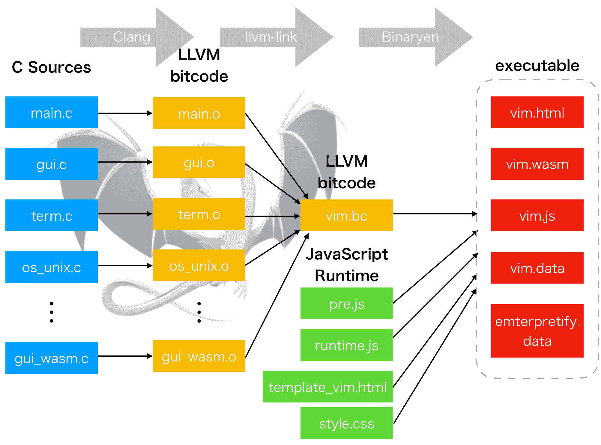
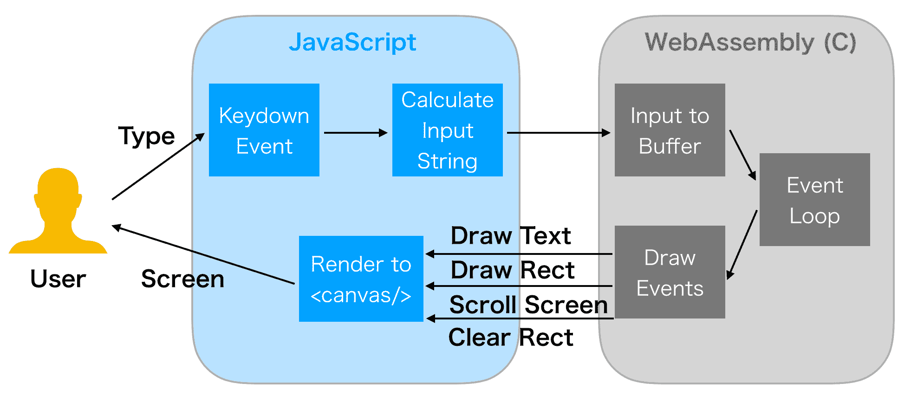

# Vim Wasm–移植到 WebAssembly 的 Vim 编辑器

> 原文：<https://kalilinuxtutorials.com/vim-wasm-vim-editor/>

Vim Wasm 项目通过将 Vim C 源代码编译到 WebAssembly 中，在浏览器上运行 Vim 编辑器。

## **通知**

1.  请从桌面浏览器(Chrome/Firefox/Safari/Edge)访问。Safari 似乎是 macOS 上最好的。
2.  请避免慢速网络。您的浏览器将获取总共约 1MB 的文件。
3.  vim.wasm 从 DOM `keydown`事件中获取关键输入。请禁用影响按键输入的浏览器扩展(最好是匿名模式)。
4.  这个项目是非常早期的实验阶段。目前只支持微小的功能。将实现更多功能(请参见 TODO 部分)。你可能很快就会注意到，它有很多问题🙂
5.  如果输入内容不能改变任何事情，请尝试点击页面中的某个地方。Vim 可能已经失去了焦点。
6.  可以通过`:e tutor`试试 vimtutor。

**也可解读为[git miner——Github](https://kalilinuxtutorials.com/gitminer-tool-mining-content-github/)**上内容的高级挖掘工具

## **Vim Wasm 如何工作**

### **构建过程**

Vim 的 WebAssembly 前端被实现为一个新的 GUI 前端。c 源代码被编译成每个 LLVM 位代码文件，然后通过 **`emcc`** 链接到一个位代码文件`vim.bc`。 **`emcc`** 最后使用 binaryen 将`**vim.bc**`编译成`**vim.wasm**`二进制，生成 HTML/JavaScript 运行时。

我一开始面临的差异是缺乏 ncurses 等终端库。我修改了`**configure**`脚本来忽略终端库检查。这是可以的，因为 Wasm 的 GUI 前端总是使用，而不是 CUI 前端。我需要许多变通办法来通过`configure`检查。

emscripten 提供了类似 Unix 的环境。所以`**os_unix.c**`可以支持 Wasm。但是，emscripten 不支持某些功能。我添加了许多`**#ifdef FEAT_GUI_WASM**`防护来禁用 Wasm 不支持的功能(即`fork (2)`支持、PTY 支持、信号处理程序被存根化等等)。

我在创作`**gui_wasm.c**`时大量引用了`gui_mac.c`和`gui_w32.c`。事件循环(`gui_mch_update()`和`**gui_mch_wait_for_chars()**`)用`sleep()`简单实现。多亏了 emscripten，几乎所有的 UI 渲染事件都是通过从 C 调用 JavaScript 函数传递给 JavaScript 层的。

c 源代码被编译(经过许多优化)成 LLVM 位代码，并集成到 emscripten 中。然后所有的位代码文件(`.o`)通过`**llvm-link**`链接器(也集成到 emscripten)链接到一个位代码文件`**vim.bc**`。

最后，我创建了 JavaScript 运行时来绘制从 c 发出的渲染事件。它用诸如“绘制文本”、“滚动屏幕”、“设置前景色”、“清除矩形”等渲染事件将 Vim 屏幕绘制到`**<canvas/>**`元素。

**`emcc`** (emscripten 的 C 编译器)使用 binaryen 将 **`vim.bc`** 编译成`**vim.wasm**`、`**vim.js**`和`**vim.html**`，并预装 Vim 运行时文件(即 colorscheme)。运行时文件放在浏览器上由 emscripten 提供的虚拟文件系统中。

现在用 web 服务器托管`**vim.html**`并通过浏览器访问它会打开 Vim。它工作了。

## **用户互动**

用户交互非常简单。你用键盘输入东西。浏览器将其视为`**keydown**`事件上的 **`KeyboardEvent`** ，JavaScript 运行时通过 emscripten 的 JS to C API 将输入发送给 Wasm。发送的输入被添加到 C 层的缓冲区中。影响编辑的状态。

由于 emscripten 的 C to JS API，用 C 实现的编辑器核心计算渲染事件并将其发送到 JavaScript 层。JavaScript 运行时接收渲染事件并将它们存储到一个队列中。在动画帧上，它将它们绘制到网页中的`**<canvas/>**`元素。

最后，您可以在页面中看到渲染结果。

## **发展**

请确保安装了 Emscripten 和 binaryen(我用的是 1.38.6)。如果使用 macOS，可以安装 **`brew install emscripten binaryen`** 。

你可以使用`build.sh`脚本来破解这个项目。在克隆这个库之后，只需运行 **`./build.sh`** ，它就会在`**wasm/**`目录中构建 vim.wasm。这需要很多时间和 CPU 能力。

最后用`**python -m** **http.server 1234**`这样的网络服务器直接在`localhost`上托管`**wasm/**`。访问`**localhost:1234/vim.html**`将启动带有调试版本的 Vim。请注意，它比发布版本慢得多，因为启用了许多调试功能。

请注意，这个库的`**wasm**`分支经常基于最新的 vim/vim 主分支。如果你想黑这个项目，请确保创建自己的分支，并通过`**git merge**`将`**wasm**`分支合并到你的分支中。

作者:布莱姆·米勒