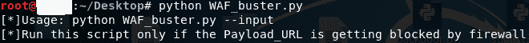
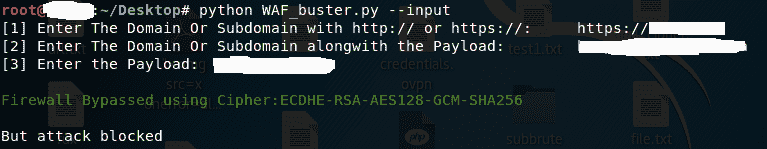

# WAF-Buster:通过滥用 SSL/TLS 密码来破坏 WAF

> 原文：<https://kalilinuxtutorials.com/waf-buster-disrupt-waf-by-abusing-ssl-tls-ciphers/>

WAF-buster 工具用于分析网络服务器端使用的网络应用防火墙所支持的密码。它首先触发 SslScan，在与 web 服务器的 SSL/TLS 协商过程中查找所有支持的密码。在获得所有支持的密码的文本文件后，我们使用 Curl 查询 web 服务器的每一个密码，以检查哪些密码不受 WAF 支持而受 Web 服务器支持，如果找到任何这样的密码，则显示消息“防火墙被绕过”。

## **WAF-Buster 安装**

```
git clone [https://github.com/viperbluff/WAF_buster.git](https://github.com/viperbluff/WAF_buster.git)
```

## **用途**

```
**Open terminal**
**python2 WAF_buster.py --input**
```

## 

## 截屏



[](https://github.com/viperbluff/WAF_buster)

**贷方:Sahil Tikoo**