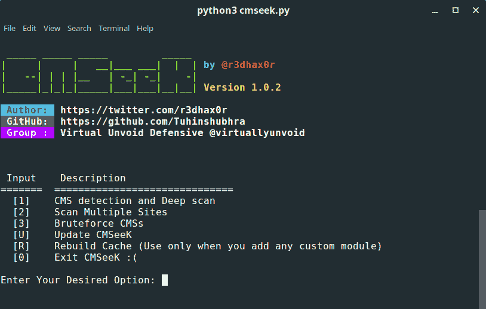
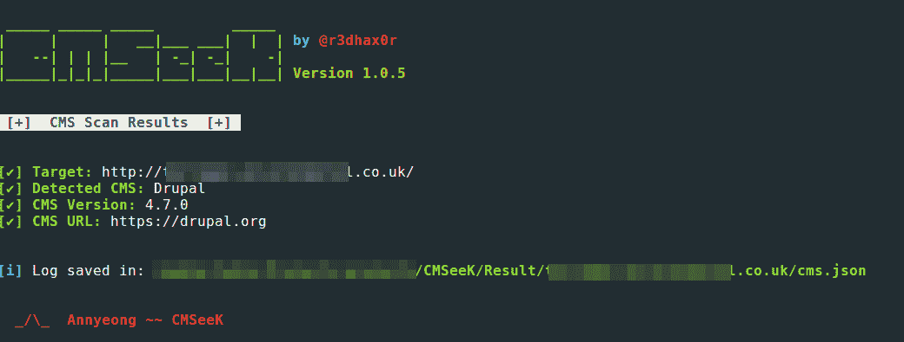
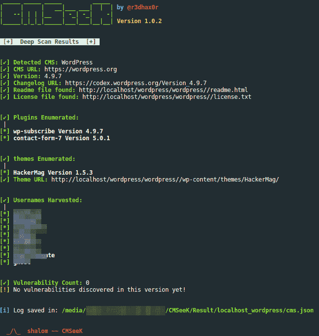

# CMS eek–CMS 检测和开发套件

> 原文：<https://kalilinuxtutorials.com/cmseek-cms-detection-exploitation-suite/>

CMSeeK 是一个 CMS 检测和开发套件，你可以扫描 WordPress、Joomla、Drupal 和 100 个其他 CMS。CMS 或内容管理系统管理数字内容的创建和修改。它通常支持协作环境中的多个用户。

## **使用 CMSeek**

1.  **超过 80 个 CMS 的基本 CMS 检测**
2.  **Drupal 版本检测**
3.  **高级 WordPress 扫描**
    1.  检测版本
    2.  用户枚举
    3.  插件枚举
    4.  主题枚举
    5.  检测用户(3 种检测方法)
    6.  寻找版本漏洞和更多！
4.  **高级 Joomla 扫描**
    1.  版本检测
    2.  备份文件查找器
    3.  管理页面查找器
    4.  核心漏洞检测
    5.  目录列表检查
    6.  配置泄漏检测
    7.  各种其他检查
5.  **模块化暴力系统**
    1.  使用预制的 bruteforce 模块或创建自己的模块并与之集成

**也可解读为[git miner——Github](https://kalilinuxtutorials.com/gitminer-tool-mining-content-github/)**上内容的高级挖掘工具

## **要求&兼容性**

*   Python3
*   基于 Unix 的系统
*   饭桶

## **安装**

使用 CMSeeK 相当容易，只需确保安装了 python3 和 git(仅用于克隆 repo ),并使用以下命令:

```
**git clone https://github.com/Tuhinshubhra/CMSeeK**
**cd CMSeeK**
```

**对于引导扫描:**

```
**python3 cmseek.py**
```

**否则:**

```
**python3 cmseek.py -u <target_url> [...]**
```

## **用途**

**程序的帮助菜单:**

```
**USAGE:
       python3 cmseek.py (for a guided scanning) OR
       python3 cmseek.py [OPTIONS] <Target Specification>**

**SPECIFING TARGET:
      -u URL, --url URL            Target Url
      -l LIST, -list LIST          path of the file containing list of sites
                                   for multi-site scan (comma separated)**

**USER AGENT:
      -r, --random-agent           Use a random user agent
      --user-agent USER_AGENT      Specify custom user agent**

**OUTPUT:
      -v, --verbose                Increase output verbosity**

**VERSION & UPDATING:
      --update                     Update CMSeeK (Requires git)
      --version                    Show CMSeeK version and exit**

**HELP & MISCELLANEOUS:
      -h, --help                   Show this help message and exit
      --clear-result               Delete all the scan result**

**EXAMPLE USAGE:
      python3 cmseek.py -u example.com                           # Scan example.com
      python3 cmseek.py -l /home/user/target.txt                 # Scan the sites specified in target.txt (comma separated)
      python3 cmseek.py -u example.com --user-agent Mozilla 5.0  # Scan example.com using custom user-Agent Mozilla is 5.0 used here
      python3 cmseek.py -u example.com --random-agent            # Scan example.com using a random user-Agent
      python3 cmseek.py -v -u example.com                        # enabling verbose output while scanning example.com** 
```

## **检测**

CMSeek 通过以下方式检测 CMS:

*   HTTP 标题
*   生成器元标签
*   页面源代码
*   robots.txt

## **截图:**



###### **主菜单** 

###### **扫描结果**

###### 

## **免责声明:**

使用 CMSeeK 测试或利用网站，而没有事先相互一致，可被视为非法活动。最终用户有责任遵守所有适用的地方、州和联邦法律。作者不承担任何责任，也不对该程序造成的任何误用或损害负责。

[ ](https://github.com/Tuhinshubhra/CMSeeK) **信用:@r3dhax0r，无形中不设防(VUD)**