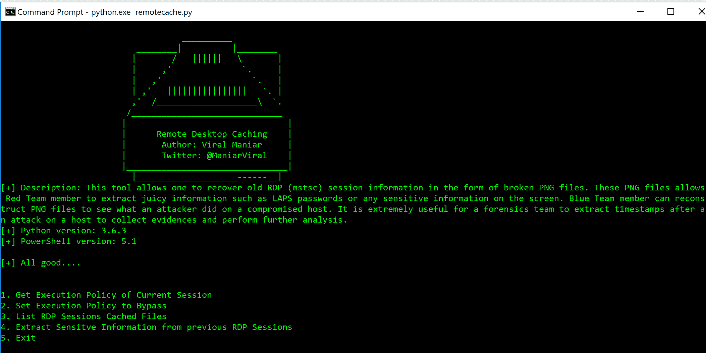
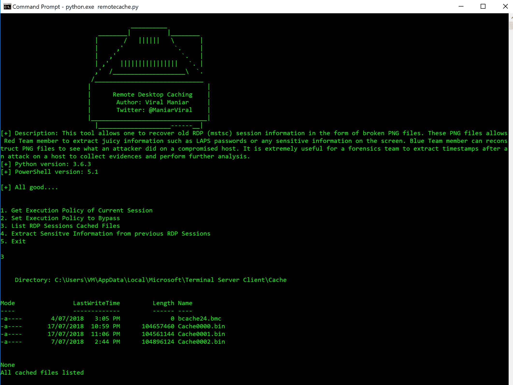

# 远程桌面缓存:恢复旧 RDP 的工具

> 原文：<https://kalilinuxtutorials.com/remote-desktop-caching-tool/>

远程桌面缓存工具允许恢复旧的 RDP (mstsc)会话信息的形式，打破 PNG 文件。对于取证团队来说，在主机受到攻击后提取时间戳以收集证据和执行进一步分析是非常有用的。

这些 PNG 文件允许红队成员提取有趣的信息，如 LAPS 密码或屏幕上的任何敏感信息。蓝队成员可以重建 PNG 文件，以查看攻击者在受损主机上做了什么。

## **远程桌面缓存使用情况**

```
**git clone https://github.com/Viralmaniar/Remote-Desktop-Caching-.git
- python.exe remotecache.py**
```

**也可阅读[easy SSH——SSH 连接管理器让你的生活更轻松](https://kalilinuxtutorials.com/easyssh-ssh-connection-manager/)**

## **截图**

使用`**python.exe remotecache.py**`首次运行`**Remote-Desktop-Caching**`时，用户将获得如下选项:



使用`**Option 1**`和`**Option 2**`用户可以知道当前的会话执行策略，并将其设置为执行`**rdpcache.ps1**` PowerShell 脚本的`**Bypass**`。使用`**Option 3**`,用户可以列出将要用来重建 PNG 文件的缓存二进制文件。



选择`**Option 4**`:开始分析缓存文件和重建过程。该选项在用户 C 驱动器中创建一个名为`**Recovered_RDP_Sessions**`的文件夹


敏感信息以破损的 PNG 图像的形式从这些二进制文件中恢复。设法恢复了`**LAPS password**`、`**Attacker IP address**`和`**malicious** **file names**`。它还揭示了攻击者在受损主机上活动的一些重要信息。对于取证小组来说`**timestamp**`在这些恢复的图像中大部分都显露出来了。


[ ](https://github.com/Viralmaniar/Remote-Desktop-Caching-) **信用:** **病毒狂热者**