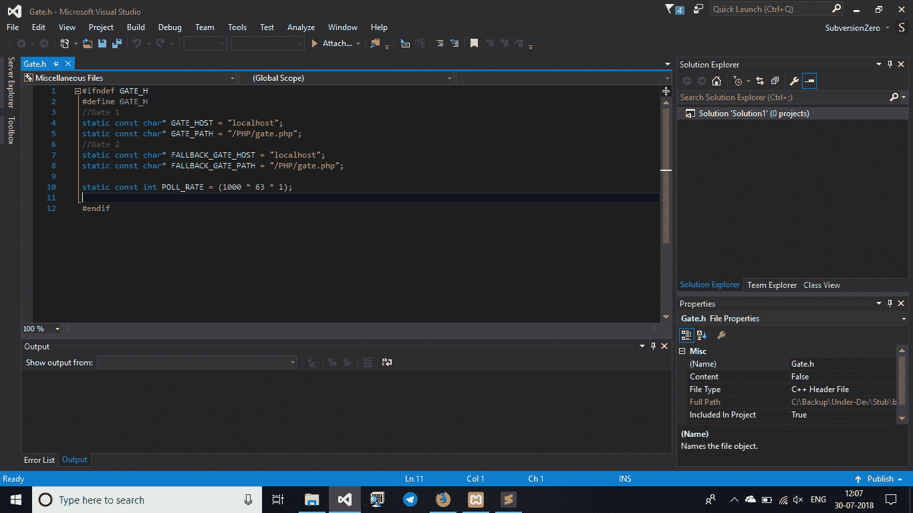
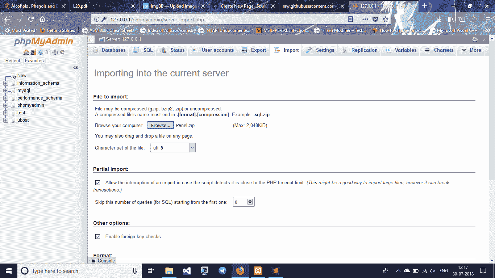
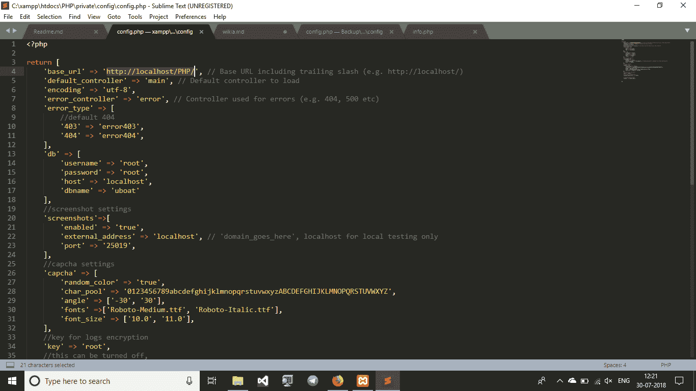
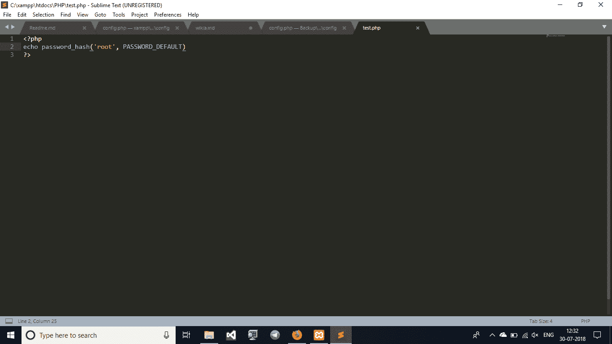
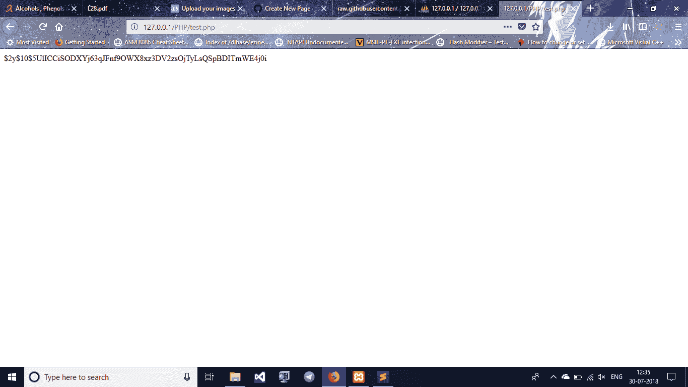
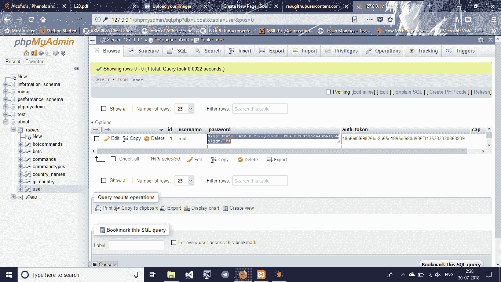
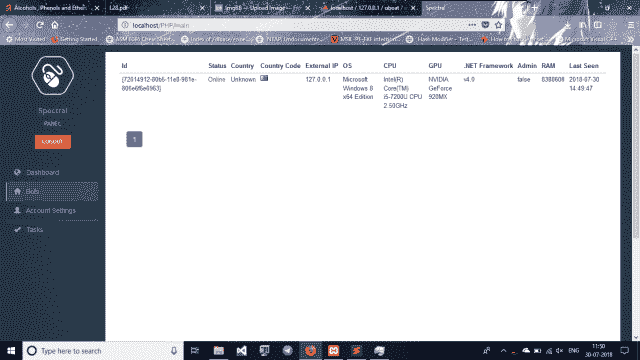

# UBoat——一个 POC HTTP 僵尸网络项目

> 原文：<https://kalilinuxtutorials.com/uboat-http-botnet-project/>

UBoat HTTP 是一个 POC HTTP 僵尸网络，旨在复制一个完全武器化的商业僵尸网络。

## **UBoat 使用**

*   用 C++编码，没有依赖性
*   加密的 C&C 通信
*   坚持不懈，防止你失控
*   连接冗余(使用备用服务器地址或域)
*   DDoS 方法(TCP 和 UDP 泛洪)
*   任务创建系统(改变系统 HWID，国家，IP，操作系统。系统)
*   远程命令
*   更新和卸载其他恶意软件
*   下载并执行其他恶意软件
*   主动和被动键盘记录器
*   启用 Windows RDP
*   易于功能更新的插件系统

## **下载**

*   [**Bot**](https://github.com/Souhardya/UBoat/releases)
*   **[面板](https://github.com/Tuhinshubhra/UBoat-Panel/releases)**

**也读 [WAF-Buster:通过滥用 SSL/TLS 密码破坏 WAF](https://kalilinuxtutorials.com/waf-buster-disrupt-waf-by-abusing-ssl-tls-ciphers/)**

## **安装**

### **Bot 编译**

更改 **gate.h** 中的 URL，如果您打算使用它，包括回退域

### **面板设置**

#### **安装:**

*   在 Win 框中安装 unix / Xampp 中的 lamp
*   你需要 PHP 7.0 严格来说不要抱怨
*   安装 **PMA** 因为我们懒(以后感谢我)

#### **数据库配置:**

*   创建一个名为“uboat”的数据库
*   将位于 **/Panel/uboat.sql** 中的 uboat.sql 重命名为 **uboat.sql.zip**
*   现在将 PhpMyAdmin 中的 **uboat.sql.zip** 导入到您创建的数据库 uboat 中

#### **面板配置:**

*   找到**/Panel/private/config/config . PHP**
*   现在用您的 C2 主机 url 编辑它的 url **localhost/PHP/**

**现在查找关键字“db”* *

1.  用户名:-您的 mysql 用户
2.  密码:-您的 mysql 密码
3.  主持人:-让它保持原样
4.  dbname :-这是您之前创建的数据库，还记得“uboat”吗？

#### **登录配置:**

现在为登录选择一个用户/密码凭证

*   比如说:-

1.  用户:- root
2.  密码:-根凯？

*   要生成密码，请定位到 **/Panel/test.php**

您可以将关键字 **root** 更改为您想要的密码，我们使用 root，因为我们选择了这里:p

*   从浏览器访问**[www.url.com/Panel/test.php](http://www.url.com/Panel/test.php)**，复制生成的哈希

你就快完成了！！

*   现在打开 PhpMyAdmin，在您创建的数据库 **uboat** 中找到表 **user**
*   更改密码列中的哈希

**耶一切都完成了**

*   ->现在通过访问**登录[http://url.com/Panel/login](http://url.com/Panel/login)**

一旦你登录，你会得到这样的东西

 **功劳:Souhardya Sardar，Tuhinshubhra &球队几乎没有防守**