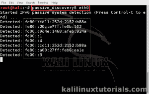

# 使用 passive_discovery6 从支持 IPv6 的网络中发现 IPv6 网络范围和主机

> 原文：<https://kalilinuxtutorials.com/passive_discovery6/>

Passive_discovery6 被动地嗅探网络并转储检测到的所有客户端的 IPv6 地址。Passive_discovery6 只是在 IPv6 网络中嗅探邻居通告数据包。

你必须先了解 IPv6 网络的基础知识。假设您知道 IPv4 和 ARP 是什么，邻居通告和邻居请求数据包将取代 IPv6 中的 ARP(IPv4)。

邻居请求是从主机发送到组播的数据包，目的是从邻居那里获得信息，就像 ARP 请求(“谁在 192.168.0.1 告诉 192.168.0.2”)一样，以便在 IPv4 中广播。

相邻主机回复邻居通告，其中包含所有信息，包括链路层地址(MAC)。与 arp 不同，这在 IPv6 网络中以异步/不规则的模式发生。

与 arp 不同，这些数据包会在整个网络中不断传输。

因此 passive_discovery6 所做的只是抓取邻居请求包，并在终端上显示信息。这非常易于使用，当与 parasite6 结合使用时，可提供出色的结果。点击 [此处](http://kalilinuxtutorials.com/ss/parasite6/) 查看 parasite6 教程。

首页:[https://github . com/mmoya/pkg-thc-IPv6/blob/master/passive _ discovery 6 . c](https://github.com/mmoya/pkg-thc-ipv6/blob/master/passive_discovery6.c)

**注:本教程是 Kali 1.0.9 最新的时候写的。在较新的版本(卡利萨那&卡利滚动)的命令已经改为 atk6-工具。例如，你正在使用 passive_discovery6，在较新的版本中就变成了 atk6-passive_discovery6。**

### 选择

```
Syntax: passive_discovery6 interface options
-D do also dump destination addresses (does not work with -m)
-s do only print the addresses, no other output
-m maxhop the maximum number of hops a target which is dumped may be away.
0 means local only, the maximum amount to make sense is usually 5
-R prefix exchange the defined prefix with the link local prefix
```

## **实验室:发现 IPv6 网络&设备**

嗯，这很简单，只需获得所有的接口名称，然后在它们上面运行工具。

场景:我连接到范围为 fc00::00/64 的 IPv6 网络，并且有几台主机也连接到该网络。

```
Command: passive_discovery6 eth0<replace with yours>
```

等待几分钟，因为广告包只出现在请求包之后&这也是不规则的。下面是截图

[](http://kalilinuxtutorials.com/ig/passive_discovery6/attachment/passivediscovery6/#main)

IPv6 Hosts appearing in the terminal.