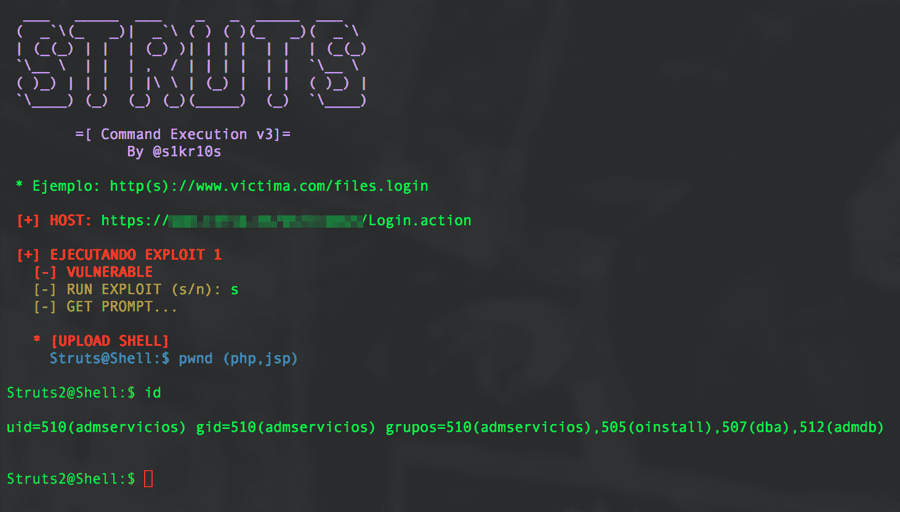

# ApacheStruts 版本 3:利用 Apache Struts 上 3 个 RCE 漏洞的工具

> 原文：<https://kalilinuxtutorials.com/apache-struts-version-3/>

ApacheStruts 版本 3 是一个利用 Apache Struts 上的 3 个 RCE 漏洞的工具。脚本包含 ApacheStruts 上 RCE 类型的 3 个漏洞的融合，还具有创建服务器外壳的能力。

Apache Struts 是一个免费的开源 MVC 框架，用于创建优雅的现代 Java web 应用程序。

**以下是所有变更的完整列表:**

*   PrintWriter 的未关闭实例化
*   使用带有默认存储值的 I18nInterceptor 为所有请求强制创建 Http 会话。
*   NotSerializableException–org . Apache . struts 2 . dispatcher . struts request wrapper
*   使用执行程序拦截器时，NotSerializableException:com . open symphony . xwork 2 . inject . container impl＄constructor injector
*   jarentryrevision 中的 ClassCastException
*   使用 PrefixBasedActionProxyFactory 时出现依赖关系映射异常
*   com . open symphony . xwork 2 . conversion . annotations . type conversion 的 converter()方法现在已被弃用。如果这个方法在下一个版本中被删除，它将禁止用 Spring bean 的名称(id)来描述转换器。
*   通过注释进行转换不起作用
*   操作类中未填充布尔值列表
*   struts 2-JSON-plugin-2 . 5 . 14 . 1 . jar 中的 JSONResult 异常
*   带有 name="method:METHODNAME "的按钮有时会忽略 struts.xml 中定义的全局允许的方法
*   无法为[zip:C:/…]创建 JarEntryRevision。未知协议 c
*   i18n interceptor＄session locale handler . read 中的 NPE
*   不使用 SQL 连接时的 JasperReportResult: NPE
*   在 BeanValidation-Plugin 中支持 JSR 303 验证组
*   不在开发模式下时，调试标记不应显示任何内容
*   允许在实现级别使用可初始化的接口
*   允许的方法继承
*   允许使用 Jackson XML 绑定来序列化/反序列化 XML
*   使用自定义数组作为 struts 2 动作表单中的字段时，jsp 页面中的文本字段数据不会填充到自定义数组中，而是填充到字符串数组或数组列表中
*   将 Spring 升级到版本 4.3.13
*   将 Log4j2 更新到 2.10.0

**亦读 [远程桌面缓存:恢复旧 RDP 的工具](https://kalilinuxtutorials.com/remote-desktop-caching-tool/)**

## **Apache Struts 外壳**

**PHP****`terminado`**
JSP**`proceso`**

## CVE 补充道

**CVE-2013-2251**`**'action:', 'redirect:' and 'redirectAction'**`
**CVE-2017-5638**`**Content-Type**`
**CVE-2018-11776**`**'redirect:' and 'redirectAction'**`

 **致谢:阿帕奇软件基金会**