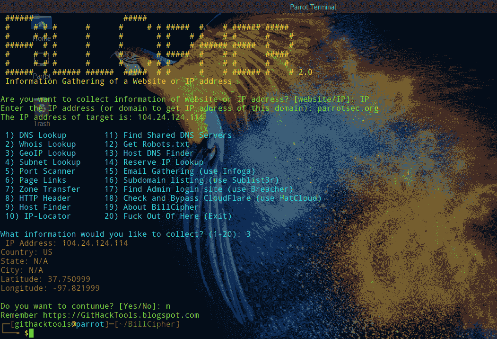
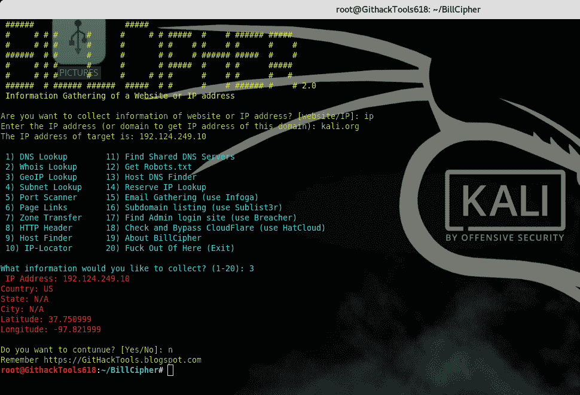

# bill cipher–网站或 IP 地址的信息收集工具

> 原文：<https://kalilinuxtutorials.com/billcipher-information-gathering-tool/>

BillCipher 版是一个网站或 IP 地址的信息收集工具，使用了 Devploit 的一些想法。如果他们拥有并支持 Python 2、Python 3 和 Ruby，那么 BillCipher 可以在任何操作系统中工作。

## **BillCipher 属性**

*   DNS 查找
*   Whois Lookup(是查找)
*   GeoIP 查找
*   子网查找
*   端口扫描仪
*   页面链接
*   区域转移
*   HTTP 标头
*   主机搜索器
*   IP 定位器
*   查找共享 DNS 服务器
*   获取 Robots.txt
*   主机 DNS 查找器
*   保留 IP 查找
*   电子邮件收集(使用 Infoga)
*   子域列表(使用 Sublist3r)
*   找到管理员登录网站(使用 Breacher)
*   检查并绕过 CloudFlare(使用 HatCloud)
*   网站复印机(使用 httrack)新！
*   主机信息扫描仪(使用 WhatWeb)新！

**也可理解为 [使用被动发现 6](https://kalilinuxtutorials.com/passive_discovery6/)** 从支持 IPv6 的网络中发现 IPv6 网络范围&主机

# **安装**

## **Linux**

```
**sudo apt update && sudo apt install ruby python python-pip python3 python3-pip
sudo apt install httrack whatweb
git clone https://github.com/GitHackTools/BillCipher
cd BillCipher
pip install -r requirements.txt
pip3 install -r requirements.txt
python3 billcipher.py**
```

## **窗户**

下载并运行 Python 2.7.x 和 Python 3.7 安装文件。

*   在**自定义 Python 2.7.x** 中，找到将 python.exe 添加到路径中的**，选择**将被安装到本地硬盘**。**
*   在**安装 Python 3.7** ，启用**将 Python 3.6 添加到路径**

下载并运行 Ruby-lang 安装文件，选择**将 Ruby 可执行文件添加到您的路径**和**使用 UTF-8 作为默认的外部编码**。

下载并运行 Git 安装文件，从 Windows 命令 Propmt 中选择**使用 Git。**

之后，运行命令 Propmt 并输入以下命令:

`**git clone [https://github.com/GitHackTools/BillCipher](https://github.com/GitHackTools/BillCipher)**`

**`cd BillCipher`**

**`pip install -r requirements.txt`**

`**pip3 install -r requirements.txt**`

**`python3 billcipher.py`**

注意: BillCipher 使用了一些来自 Devploit 的想法，那就是使用 HackerTarget API。

## **截图**



[](https://github.com/GitHackTools/BillCipher)

**信用:[git hack tools](https://githacktools.blogspot.com)**