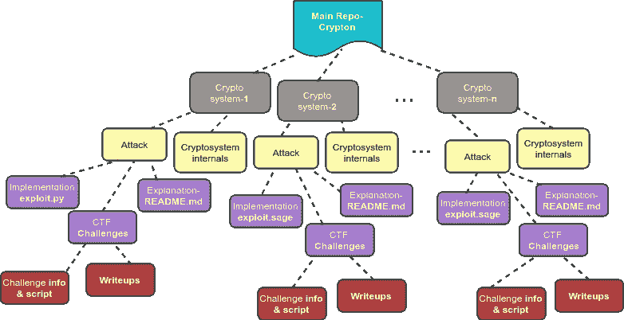

# crypton–对各种加密系统、数字签名、哈希算法的攻击

> 原文：<https://kalilinuxtutorials.com/crypton/>

**Crypton** 是一个学习和实践攻击性和防御性密码学的教育图书馆。它基本上是对各种加密系统(对称和非对称)、数字签名、消息认证码和认证加密系统的所有现有漏洞和攻击的解释和实现的集合。每个攻击还补充了来自“夺旗”竞赛的示例挑战及其各自的文章。已经熟悉(或对 CTFs 感兴趣)这一领域的个人可以使用 Crypton 作为工具来解决基于特定现有漏洞的挑战。

本自述文件包含不同的部分:

*   动机——是什么促使我创建了这个图书馆
*   **库结构-**Crypton 的目录结构
*   **域覆盖-** 这个库中涵盖了所有的密码系统和攻击
*   **未来计划/大惊小怪-** 即将推出的攻击/概念

**也可阅读 [Apache Struts 版本 3:利用 Apache Struts 上 3 个 RCE 漏洞的工具](https://kalilinuxtutorials.com/apache-struts-version-3/)**

## **动机**

帮助 CTF 玩家和对加密领域感兴趣的个人提供一个学习加密攻击的平台，并为有经验的 CTF 玩家提供一个练习挑战的平台。此外，通过各种攻击解释说明协议的正确实施是多么重要。

## **库结构**

## **域覆盖范围**

### **1。分组密码**

| 没有。 | 主题 | 说明 | Impl。/利用 | 挑战# |
| --- | :-: | :-: | :-: | :-: |
| one | [分组密码基础知识](https://github.com/ashutosh1206/Crypton/tree/master/Block-Cipher#block-cipher)–分组密码的工作、填充等。 | 

*   [ [link]](https://github.com/ashutosh1206/Crypton/blob/master/Block-Cipher/README.md)

 | 

 | 

 |
| Two | [加密模式](https://github.com/ashutosh1206/Crypton/tree/master/Block-Cipher/Mode-of-Encryption)–分组密码的不同操作模式:ECB、CBC、CTR | 

*   [ [link]](https://github.com/ashutosh1206/Crypton/blob/master/Block-Cipher/Mode-of-Encryption/README.md)

 | 

 | 

 |
| three | [块大小检测](https://github.com/ashutosh1206/Crypton/tree/master/Block-Cipher#block-size-detection)–检测远程服务上加密数据的块密码的块大小 | 

*   [ [link]](https://github.com/ashutosh1206/Crypton/tree/master/Block-Cipher#block-size-detection)

 | 

 | 

 |
| four | [模式检测](https://github.com/ashutosh1206/Crypton/tree/master/Block-Cipher#mode-detection)–检测加密模式的类型:独立或相关的块加密 | 

*   [ [link]](https://github.com/ashutosh1206/Crypton/tree/master/Block-Cipher#mode-detection)

 | 

 | 

 |
| five | [ECB 一次一个字节](https://github.com/ashutosh1206/Crypton/tree/master/Block-Cipher/Attack-ECB-Byte-at-a-Time)–在 ECB 模式下，对运行在远程服务上的`secret`字符串进行一次一个字节的解密加密`input` + `secret` | 

*   [ [link]](https://github.com/ashutosh1206/Crypton/blob/master/Block-Cipher/Attack-ECB-Byte-at-a-Time/README.md)

 | 

 | 

*   [ [link]](https://github.com/ashutosh1206/Crypton/tree/master/Block-Cipher/Attack-ECB-Byte-at-a-Time/Challenges)

 |
| six | [CBC IV 检测](https://github.com/ashutosh1206/Crypton/tree/master/Block-Cipher/CBC-IV-Detection)–检测远程服务上初始化向量的值，该远程服务在 CBC 模式下使用分组密码加密我们的输入 | 

*   [ [link]](https://github.com/ashutosh1206/Crypton/blob/master/Block-Cipher/CBC-IV-Detection/README.md)

 | 

*   [ [link]](https://github.com/ashutosh1206/Crypton/blob/master/Block-Cipher/CBC-IV-Detection/example.py)

 | 

 |
| seven | [CBC 位翻转攻击](https://github.com/ashutosh1206/Crypton/tree/master/Block-Cipher/Attack-CBC-Bit-Flipping)–利用 cookie 生成机制，在 CBC 模式下使用分组密码生成 cookie 时以管理员身份登录 | 

*   [ [link]](https://github.com/ashutosh1206/Crypton/blob/master/Block-Cipher/Attack-CBC-Bit-Flipping/README.md)

 | 

 | 

*   [ [link]](https://github.com/ashutosh1206/Crypton/tree/master/Block-Cipher/Attack-CBC-Bit-Flipping/Challenges)

 |
| eight | [CBC 字节一次](https://github.com/ashutosh1206/Crypton/tree/master/Block-Cipher/Attack-CBC-Byte-at-a-Time)–解密运行在远程服务上的`secret`字符串一次字节加密`input` + `secret`在 ECB 模式下 | 

*   [ [link]](https://github.com/ashutosh1206/Crypton/blob/master/Block-Cipher/Attack-CBC-Byte-at-a-Time/README.md)

 | 

*   [ [link]](https://github.com/ashutosh1206/Crypton/blob/master/Block-Cipher/Attack-CBC-Byte-at-a-Time/exploit.py)

 | 

 |
| nine | [CBC 填充 Oracle 攻击](https://github.com/ashutosh1206/Crypton/tree/master/Block-Cipher/Attack-CBC-Padding-Oracle)–解密由提供加密/解密的易受攻击服务加密的数据 | 

*   [ [link]](https://github.com/ashutosh1206/Crypton/blob/master/Block-Cipher/Attack-CBC-Padding-Oracle/README.md)

 | 

 | 

*   [ [link]](https://github.com/ashutosh1206/Crypton/tree/master/Block-Cipher/Attack-CBC-Padding-Oracle/Challenges)

 |
| Ten | [CTR 位翻转](https://github.com/ashutosh1206/Crypton/tree/master/Block-Cipher/Attack-CTR-Bit-Flipping)–在 CBC 模式下使用分组密码生成 cookie 时，利用 cookie 生成机制以管理员身份登录 | 

*   [ [link]](https://github.com/ashutosh1206/Crypton/blob/master/Block-Cipher/Attack-CTR-Bit-Flipping/README.md)

 | 

 | 

*   [ [link]](https://github.com/ashutosh1206/Crypton/tree/master/Block-Cipher/Attack-CTR-Bit-Flipping/Challenges)

 |

### **2。RSA 加密**

| 没有。 | 主题 | 说明 | Impl。/利用 | 挑战# |
| --- | :-: | :-: | :-: | :-: |
| one | [无填充 RSA Enc/Dec](https://github.com/ashutosh1206/Crypton/tree/master/RSA-encryption)–RSA 中的密钥生成、分发、加密/解密、解密公式验证和填充 | 

*   [ [link]](https://github.com/ashutosh1206/Crypton/blob/master/RSA-encryption/README.md)

 | 

 | 

 |
| Two | [直接根攻击](https://github.com/ashutosh1206/Crypton/blob/master/RSA-encryption/README.md#padding-and-padding-schemes)–对公钥指数较低的非填充 RSA 的攻击 | 

*   [ [link]](https://github.com/ashutosh1206/Crypton/blob/master/RSA-encryption/README.md#padding-and-padding-schemes)

 | 

 | 

 |
| three | [费马因式分解](https://github.com/ashutosh1206/Crypton/tree/master/RSA-encryption/Factorisation-Fermat)–当`p`和`q`值接近时，用于因式分解模数`n`的技术 | 

*   [ [link]](https://github.com/ashutosh1206/Crypton/blob/master/RSA-encryption/Factorisation-Fermat/README.md)

 | 

*   [ [link]](https://github.com/ashutosh1206/Crypton/blob/master/RSA-encryption/Factorisation-Fermat/fermat.sage)

 | 

*   [ [link]](https://github.com/ashutosh1206/Crypton/tree/master/RSA-encryption/Factorisation-Fermat/Challenges)

 |
| four | [波拉德的 p-1 因子分解](https://github.com/ashutosh1206/Crypton/tree/master/RSA-encryption/Factorisation-Pollard's_p-1)——当因子`p` & `q`、`p-1`和`q-1`都有很小的质因数时，因子分解`n`的技术 | 

*   [ [link]](https://github.com/ashutosh1206/Crypton/blob/master/RSA-encryption/Factorisation-Pollard's_p-1/README.md)

 | 

*   [ [link]](https://github.com/ashutosh1206/Crypton/blob/master/RSA-encryption/Factorisation-Pollard's_p-1/exploit.py)

 | 

*   [ [link]](https://github.com/ashutosh1206/Crypton/tree/master/RSA-encryption/Factorisation-Pollard's_p-1/Challenges)

 |
| five | [共模攻击](https://github.com/ashutosh1206/Crypton/tree/master/RSA-encryption/Attack-Common-Modulus)——当对应的明文用相同的模数加密两次后解密密文`n` | 

*   [ [link]](https://github.com/ashutosh1206/Crypton/blob/master/RSA-encryption/Attack-Common-Modulus/README.md)

 | 

*   [ [link]](https://github.com/ashutosh1206/Crypton/blob/master/RSA-encryption/Attack-Common-Modulus/exploit.py)

 | 

*   [ [link]](https://github.com/ashutosh1206/Crypton/tree/master/RSA-encryption/Attack-Common-Modulus/Challenges)

 |
| six | [公素数攻击](https://github.com/ashutosh1206/Crypton/tree/master/RSA-encryption/Attack-Common-Prime)——当模数`n1`和`n2`有公因子时，检索它们的因子 | 

*   [ [link]](https://github.com/ashutosh1206/Crypton/blob/master/RSA-encryption/Attack-Common-Prime/README.md)

 | 

 | 

*   [ [link]](https://github.com/ashutosh1206/Crypton/tree/master/RSA-encryption/Attack-Common-Prime/Challenges)

 |
| seven | [维纳攻击](https://github.com/ashutosh1206/Crypton/tree/master/RSA-encryption/Attack-Wiener)——当 d < N ^(0.25) 时得到解密密钥指数`d`的值 | 

*   [ [link]](https://github.com/ashutosh1206/Crypton/blob/master/RSA-encryption/Attack-Wiener/README.md)

 | 

*   [ [link]](https://github.com/ashutosh1206/Crypton/blob/master/RSA-encryption/Attack-Wiener/exploit.py)

 | 

*   [ [link]](https://github.com/ashutosh1206/Crypton/tree/master/RSA-encryption/Attack-Wiener/Challenges)

 |
| eight | [维纳攻击变种](https://github.com/ashutosh1206/Crypton/tree/master/RSA-encryption/Attack-Wiener-variant)——当`d`比 N ^(0.25) 或 d < N ^(0.25) 大几个比特时，得到解密密钥指数`d`的值 | 

*   [ [link]](https://github.com/ashutosh1206/Crypton/blob/master/RSA-encryption/Attack-Wiener-variant/README.md)

 |  | 

*   [ [link]](https://github.com/ashutosh1206/Crypton/tree/master/RSA-encryption/Attack-Wiener-variant/Challenges)

 |
| nine | [铜匠攻击](https://github.com/ashutosh1206/Crypton/tree/master/RSA-encryption/Attack-Coppersmith)——铜匠定理，对老套消息的攻击和高位已知的因式分解`n` | 

*   [ [link]](https://github.com/ashutosh1206/Crypton/blob/master/RSA-encryption/Attack-Coppersmith/README.md)

 | 

*   [ [link]](https://github.com/ashutosh1206/Crypton/blob/master/RSA-encryption/Attack-Coppersmith/exploit.py)

 | 

*   [ [link]](https://github.com/ashutosh1206/Crypton/tree/master/RSA-encryption/Attack-Coppersmith/Challenges)

 |
| Ten | [Franklin Reiter 相关消息攻击](https://github.com/ashutosh1206/Crypton/tree/master/RSA-encryption/Attack-Franklin-Reiter)–检索使用相同模数加密的相关消息的攻击 | 

*   [ [link]](https://github.com/ashutosh1206/Crypton/blob/master/RSA-encryption/Attack-Franklin-Reiter/README.md)

 | 

*   [ [link]](https://github.com/ashutosh1206/Crypton/blob/master/RSA-encryption/Attack-Franklin-Reiter/exploit.sage)

 | 

*   [ [link]](https://github.com/ashutosh1206/Crypton/tree/master/RSA-encryption/Attack-Franklin-Reiter/Challenges)

 |
| Eleven | [Hastad 的广播攻击-扩展为](https://github.com/ashutosh1206/Crypton/tree/master/RSA-encryption/Attack-Hastad-Broadcast)-检索不同人之间广播的消息的攻击，使用相同的指数但不同的模数加密 | 

*   [ [link]](https://github.com/ashutosh1206/Crypton/blob/master/RSA-encryption/Attack-Hastad-Broadcast/README.md)

 | 

*   [ [link]-the script needs to be repaired](https://github.com/ashutosh1206/Crypton/blob/master/RSA-encryption/Attack-Hastad-Broadcast/exploit.py)

 | 

*   [ [link]](https://github.com/ashutosh1206/Crypton/tree/master/RSA-encryption/Attack-Hastad-Broadcast/Challenges)

 |
| Twelve | [PKCS1-v 1.5-填充 RSA-加密/解密](https://github.com/ashutosh1206/Crypton/tree/master/RSA-encryption/PKCS1-v1.5-Padded-RSA)–ASN1 编码，填充 RSA 加密(需要修复) | 

 | 

 | 

 |
| Thirteen | [简介-RSA-挑战](https://github.com/ashutosh1206/Crypton/tree/master/RSA-encryption/Intro-Challenges)–RSA 中与数论相关的基本挑战 | 

*   [ [link]](https://github.com/ashutosh1206/Crypton/blob/master/RSA-encryption/Intro-Challenges/README.md)

 | 

 | 

*   [ [link]](https://github.com/ashutosh1206/Crypton/tree/master/RSA-encryption/Intro-Challenges)

 |

### **3。消息认证码**

| 没有。 | 主题 | 说明 | Impl。/利用 | 挑战# |
| --- | :-: | :-: | :-: | :-: |
| one | [消息认证码](https://github.com/ashutosh1206/Crypton/tree/master/Message-Authentication-Code)——MAC 内部及安全性分析 | 

*   [ [link]](https://github.com/ashutosh1206/Crypton/blob/master/Message-Authentication-Code/README.md)

 | 

 | 

 |
| Two | [CBC MAC 伪造](https://github.com/ashutosh1206/Crypton/tree/master/Message-Authentication-Code/CBC-MAC-Forgery)——生成两条消息`M1`和`M2`具有相同的 CBC-MAC 认证标签 | 

*   [ [link]](https://github.com/ashutosh1206/Crypton/blob/master/Message-Authentication-Code/CBC-MAC-Forgery/README.md)

 | 

 | 

*   [ [link]](https://github.com/ashutosh1206/Crypton/tree/master/Message-Authentication-Code/CBC-MAC-Forgery/Challenges)

 |
| three | [对 CBC-MAC 的长度扩展攻击](https://github.com/ashutosh1206/Crypton/tree/master/Message-Authentication-Code/Attack-Length-Extension-CBC-MAC)–生成消息 M1 &#124; &#124; M2 &#124; &#124;给定 MAC(M1)的有效认证标签 | 

*   [ [Link]](https://github.com/ashutosh1206/Crypton/blob/master/Message-Authentication-Code/Attack-Length-Extension-CBC-MAC/README.md)

 | 

*   [ [link]](https://github.com/ashutosh1206/Crypton/blob/master/Message-Authentication-Code/Attack-Length-Extension-CBC-MAC/CBC-Length-Extension.py)

 | 

 |

### **4。离散对数问题**

| 没有。 | 主题 | 说明 | Impl。/利用 | 挑战# |
| --- | :-: | :-: | :-: | :-: |
| one | [DLP](https://github.com/ashutosh1206/Crypton/tree/master/Discrete-Logarithm-Problem)–循环群，离散对数问题，小步-大步算法 | 

*   [ [link]](https://github.com/ashutosh1206/Crypton/blob/master/Discrete-Logarithm-Problem/README.md)

 | 

 | 

*   [ [link]](https://github.com/ashutosh1206/Crypton/tree/master/Discrete-Logarithm-Problem/Challenges)

 |
| Two | [椭圆曲线 DLP](https://github.com/ashutosh1206/Crypton/tree/master/Discrete-Logarithm-Problem/Elliptic-Curve-DLP)–定义单位元、点的逆、EC 上点的循环群、哈塞定理、ECDLP | 

*   [ [link]](https://github.com/ashutosh1206/Crypton/blob/master/Discrete-Logarithm-Problem/Elliptic-Curve-DLP/README.md)

 | 

 | 

 |

### **5。埃尔加马尔加密**

| 没有。 | 主题 | 说明 | Impl。/利用 | 挑战# |
| --- | :-: | :-: | :-: | :-: |
| one | [ElGamal 密码系统-加密/解密](https://github.com/ashutosh1206/Crypton/tree/master/Elgamal-Encryption)-ElGamal 密码系统中的密钥生成、加密和解密 | 

*   [ [link]](https://github.com/ashutosh1206/Crypton/blob/master/Elgamal-Encryption/README.md)

 | 

*   [ [link]](https://github.com/ashutosh1206/Crypton/blob/master/Elgamal-Encryption/example.py)

 | 

*   [ [link]](https://github.com/ashutosh1206/Crypton/tree/master/Elgamal-Encryption/Challenges)

 |

### **6。认证加密(AE)**

| 没有。 | 主题 | 说明 | Impl。/利用 | 挑战# |
| --- | :-: | :-: | :-: | :-: |
| one | [AE 基础&内部](https://github.com/ashutosh1206/Crypton/tree/master/Authenticated-Encryption)–认证加密的工作原理 | 

*   [ [link]](https://github.com/ashutosh1206/Crypton/blob/master/Authenticated-Encryption/README.md)

 | 

 | 

 |
| Two | [带 MAC 的 AE](https://github.com/ashutosh1206/Crypton/tree/master/Authenticated-Encryption/AE-with-MACs)–用 MAC 实现 AE 的不同技术:加密和 MAC，MAC 再加密和加密再 MAC | 

*   [ [link]](https://github.com/ashutosh1206/Crypton/tree/master/Authenticated-Encryption#authenticated-encryption-using-macs)

 | 

 | 

 |
| three | [认证密码](https://github.com/ashutosh1206/Crypton/tree/master/Authenticated-Encryption#authenticated-ciphers) | 

*   [ [link]](https://github.com/ashutosh1206/Crypton/tree/master/Authenticated-Encryption#authenticated-ciphers)

 | 

 | 

 |
| four | [带有相关数据的 AE](https://github.com/ashutosh1206/Crypton/tree/master/Authenticated-Encryption#authenticated-encryption-with-associated-data-aead) | 

*   [ [link]](https://github.com/ashutosh1206/Crypton/tree/master/Authenticated-Encryption#authenticated-encryption-with-associated-data-aead)

 | 

 | 

 |
| five | [AES-GCM](https://github.com/ashutosh1206/Crypton/tree/master/Authenticated-Encryption/AES-GCM)–AES-GCM、Wegman-Carter MAC 中的加密 | 

*   [ [link]](https://github.com/ashutosh1206/Crypton/blob/master/Authenticated-Encryption/AES-GCM/README.md)

 | 

*   [ [link]](https://github.com/ashutosh1206/Crypton/blob/master/Authenticated-Encryption/AES-GCM/AES-GCM-implementation.py)

 | 

 |
| six | [对 AES-GCM 的禁止攻击](https://github.com/ashutosh1206/Crypton/tree/master/Authenticated-Encryption/AES-GCM/Attack-Forbidden)–由于随机数重用对 AES-GCM 的攻击 | 

*   [ [link]](https://github.com/ashutosh1206/Crypton/blob/master/Authenticated-Encryption/AES-GCM/Attack-Forbidden/README.md)

 | 

 | 

*   [ [link]](https://github.com/ashutosh1206/Crypton/tree/master/Authenticated-Encryption/AES-GCM/Attack-Forbidden/Challenges)

 |

### **7。椭圆曲线**

| 没有。 | 主题 | 说明 | Impl。/利用 | 挑战# |
| --- | :-: | :-: | :-: | :-: |
| one | [椭圆曲线内部](https://github.com/ashutosh1206/Crypton/tree/master/Elliptic-Curves)–定义椭圆曲线、点加法、点加倍和标量乘法 | 

*   [ [link]](https://github.com/ashutosh1206/Crypton/blob/master/Elliptic-Curves/README.md)

 | 

 | 

 |

### **8。数字签名**

| 没有。 | 主题 | 说明 | Impl。/利用 | 挑战# |
| --- | :-: | :-: | :-: | :-: |
| one | [ElGamal 签名](https://github.com/ashutosh1206/Crypton/tree/master/Digital-Signatures/ElGamal-Signatures)–ElGamal 签名方案的密钥生成、签名生成、签名验证和正确性 | 

*   [ [link]](https://github.com/ashutosh1206/Crypton/blob/master/Digital-Signatures/ElGamal-Signatures/README.md)

 | 

*   [ [link]](https://github.com/ashutosh1206/Crypton/blob/master/Digital-Signatures/ElGamal-Signatures/example.py)

 | 

*   [ [link]](https://github.com/ashutosh1206/Crypton/tree/master/Digital-Signatures/ElGamal-Signatures/Challenges)

 |
| Two | [椭圆曲线 DSA](https://github.com/ashutosh1206/Crypton/tree/master/Digital-Signatures/Elliptic-Curve-DSA)–签名生成、签名验证和签名算法的正确性 | 

*   [ [link]](https://github.com/ashutosh1206/Crypton/blob/master/Digital-Signatures/Elliptic-Curve-DSA/README.md)

 | 

 | 

 |
| three | [攻击 k-重用 ECDSA](https://github.com/ashutosh1206/Crypton/tree/master/Digital-Signatures/Elliptic-Curve-DSA/Attack-k-reuse)-因重用而伪造 ECD sa 签名`k` | 

*   [ [link]](https://github.com/ashutosh1206/Crypton/blob/master/Digital-Signatures/Elliptic-Curve-DSA/Attack-k-reuse/README.md)

 | 

 | 

 |
| four | [无填充 RSA 数字签名](https://github.com/ashutosh1206/Crypton/tree/master/Digital-Signatures/Unpadded-RSA-Digital-Signatures)-RSA 数字签名方案中的签名生成和验证 | 

*   [ [link]](https://github.com/ashutosh1206/Crypton/blob/master/Digital-Signatures/Unpadded-RSA-Digital-Signatures/README.md)

 | 

*   [ [link]](https://github.com/ashutosh1206/Crypton/blob/master/Digital-Signatures/Unpadded-RSA-Digital-Signatures/example.py)

 | 

 |
| five | [PKCS1-v1.5 填充 RSA 数字签名](https://github.com/ashutosh1206/Crypton/tree/master/Digital-Signatures/PKCS%231-v1.5-Padded-RSA-Digital-Signature) | 

*   [ [link]](https://github.com/ashutosh1206/Crypton/blob/master/Digital-Signatures/PKCS%231-v1.5-Padded-RSA-Digital-Signature/README.md)

 | 

*   [ [link]](https://github.com/ashutosh1206/Crypton/blob/master/Digital-Signatures/PKCS%231-v1.5-Padded-RSA-Digital-Signature/example.py)

 | 

 |
| six | [e=3 布莱肯巴赫的进攻](https://github.com/ashutosh1206/Crypton/tree/master/Digital-Signatures/Attack-e%3D3-Bleichenbacher) | 

*   [ [link]](https://github.com/ashutosh1206/Crypton/blob/master/Digital-Signatures/Attack-e%3D3-Bleichenbacher/README.md)

 | 

*   [ [link]](https://github.com/ashutosh1206/Matasano-Crypto-Challenges/tree/master/set6/p42)

 | 

*   [ [link]](https://github.com/ashutosh1206/Crypton/tree/master/Digital-Signatures/Attack-e%3D3-Bleichenbacher/Challenges)

 |

## **FUSS**

*   **RSA 加密**
    *   对 RSA 密码系统的选择密文攻击-逐字节解密
    *   对 PKCS1 的填充 Oracle 攻击填充 RSA 加密系统 at
    *   费马系数
        *   筛网改进
    *   铜匠的攻击
        *   Boneh Durfee 攻击
    *   哈斯塔德的广播攻击
        *   在填充消息上实现 HBA
    *   PKCS1-v1.5 填充 RSA 加密

## **Crypton 免责声明**

作者不保证代码是安全的。该库仅用于教育目的，代码不应用于在现实世界中实现。库中所有的示例脚本都是简单的实现。

**信用:阿修图代替**