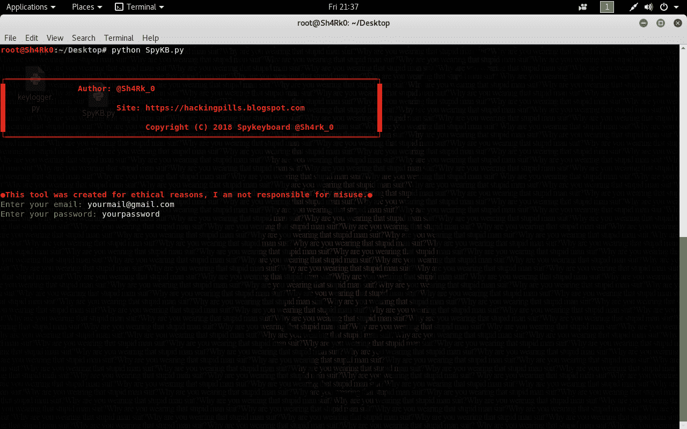
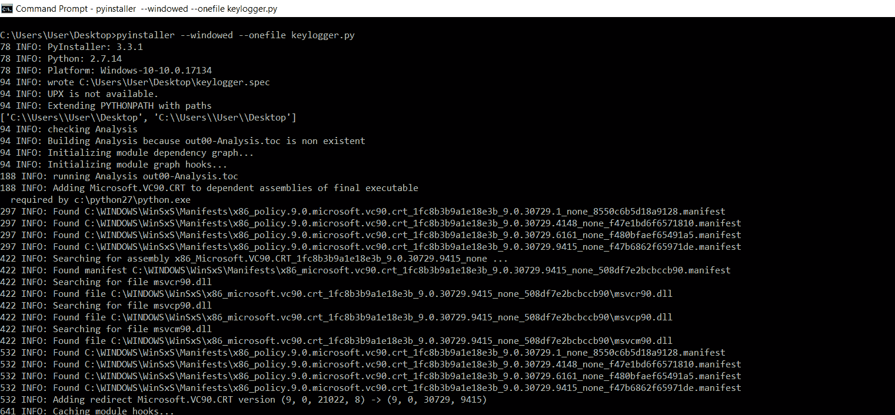

# spykeyboard–键盘记录器，它将数据发送到我们的 Gmail

> 原文：<https://kalilinuxtutorials.com/spykeyboard-keylogger-sends-data-gmail/>

Spykeyboard 是一个脚本，它允许我们生成一个不可检测的键盘记录器，将捕获的按键发送到我们的 gmail 邮箱。一旦我们在 kali linux 中生成了键盘记录器，我们就必须通过**。py** 文件到 windows 机器上转换成**。exe** 。该工具正在开发中。

**也读[Crypton——对各种加密系统、数字签名、哈希算法的攻击](https://kalilinuxtutorials.com/crypton/)**

## **Spykeyboard 安装 Linux & Windows**

```
pip install keyboard
```



### **编译成。exe**



[](https://github.com/Sh4rk0-666/Spykeyboard)