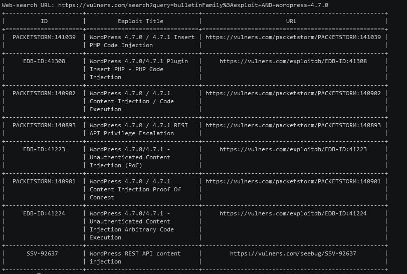
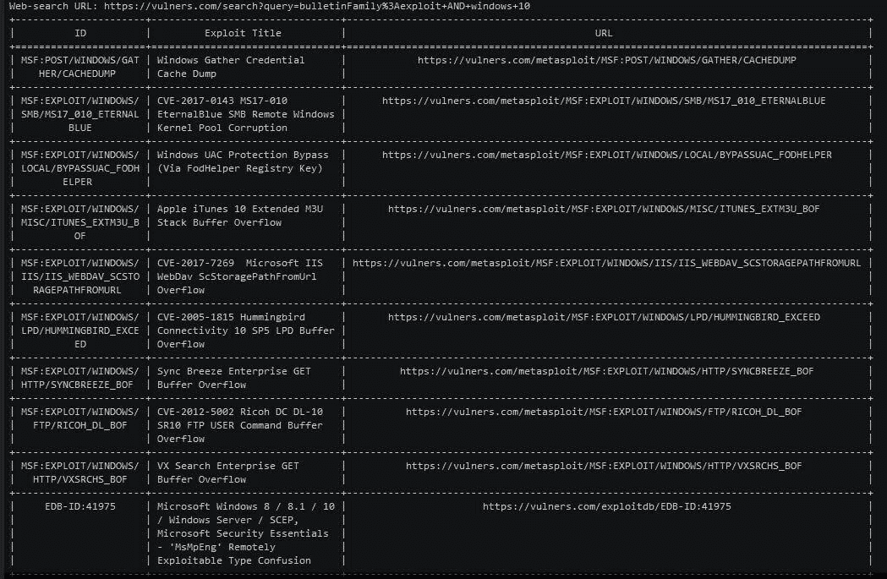

# getsploit v 0 . 2 . 2–用于搜索和下载漏洞的命令行实用程序

> 原文：<https://kalilinuxtutorials.com/getsploit-searching-downloading-exploits/>

Getsploit 允许您在所有最流行的集合中在线搜索漏洞:Exploit-DB、Metasploit、Packetstorm 等。最强大的功能是在您的工作路径中直接下载利用源代码。

该工具在支持 SQLite FTS4 的 python2.6、python2.7 和 python3.6 上进行了测试。如果你发现任何错误，不要犹豫，打开问题。

**也读作[Spykeyboard——键盘记录器，它将数据发送到我们的 Gmail](https://kalilinuxtutorials.com/spykeyboard-keylogger-sends-data-gmail/)**

## **如何使用 Getsploit？**

### **安装**

```
**pip install** getsploit
```

### **搜索**

```
**# git clone https://github.com/vulnersCom/getsploit
# cd getsploit
# ./getsploit.py wordpress 4.7.0
Total found exploits: 8
Web-search URL: https://vulners.com/search?query=bulletinFamily%3Aexploit%20AND%20wordpress%204.7.0**
```



### **保存漏洞文件**

```
`# ./getsploit.py -m wordpress 4.7.0
Total found exploits: 8
Web-search URL: https://vulners.com/search?query=bulletinFamily%3Aexploit%20AND%20wordpress%204.7.0`
```

### 

### **本地数据库**

如果你的 Python 支持 sqlite3 lib(内置)，你可以使用*–更新*和*–本地*命令将整个漏洞数据库下载到你的 PC。更新后，您可以执行本地离线搜索。

```
`# ./getsploit.py --update
Downloading getsploit database archive. Please wait, it may take time. Usually around 5-10 minutes.
219642496/219642496 [100.00%]
Unpacking database.
Database download complete. Now you may search exploits using --local key './getsploit.py -l wordpress 4.7'` 
```

[](https://github.com/vulnersCom/getsploit)