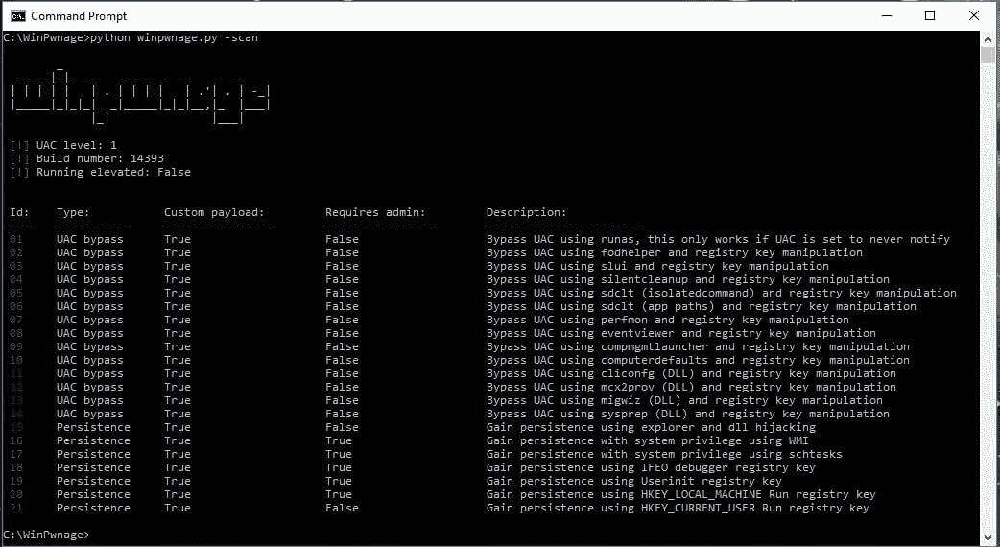
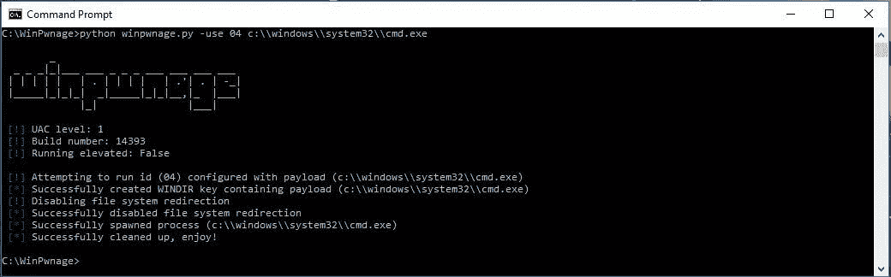

# WinPwnage–提升、UAC 旁路、权限提升、dll 劫持技术

> 原文：<https://kalilinuxtutorials.com/winpwnage-dll-hijack-techniques/>

WinPwnage 的意思是研究技术。这些技巧可以在网上、不同的博客和 GitHub 上找到。感谢所有的研究人员，我不为任何发现邀功。

重写它们并移植到 Python 2.7。todo 文件夹下的代码未经测试，不要指望它能工作。

## **在 WinPwnage 中实现的技术**

*   使用 fodhelper 的 UAC 旁路
*   使用计算机默认值绕过 UAC
*   使用 slui 的 UAC 旁路
*   使用静默清理绕过 UAC
*   使用 compmgmtlauncher 绕过 UAC
*   使用 sdclt (isolatedcommand)的 UAC 旁路
*   使用 sdclt 的 UAC 旁路(应用程序路径)
*   使用 perfmon 绕过 UAC
*   使用事件查看器绕过 UAC
*   使用 sysprep 绕过 UAC(支持 dll 有效负载)
*   使用 migwiz 绕过 UAC(支持 dll 有效负载)
*   使用 mcx2prov 绕过 UAC(支持 dll 有效负载)
*   使用 cliconfg 绕过 UAC(支持 dll 有效负载)
*   使用 userinit 的持久性
*   使用图像文件执行选项的持久性
*   使用 hklm 运行的持久性
*   使用 hkcu 运行的持久性
*   使用 schtask 的持久性(系统权限)
*   使用浏览器 dll 劫持的持久性
*   使用 WMI 的持久性(系统权限)

**也读作 [复仇女神——一个命令行网络包神石&注入实用程序](https://kalilinuxtutorials.com/nemesis-command-line-network-packet/)**

## **安装依赖关系**

`**pip install -r requirements.txt**`

## **建造**

为了成功构建，安装 [py2exe](http://www.py2exe.org) 模块，并使用提供的 build.py 脚本将所有脚本编译成可移植的可执行文件。在 Windows 10 上，编译、重新运行直到成功或提升提示时，可能会出现拒绝访问错误。

## **截图**

 

