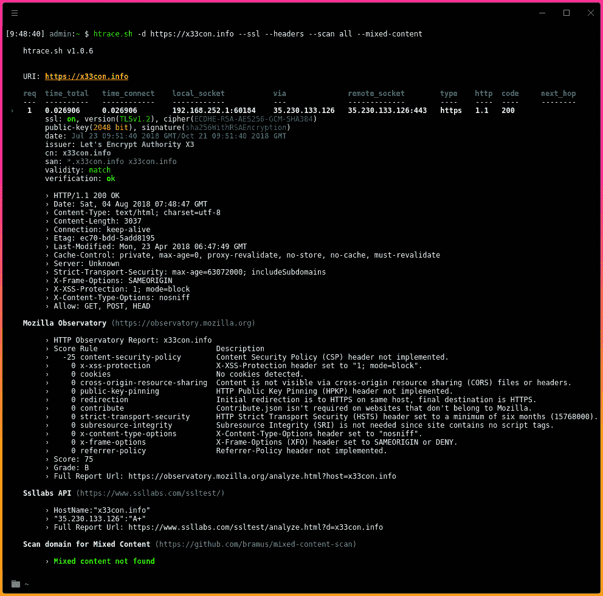

# htrace . sh–用于调试 Http/Https 流量跟踪的简单 Shell 脚本

> 原文：<https://kalilinuxtutorials.com/htrace-sh-simple-shell-script/>

htrace.sh s 使用简单的 shell 脚本来调试 http/https 流量跟踪、响应头和混合内容。使用 Nmap NSE 库扫描域。支持外部安全工具:Mozilla Observatory 和 SSL Labs API。

htrace.sh 是一个 shell 脚本，允许您验证您的域配置并捕捉任何错误(例如重定向循环)。它还显示有关 ssl 配置(如果有)、响应头的基本信息，检查混合内容，并使用 Nmap 脚本和强大的外部工具(如 Ssllabs 或 Mozilla Observatory)执行安全扫描。

**也可理解为[WinPwnage——提升、UAC 旁路、特权升级、dll 劫持技术](https://kalilinuxtutorials.com/winpwnage-dll-hijack-techniques/)**



## **功能**

它有助于:

*   正确检查**域配置**(网络服务器/反向代理)
*   **重定向分析**，例如消除重定向循环
*   检查每个请求的**响应头**
*   检查**基本 ssl** 配置
    *   **验证**证书(日期、cn、san)和**验证** ssl 连接
*   扫描域中的**混合内容**
*   使用 **Nmap NSE 库**扫描域
*   使用外部安全工具扫描域: **Mozilla Observatory** 和 **SSL Labs API**

**注意:**使用 **htrace.sh** 前请参见 **[要求](https://github.com/trimstray/htrace.sh#requirements)** 。

## **如何使用 htrace.sh**

很简单:

```
# Clone this repository
git clone https://github.com/trimstray/htrace.sh

# Go into the repository
cd htrace.sh

# Install
./setup.sh install

# Run the app
htrace.sh --domain https://google.com
```

> *   The symbolic link of `**bin/htrace.sh**` is placed in **`/usr/local/bin`**
> *   The manual page is placed on `**/usr/local/man/man8**`

## **外部工具**

**htrace.sh** 支持安全扫描的外部工具:

*   **Mozilla 天文台**–CLI 版[observatory.mozilla.org](https://observatory.mozilla.org/)带参数:`**--format=report --rescan --zero --quiet**`
*   **SSL Labs**—[SSL Labs API](https://www.ssllabs.com/ssltest/)
    的命令行参考实现客户端，带参数:`**-quiet -grade**`
*   **混合内容扫描**–CLI 工具，用于检查支持 HTTPS 的网站的混合内容
    ，参数:`**-user-agent \"$_user_agent\" --no-check-certificate**`
*   **Nmap NSE 库**–通过脚本为 Nmap
    提供自动安全扫描:
    *   http auth 查找器
    *   http-chrono
    *   http-cookie-标志
    *   http-cors
    *   http-跨域-策略
    *   http-csrf
    *   http-dombased-xss
    *   转到 http
    *   http-grep
    *   http-内部-IP-公开
    *   http-jsonp-检测
    *   http-恶意软件-主机
    *   http-方法
    *   http-密码
    *   http-phpself-xss
    *   http-PHP-版本
    *   http-机器人. txt
    *   http-网站地图生成器
    *   http-shellshock
    *   http-stored-xss
    *   http-不安全-输出-转义
    *   http-useragent-tester
    *   http-vhosts
    *   http-xsed
    *   ssl 枚举密码
    *   whois-IP！whois-IP！whois-IP

如果你不知道如何安装这些工具，不知道它们应该放在哪里，请查看 **[Dockerfile](https://github.com/trimstray/htrace.sh/blob/master/build/Dockerfile)** 中对每个步骤的准确描述。

**注意:**当扫描**混合内容**和 **nmap 脚本引擎**时，记住可能需要很长时间才能检查完整个站点。

## **报告**

如果要生成 html 格式的报告，请使用 **[ansi2html.sh](https://raw.githubusercontent.com/pixelb/scripts/master/scripts/ansi2html.sh)** 工具。使用的详细说明:

```
**htrace.sh -d https://nmap.org -s -h | ansi2html --bg=dark > report.html**
```

### **构建映像**

```
**cd htrace.sh/build
docker build --rm -t htrace.sh -f Dockerfile .**
```

### **运行容器**

```
docker run --rm -it --name htrace.sh htrace.sh -d http://nmap.org -h
```

## **参数**

提供以下选项:

```
 htrace.sh v1.0.6

Usage:
    htrace.sh <option|long-option>

  Examples:
    htrace.sh --domain https://example.com
    htrace.sh --domain https://example.com -s -h --scan ssllabs 
  Options:
        --help                                show this message
        -d|--domain <domain_name>             set domain name
        -s|--ssl                              show ssl server/connection params
        -h|--headers                          show response headers
        --scan <all|observatory|ssllabs>      scan domain with external security tools
        --mixed-content                       scan website for mixed content
        --nse                                 scan website with nmap nse library
        --user-agent <val>                    set 'User-Agent' header
        --max-redirects <num>                 set max redirects (default: 10)
        --timeout <num>                       set max timeout (default: 15)
```

[](https://github.com/trimstray/htrace.sh) 功劳: [GPLv3](http://www.gnu.org/licenses/)