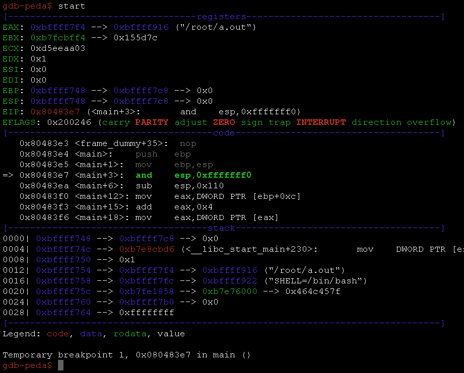
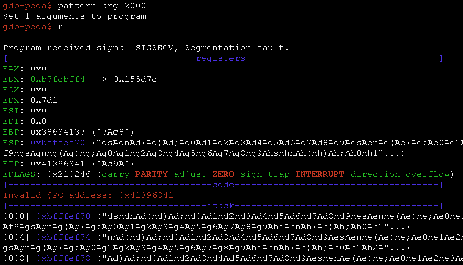

# peda——为 GDB 提供 Python 开发援助

> 原文：<https://kalilinuxtutorials.com/peda-python-exploit-development/>

PEDA 为 GDB 提供 python 开发援助。

## **特性**

*   增强 gdb 的显示:在调试过程中，着色并显示反汇编代码、寄存器、内存信息。
*   添加命令以支持调试和漏洞开发(使用`peda help`查看完整的命令列表):
    *   **`aslr`** —显示/设置 GDB 的 ASLR 设置
    *   `**checksec**` —检查二进制文件的各种安全选项
    *   `**dumpargs**` —显示在调用指令处停止时传递给函数的参数
    *   `**dumprop**` —转储特定内存范围内的所有 ROP 小工具
    *   **`elfheader`** —从调试后的 ELF 文件中获取头文件信息
    *   `**elfsymbo**l` —从 ELF 文件中获取非调试符号信息
    *   `**lookup**` —搜索属于存储范围的所有地址/地址参考
    *   `**patch**` —补丁存储器从 string/hexstring/int 地址开始
    *   `**pattern**` —生成、搜索或向存储器写入循环模式
    *   `**procinfo**` —显示/proc/pid/中的各种信息
    *   `**pshow**` —显示各种 PEDA 选项和其他设置
    *   `**pset**` —设置各种 PEDA 选项和其他设置
    *   `**readelf**` —从 ELF 文件中获取标题信息
    *   `**ropgadget**` —获取二进制或库的常用 ROP 小工具
    *   `**ropsearch**` —在内存中搜索 ROP 小工具
    *   `**searchmem|find**` —在存储器中搜索模式；支持正则表达式搜索
    *   **`shellcode`** —生成或下载常用外壳代码。
    *   `**skeleton**` —生成 python 漏洞代码模板
    *   **`vmmap`** —获取被调试进程中的段的虚拟映射地址范围
    *   `**xormem**` —用密钥对存储区进行异或运算

## **PEDA 安装**

```
git clone https://github.com/longld/peda.git ~/peda
echo "source ~/peda/peda.py" >> ~/.gdbinit
echo "DONE! debug your program with gdb and enjoy"
```

**也读作[htrace . sh——调试 Http/Https 流量追踪的简单 Shell 脚本](https://kalilinuxtutorials.com/htrace-sh-simple-shell-script/)**

## **截图**



[](https://github.com/longld/peda)