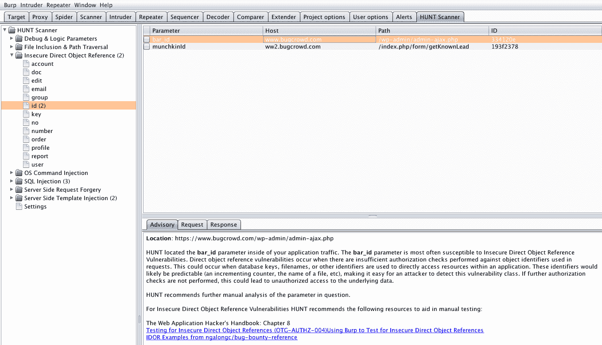
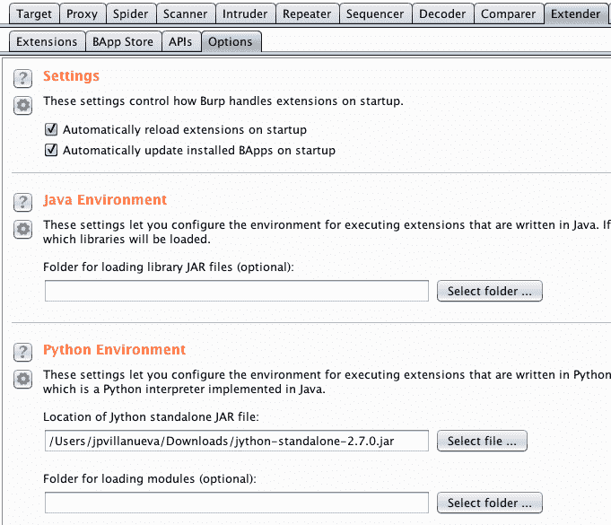
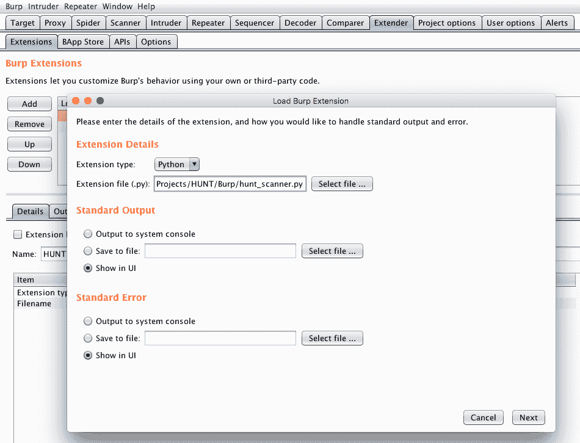
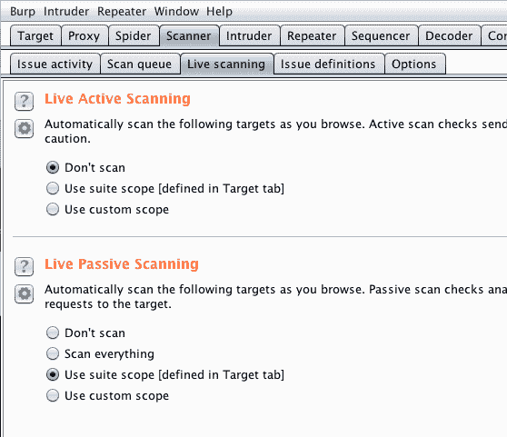

# HUNT–Burp Suite Pro/Free 和 OWASP ZAP 扩展

> 原文：<https://kalilinuxtutorials.com/hunt-burp-suite/>

HUNT Suite 是 Burp Suite Pro/Free 和 OWASP ZAP 扩展的集合。确定易受某些漏洞类别(Burp Suite Pro 和 OWASP ZAP)攻击的常见参数。组织测试方法(Burp Suite Pro 和免费)。

## **寻线参数扫描器–漏洞类别**

*   SQL 注入
*   本地/远程文件包含和路径遍历
*   服务器端请求伪造和打开重定向
*   操作系统命令注入
*   不安全的直接对象引用
*   服务器端模板注入
*   逻辑和调试参数

## **HUNT Suite for Burp Suite Pro/Free**

### **寻线参数扫描器(hunt_scanner.py)**

这个扩展并不测试这些参数，而是对它们发出警报，以便 bug 猎人可以手动测试它们。对于每一类漏洞，Bugcrowd 都确定了与该漏洞类相关的常见参数或函数。我们还在问题描述中提供精选资源，对这些漏洞类别进行全面的手动测试。

**也读作[htrace . sh——调试 Http/Https 流量追踪的简单 Shell 脚本](https://kalilinuxtutorials.com/htrace-sh-simple-shell-script/)**

### **亨特测试方法论(hunt_methodology.py)**

这个扩展允许测试人员发送请求和响应到一个叫做“HUNT Methodology”的 Burp Suite 标签。这个选项卡在左侧包含一个树，它是您的测试方法的可视化表示。通过在这里发送请求/响应，测试人员可以组织或证明已经在应用程序的那个部分完成了手动测试，或者已经完成了某个方法步骤。

## **为 Burp Suite Pro/Free 安装 HUNT Suite】**

### **入门**

*   下载[最新单机](http://www.jython.org/downloads.html) Jython `jar`。
*   导航至*扩展器- >选项*。
    *   找到名为 *Python 环境*的部分。
    *   点击*选择文件…* ，添加 Jython `jar`的位置。

*   导航到*扩展器- >扩展*。
    *   点击*添加*。
    *   找到*扩展细节*。
        *   选择“Python”作为*扩展类型*。
        *   单击“选择文件…”选择扩展在文件系统中的位置。
        *   对寻线参数扫描器和寻线测试方法都这样做

*   寻线参数扫描器将开始运行通过代理的流量。

## **设定范围**

这是设置你的测试范围的重要一步，因为被动扫描仪噪音非常大。寻线参数扫描器用自己的发现创建自己的窗口，而不是污染扫描器窗口。

*   导航到*目标- >范围*。
    *   点按“使用高级范围控制”注记格。
    *   单击添加将包括到您的范围中。

*   导航至*扫描仪- >实时扫描*。
    *   在“实时被动扫描”部分，单击“使用套件范围[在目标选项卡中定义]”。

## **为 OWASP ZAP 寻找扫描器(Alpha 由里卡多·洛博@_sbzo 提供)**

*   找到“管理插件”图标，确保你已经安装了`Python Scripting`。
*   确保单击了“显示所有选项卡”图标
*   点击`Tools`菜单，导航至`Options`部分。选择`Passive Scanner`并勾选`Scan messages only in scope`框，然后勾选`OK`
*   点击进入`Scripts`选项卡(在`Sites`选项卡旁边)
*   点击`load script`图标，将每个 python 脚本加载到 ZAP 中。它们应该出现在`passive rules`下
*   右击`passive rules`下的每个脚本，启用并保存它们
*   浏览网站并接收提醒！

## **重要提示**

寻线参数扫描器利用 Burp 中的被动扫描 API。以下是运行被动扫描检查的条件:

*   主动扫描的首次请求
*   代理请求
*   任何时候从上下文菜单中选择“进行被动扫描”

**被动扫描不会在以下情况下运行:**

*   在每次主动扫描响应时
*   关于中继器响应
*   入侵者的反应
*   序列发生器响应
*   蜘蛛的反应

 **信用:JP 维拉纽瓦&杰森哈德克斯**