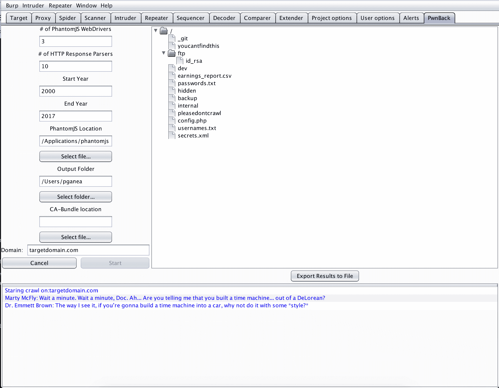

# pwn back——使用 Wayback 机器生成网站地图的 Burp 扩展插件

> 原文：<https://kalilinuxtutorials.com/pwnback-burp-extender-plugin/>

PwnBack 需要运行 PhantomJS。要了解为什么目前需要它，请参见章节[幻象。](https://github.com/P3GLEG/PwnBack###PhantomJS)

该插件有几个设置，用户可以根据他们的硬件设置来定义。

*   幻想曲网络驱动
    *   要打开的 Firefox 无头浏览器的数量。请注意打嗝套件的内存设置
*   HTTP 响应解析器
    *   它们负责解析 WebDriver 生成的请求。增加这个数字，你可能收获很少。
*   开始年份
    *   你想在一个网站的历史上追溯多远？
*   结束年份
    *   何时停止查看网站的历史
*   幻像位置
    *   幻想曲二进制文件的位置
*   输出文件夹
    *   按下“导出结果”按钮时保存结果的位置
*   领域
    *   要爬网的域名。example.com、example.org 等。
*   CA 包
    *   您希望用于幻像的 CA 证书。您不需要这样做，但是，如果没有流量产生，请检查故障排除。

**也读作[SQLMap v 1 . 2 . 9——自动 SQL 注入&数据库接管工具](https://kalilinuxtutorials.com/sqlmap-v1-2-9-automatic-injection/)**



## **PwnBack 安装**

在 BurpSuite 中，打开扩展器选项卡

单击添加按钮

找到此 repo 中包含的 jar 文件。

的当前版本是 v1.7.21，我无法保证向后支持。

## **建造**

运行以下命令

```
git clone https://github.com/k4ch0w/PwnBack.git
cd PwnBack
./gradlew fatJar
```

## **故障排除**

某些计算机上的 JVM 证书存储和 archive.org 提供的 SSL 证书存在问题。如果没有生成流量，请运行以下命令并提供 CA-Bundle 的路径

```
curl --remote-name --time-cond cacert.pem https://curl.haxx.se/ca/cacert.pem
```

[](https://github.com/P3GLEG/PwnBack) 功劳:**加内亚**