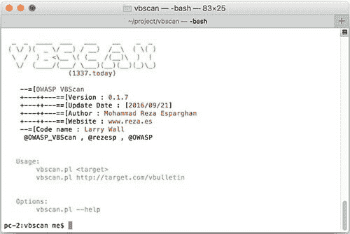

# VB scan–OWASP 是一个黑盒 vBulletin 漏洞扫描器

> 原文：<https://kalilinuxtutorials.com/vbscan-owasp-vbulletin-scanner/>

OWASP VBScan(简称[VB]ullet in Vulnerability[Scan]ner)是一个用 perl 编程语言开发的开源项目，用于检测 VBulletin CMS 漏洞并进行分析。如果你想在 vBulletin 论坛上做渗透测试，OWASP VBScan 是你最好的选择！

## **VBScan 用法**

```
./vbscan.pl <target>
./vbscan.pl http://target.com/vbulletin
```



**也可阅读[HUNT–Burp Suite Pro/Free 和 OWASP ZAP Extensions](https://kalilinuxtutorials.com/hunt-burp-suite/)**

**OWASP VBScan 0.1.7 简介**

[https://www.youtube.com/embed/SirozqDYERA?feature=oembed](https://www.youtube.com/embed/SirozqDYERA?feature=oembed)

[ ](https://github.com/rezasp/vbscan/) **贷方:穆罕默德·礼萨·埃斯帕甘**