# MobSF–移动安全框架是一个自动化的一体化移动应用程序

> 原文：<https://kalilinuxtutorials.com/mobsf-mobile-security-framework/>

**移动安全框架或 MobSF** 是一个自动化的一体化移动应用程序(Android/iOS/Windows)笔测试框架，能够执行静态、动态和恶意软件分析。它可以用于对 Android、iOS 和 Windows mobile 应用程序进行有效和快速的安全分析，并支持二进制文件(APK、IPA & APPX)和压缩源代码。它可以在运行时对 Android 应用进行动态应用测试，并具有由 CapFuzz 支持的 Web API fuzzing 功能。

## **静态分析仪 Docker 图像**

MobSF 静态分析器的自动预构建 docker 映像可从 [DockerHub](https://hub.docker.com/r/opensecurity/mobile-security-framework-mobsf/) 获得

```
docker pull opensecurity/mobile-security-framework-mobsf
docker run -it -p 8000:8000 opensecurity/mobile-security-framework-mobsf:latest
```

**也读作 [无头打嗝——使用打嗝套件](https://kalilinuxtutorials.com/headless-burp-automate-security/)** 自动化安全测试

## **要求**

### **静态分析**

*   Python 3.6 以上版本
*   Oracle JDK 1.7 或更高版本
*   Mac OS 用户必须安装命令行工具
*   iOS IPA 分析仅适用于 Mac 和 Linux。
*   Windows 应用程序静态分析需要适用于 Mac 和 Linux 的 Windows 主机或 Windows 虚拟机。

**注:**

*   在 Linux 和 Mac 上，安装 Oracle Java 1.7 或更高版本，并将**设为默认**版本。
*   在 Linux 上，确保启用了 32 位执行支持。

### **动态分析**

*   如果你要用 MobSF x86 Android VM，需要 Oracle VirtualBox-[VirtualBox 下载](https://www.virtualbox.org/wiki/Downloads)。
*   如果你要用 MobSF Android AVD (ARM 模拟器)，需要 [Android Studio](https://developer.android.com/studio/index.html) 和一个配置好的 AVD。
*   硬件要求:最低 4GB 内存、5GB 硬盘/固态硬盘和虚拟化支持，用于运行 MobSF 虚拟机和英特尔 HAXM(如果您运行的是 MobSF ARM 仿真器)。

## **安装**

**在 Windows (7、8、8.1、10)、Kali (2016.2)、Ubuntu (14.04、16.04)、OSX(小牛、约塞米蒂、埃尔卡皮坦)、OS(塞拉、高塞拉)上测试**

### **配置静态分析仪**

```
git clone https://github.com/MobSF/Mobile-Security-Framework-MobSF.git
cd Mobile-Security-Framework-MobSF
pip3 install virtualenv
virtualenv -p python3 venv
source venv/bin/activate
pip3 install -r requirements.txt
```

### **PDF 报告生成**

*   您需要单独安装`wkhtmltopdf`二进制文件来生成 PDF 报告。
*   查看 [wkhtmltopdf 下载](http://wkhtmltopdf.org/downloads.html)和[安装 wkhtmltopdf wiki](https://github.com/JazzCore/python-pdfkit/wiki/Installing-wkhtmltopdf) 了解更多信息。
*   在 Windows 中，需要将包含`wkhtmltopdf`二进制文件的文件夹添加到环境变量 PATH 中。

## **运行中**

**`python3 manage.py runserver`**

如果需要在特定端口号上运行，请尝试 **`python3 manage.py runserver PORT_NO`** 。要把 MobSF 暴露给某个特定的 IP，可以试试`**python3 manage.py runserver IP:PORT_NO**`。

如果一切顺利，您将得到如下所示的输出。

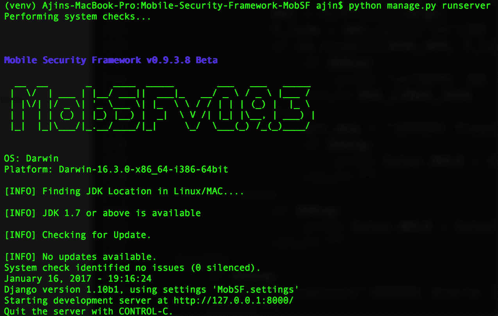

您可以导航到 **`http://localhost:8000/`** 进入 MobSF Web 界面。

### **用 MobSF Android 4 . 4 . 2 x86 VirtualBox VM 配置动态分析器**

Dynamic Anlayzer 仅适用于 Android 二进制文件(APK ),并且仅当您的计算机至少有 4GB 内存和完全虚拟化支持时才有效。

**注意**:如果您在 VirtualBox 中配置 MobSF 虚拟机进行动态分析，您必须在主机操作系统中配置 MobSF，而不是在任何虚拟机中配置。

要配置动态分析器，我们需要 4 样东西。

*   新的 VM
*   快照 UUID
*   主机/代理 IP
*   虚拟机/设备 IP

#### **接下来的步骤**

*   打开 VirtualBox，进入**文件- >导入设备**，选择 MobSF_VM_X.X.ova 文件。


*   继续导入过程。不要改变任何东西。
*   一旦 OVA 成功导入，您将在 VirtualBox 中看到一个名为 MobSF_VM_X.X 的新条目
*   右键单击 MobSF 虚拟机并选择设置，转到网络选项卡。这里我们需要配置两个网络适配器。
    *   应该启用适配器 1 并将其连接到仅主机适配器。记住适配器的名称。我们需要名称来识别主机/代理 IP。

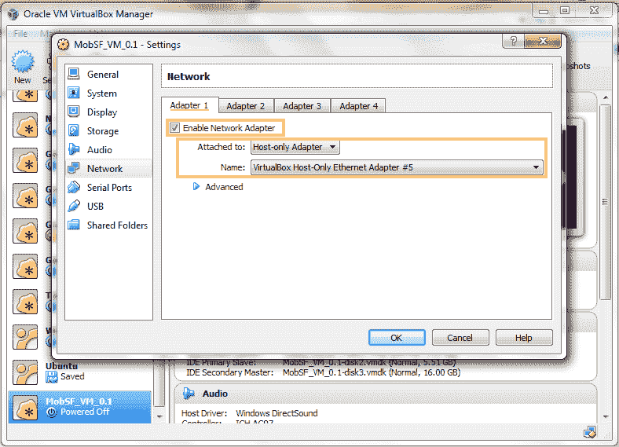

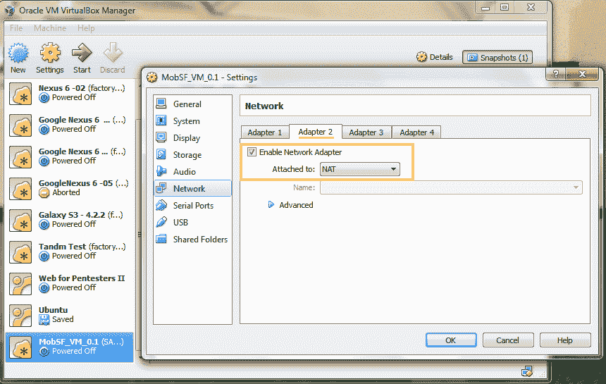

*   保存设置并启动 MobSF 虚拟机。当虚拟机启动时。记下**虚拟机 IP** 。

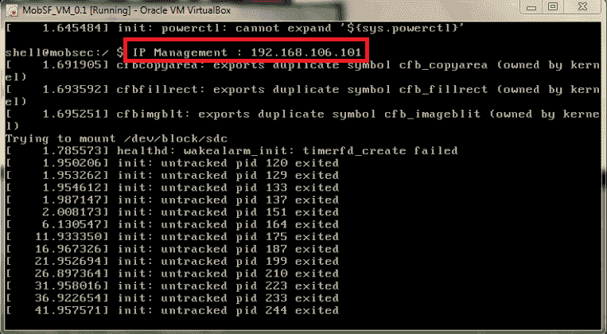

*   一旦虚拟机启动，它将显示一个锁定屏幕。锁屏的密码是`1234`。

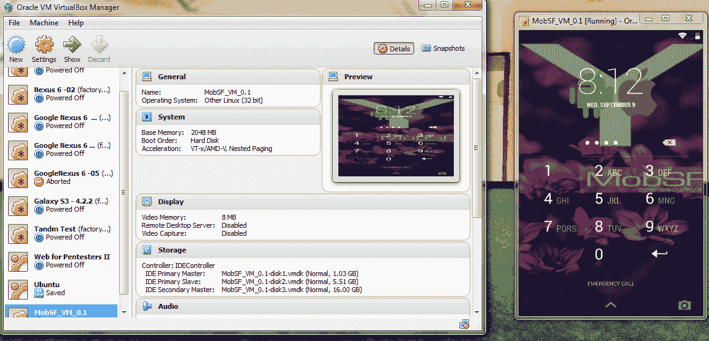

**注意**:如果虚拟机不能正常启动，则不能使用 MobSF 虚拟机进行动态分析。

*   **获取主机/代理 IP**
    *   **Windows** :在命令提示符下发出`ipconfig`命令，记下主机专用适配器名称对应的 IP。

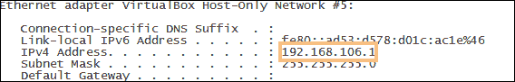

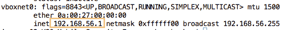

**注意**:VirtualBox 主机专用适配器 IP 和 MobSF 虚拟机 IP 应该在同一个网络范围内。如果您的 MobSF 虚拟机 IP 和适配器 IP 在不同的网络范围内，请将适配器 IP 修改为与 MobSF 虚拟机 IP 在同一网络范围内。

*   转到 **MobSF VM** 中的 Wi-Fi 设置，将代理 IP 设置为您在上一步中获得的主机/代理 IP，端口号设置为`1337`。

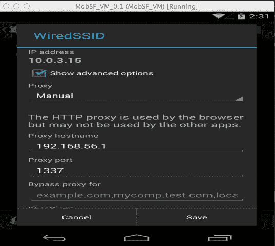

*   保存设置并导航至 **MobSF VM** 的主屏幕。等待 30 秒，在 VirtualBox 中保存 **MobSF 虚拟机**的快照

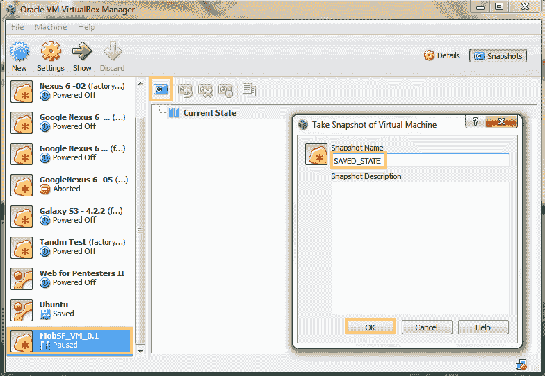

*   快照保存后，右击 **MobSF VM** ，选择`Show in Explorer`或`Show in Finder`。

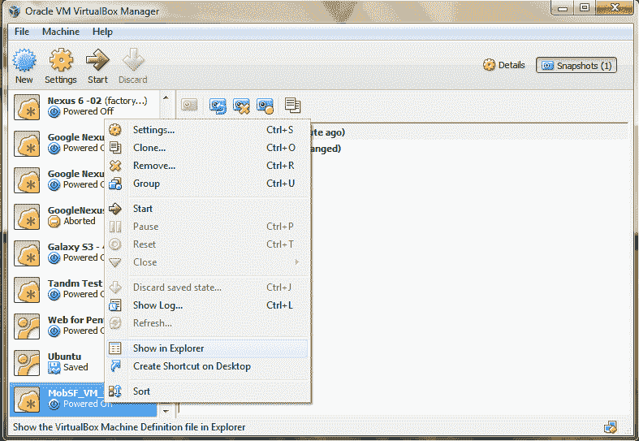

*   在任何文本编辑器中打开文件 **MobSF_VM_X.X.vbox** ,记下虚拟机 UUID 和快照 UUID。

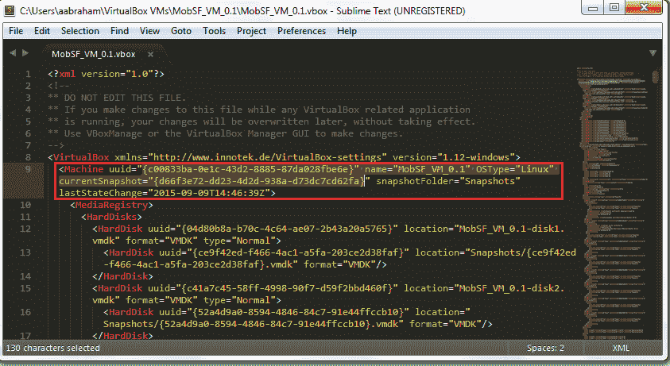

这里 **`uuid`** 的值是**VM UUID****`currentSnapshot`**是**快照 UUID** 。

*   现在，我们拥有了配置动态分析器所需的所有东西(主机/代理 IP、虚拟机 IP、虚拟机 UUID 和快照 UUID)
*   转到 **`MobSF/settings.py`** 并将适当的值设置为
    *   新建=虚拟机新建
    *   SUUID =快照 UUID
    *   VM_IP = VM IP
    *   PROXY_IP =主机/代理 IP
*   在 **`MobSF/settings.py`** 中，设置 `**ANDROID_DYNAMIC_ANALYZER = "MobSF_VM"**` (默认)
*   这将配置 MobSF 使用 Android VirtualBox VM 进行动态分析。

### **用 **MobSF Android 4.1.2 arm 仿真器**配置动态分析器**

*   确保安装了 [Android Studio](https://developer.android.com/studio/index.html) 并创建了 AVD。(推荐带棒棒糖图片的 Nexus 5)
*   提取 [MobSF_ARM_Emulator.zip](https://goo.gl/LRrGs3)
*   运行`**scripts/mobsfy_AVD.py**`脚本并指定包含从`**MobSF_ARM_Emulator.zip**`提取的文件的目录。
*   在`MobSF/settings.py`中，设置 **`ANDROID_DYNAMIC_ANALYZER = "MobSF_AVD"`**
*   这将配置 MobSF 使用 Android arm 仿真器进行动态分析。

#### **手动配置(不推荐)**

*   如果 `**mobsfy_AVD.py**` 脚本运行不成功，需要手动设置 `**MobSF/settings.py**` 中 **`AVD_EMULATOR`** 和`**AVD_PATH**`的值。
*   遵循模拟器 zip 中的自述文件，并根据您的系统更改所有路径字段
*   编辑`**MobSF/settings.py**`并修改

```
AVD_EMULATOR = r'/Users/[USERNAME]/Library/Android/sdk/tools/emulator'
# This can be /Users/[USERNAME]/Library/Android/Sdk/emulator/emulator for newer versions of android SDK

AVD_PATH = r'/Users/[USERNAME]/.android/avd'
 # Path to the avd folder where you extracted the emulator
```

*   在`**MobSF/settings.py**`中，设置 **`**ANDROID_DYNAMIC_ANALYZER =** "MobSF_AVD"`**

### **使用根 Android 4.03–4.4 设备配置动态分析器**

*   MobSFy 根 Android 设备，按照这里的说明:[在 Android 设备中配置 MobSF 动态分析环境](https://github.com/MobSF/Mobile-Security-Framework-MobSF/wiki/2.-Configure-MobSF-Dynamic-Analysis-Environment-in-your-Android-Device-or-VM)
*   在`**MobSF/settings.py**`中，设置`**ANDROID_DYNAMIC_ANALYZER = "MobSF_REAL_DEVICE"**`
*   用您从 WiFi ADB 获得的 IP 和端口设置`**DEVICE_IP**`和 **`DEVICE_ADB_PORT`**

### **使用根 Android 4.03–4.4 VM 配置动态分析器**

*   MobSFy 自定义虚拟机，按照这里的说明:[在自定义虚拟机中配置 MobSF 动态分析环境](https://github.com/MobSF/Mobile-Security-Framework-MobSF/wiki/2.-Configure-MobSF-Dynamic-Analysis-Environment-in-your-Android-Device-or-VM)
*   **虚拟机器上的虚拟机**:如果虚拟机托管在 Virtual Box 上，按照您配置 [MobSF x86 VirtualBox 虚拟机](https://github.com/MobSF/Mobile-Security-Framework-MobSF/wiki/1.-Documentation#configuring-dynamic-analyzer-with-mobsf-android-442-x86-virtualbox-vm)的相同步骤，设置适当的`VM **UUID**`、 **`Snapshot UUID`** 、 **`Host/Proxy IP`** 、 **`VM IP`** ，并设置`**ANDROID_DYNAMIC_ANALYZER = "MobSF_VM"**`
*   **任何其他虚拟机**:将其配置为真实设备。设置`**ANDROID_DYNAMIC_ANALYZER = "MobSF_REAL_DEVICE"**`并指定`**DEVICE_IP**`和`**DEVICE_ADB_PORT**`。快照功能仅适用于 VirtualBox 中托管的虚拟机。

## **更新 MobSF**

如果您正在更新 MobSF，在大多数情况下，您可能必须执行数据库迁移，否则您会看到如下错误

```
[ERROR] Saving to DB (E:\Mobile-Security-Framework-MobSF\StaticAnalyzer\views\android\db_interaction.py, LINE 236 "static_db.save()"): table StaticAnalyzer_staticanalyzerandroid has no column named
```

运行以下命令来迁移您的数据库

```
python3 manage.py makemigrations
python3 manage.py migrate
```

如果以上更改不起作用，您可能必须在 Mac/Linux 中运行`clean.sh`(存在于`scripts`)。之后，运行上述命令。

注意:这将删除以前保存的扫描结果。

## **禁用组件**

默认情况下，一些组件是禁用的，因为它们是实验性的

### apkid

默认情况下，APKiD 是禁用的。在启用之前，您必须安装 yara-python 的 rednaga fork。

```
git clone --recursive https://github.com/rednaga/yara-python-1 yara-python
cd yara-python
python3 setup.py build --enable-dex install
```

通过将`APKID_ENABLED`设置为`True`来启用`settings.py`中的 APKiD。

## **运行测试**

*   基本静态分析器单元测试–运行 MobSF 并导航至`**http://127.0.0.1:8000/runtest/**`
*   MobSF REST API 单元测试–运行 MobSF 并导航至 **`http://127.0.0.1:8000/runapitest/`**

## **截图**

#### **静态分析–安卓 APK**

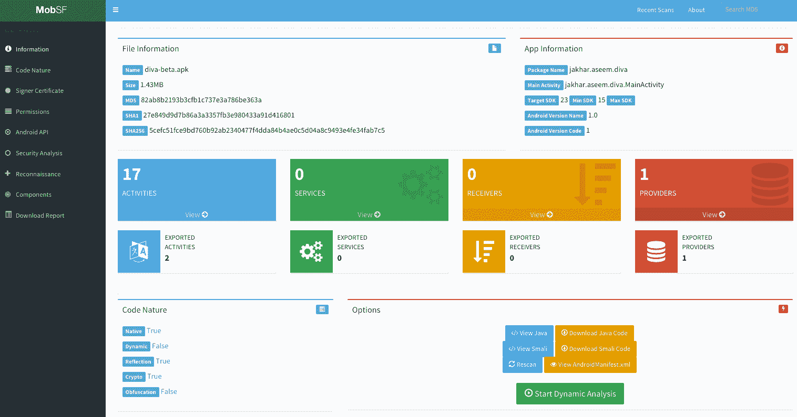 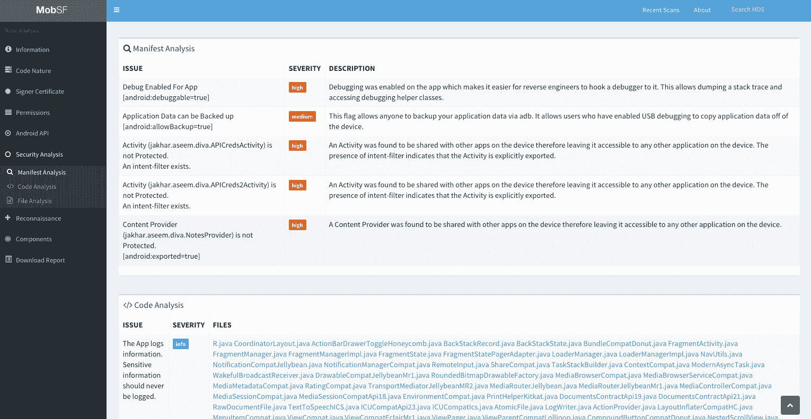

#### **静态分析–iOS IPA**

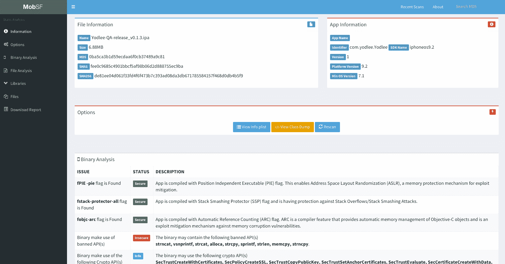

#### **静态分析——APPX 视窗**

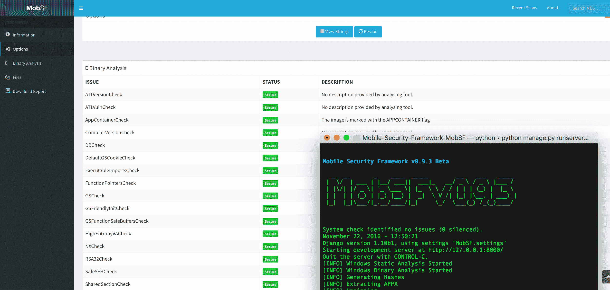

#### **动态分析–安卓 APK**

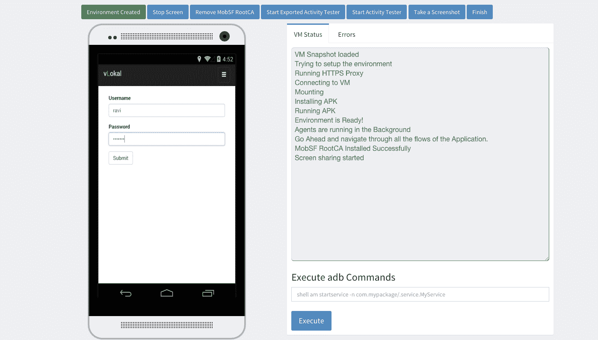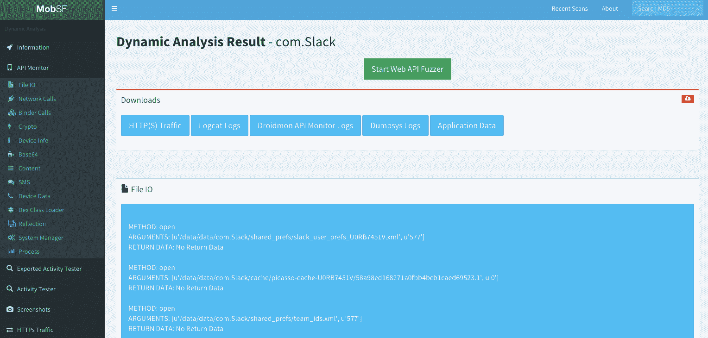

#### **Web API Fuzzer**

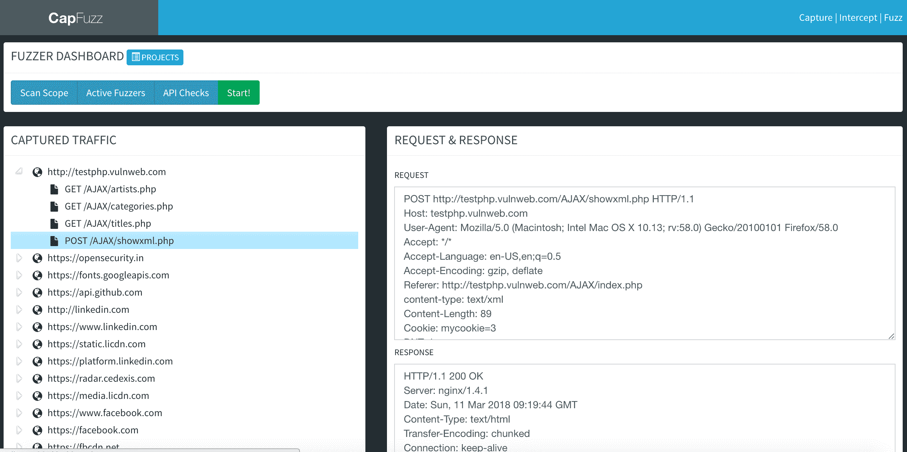 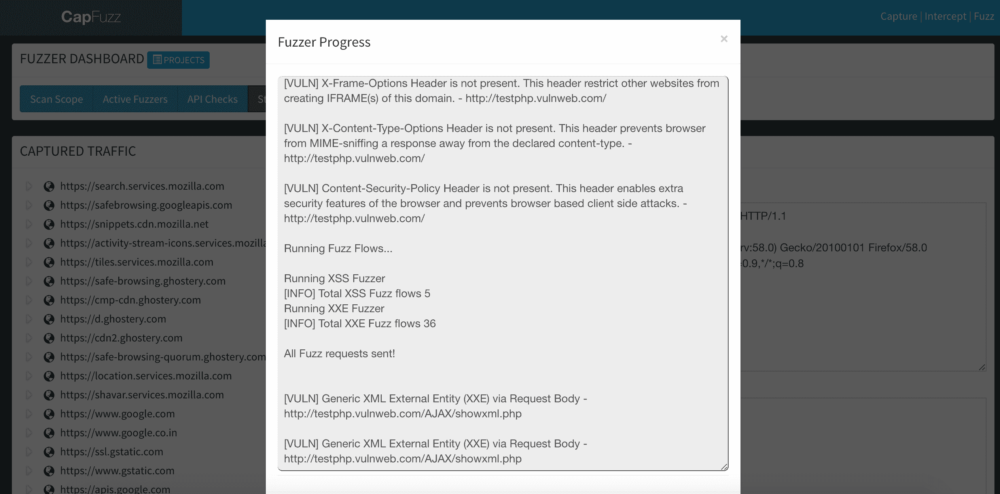

## **视频演示**

[https://www.youtube.com/embed/h00v1euuFXg?feature=oembed](https://www.youtube.com/embed/h00v1euuFXg?feature=oembed)

[](https://github.com/MobSF/Mobile-Security-Framework-MobSF)