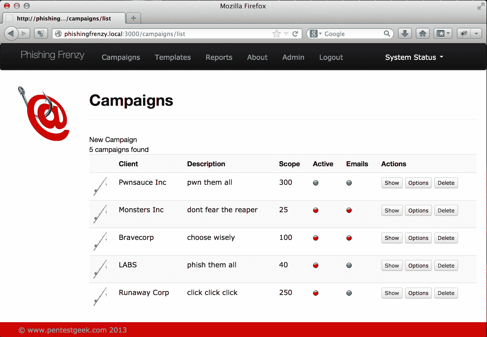

# 网络钓鱼狂潮——Ruby on Rails 网络钓鱼框架

> 原文：<https://kalilinuxtutorials.com/phishing-frenzy-phishing-framework/>

[网络钓鱼**狂热**](http://www.phishingfrenzy.com) 是一个开源的 Ruby on Rails 应用程序，渗透测试人员利用它来管理电子邮件网络钓鱼活动。

该项目的目标是简化网络钓鱼流程，同时尽可能为客户提供最真实的网络钓鱼活动。



**也读作[can gibrina–A Fast&power full Dashboard(管理)Finder](https://kalilinuxtutorials.com/cangibrina-dashboard-admin-finder/)**

## **在 Kali Linux 上安装钓鱼狂潮**

#### **克隆回购**

使用 git 克隆网络钓鱼狂热知识库

```
**# git clone https://github.com/pentestgeek/phishing-frenzy.git /var/www/phishing-frenzy**
```

#### **安装 RVM、红宝石**和**包**

```
$ \curl -sSL https://get.rvm.io | bash
```

在安装结束时，请听取针对 RVM 的任何安装后说明

#### **用 RVM 安装 Ruby 2.1**

```
$ rvm install 2.1.5
```

#### **安装导轨**

```
# rvm all do gem install --no-rdoc --no-ri rails
```

#### **为 Apache 安装 mod _ passenger】**

```
# rvm all do gem install --no-rdoc --no-ri passenger
```

#### **安装乘客**

调用乘客安装脚本

```
# passenger-install-apache2-module
```

#### **安装人员说我缺少一些 apache 依赖项**

```
# apt-get install apache2-threaded-dev libapr1-dev libaprutil1-dev libcurl4-openssl**-**dev
```

安装完依赖项后，再次调用乘客安装脚本。乘客安装完成后，请务必注意注释和结尾。您需要在/etc/apache2/apache.conf 文件中添加 3 行文本。

```
**# passenger-install-apache2-module**
```

安装我们需要 MySQL 正确捆绑的包

```
# apt-get install libmysqlclient**-**dev
```

## **阿帕奇 VHOST 配置**

将 Include 语句添加到 apache2.conf 中，并创建文件**/etc/Apache 2/pf . conf**

```
Include pf.conf
```

向 pf.conf 文件添加内容

```
<IfModule mod_passenger.c>
PassengerRoot %ROOT
PassengerRuby %RUBY
</IfModule>

<VirtualHost *:80>
ServerName phishing-frenzy.com
# !!! Be sure to point DocumentRoot to 'public'!
DocumentRoot /var/www/phishing-frenzy/public
RailsEnv development
<Directory /var/www/phishing-frenzy/public>
# This relaxes Apache security settings.
AllowOverride all
# MultiViews must be turned off.
Options -MultiViews
</Directory>
</VirtualHost>
```

取消注释掉**/etc/Apache 2/ports . conf**中的# NameVirtualHost *:443 行，以允许 SSL 钓鱼网站正确呈现

## **MySQL** 的实现

确保 mysql 正在运行

```
# service mysql start
```

登录并创建网络钓鱼狂热开发模式的表格和权限

```
# mysql -u root -p
mysql> create database pf_dev;
mysql> grant all privileges on pf_dev.* to 'pf_dev'@'localhost' identified by 'password';
```

安装所需的 Gems

```
# cd /var/www/phishing-frenzy/

# bundle install
```

如果您的 web 应用程序因为声明您丢失了一块宝石而无法运行，您可能需要运行

```
# bundle install --deployment

# rake db:migrate

# rake db:seed
```

安装 Redis

```
# wget http://download.redis.io/releases/redis-stable.tar.gz

# tar xzf redis-stable.tar.gz

# cd redis-x.x.x/

# make

# make install

# cd utils/

# ./install_server.sh
```

如果您想将 redis 绑定到环回接口，请查阅 redis 文档以了解更多详细信息

## **Sidekiq 配置**

为 sidekiq pid 创建一个 tmp 目录

```
# mkdir -p /var/www/phishing-frenzy/tmp/pids
```

启动 sidekiq 服务器与 redis 进行交互

```
**# bundle exec sidekiq -C config/sidekiq.yml**
```

## **系统配置**

编辑 sudoers 文件，确保 www-data 帐户可以重新加载 apache

```
www-data ALL=(ALL) NOPASSWD: /etc/init.d/apache2 reload
```

使用 rake helper 加载 PF 的 Efax 和英特尔默认模板

```
**# rake templates**:load
```

更改网络钓鱼目录的所有权，以便 apache 可以正确访问

```
# chown **-**R www-data:www-data /var/www/phishing-frenzy/
```

更改上传目录的权限

```
# chmod -R 755 /var/www/phishing-frenzy/public/uploads/
```

更改启用站点的目录的所有权，以允许网络钓鱼狂潮使用 Apache 管理虚拟主机

```
# chown -R www-data:www-data /etc/apache2/sites-enabled/
# chmod -R 755 /etc/apache2/sites-enabled/
```

启动 Apache web 服务器

**# apachectl 开始**

网络钓鱼狂潮的默认登录配置为:

**用户名:admin**
**密码:Funt1me！**

## **配置 HTTPS / SSL**

如果你想在 HTTPS 上运行你的网络钓鱼狂潮用户界面，你可以做一些额外的改变。

运行几个命令来启用 apache 中的 SSL 模块，并创建一个目录来存储证书和密钥。

```
$ sudo a2enmod ssl

$ sudo service apache2 restart

$ sudo mkdir /etc/apache2/ssl
```

使用 openssl 创建我们的自签名证书

```
$ sudo openssl req -x509 -nodes -days 365 -newkey rsa:2048 -keyout /etc/apache2/ssl/pf.key -out /etc/apache2/ssl/pf.crt

<IfModule mod_passenger.c>
PassengerRoot %ROOT
PassengerRuby %RUBY
</IfModule>

<VirtualHost *:443>
ServerName phishing-frenzy.com

SSLEngine on
SSLCertificateFile /etc/apache2/ssl/pf.crt
SSLCertificateKeyFile /etc/apache2/ssl/pf.key

# !!! Be sure to point DocumentRoot to 'public'!
DocumentRoot /var/www/phishing-frenzy/public
RailsEnv development
<Directory /var/www/phishing-frenzy/public>
# This relaxes Apache security settings.
AllowOverride all
# MultiViews must be turned off.
Options -MultiViews
</Directory>
</VirtualHost>
```

将全局设置菜单中的应用程序站点 URL 更新为相应的 FQDN，其中 HTTPS 地址启用了 SSL。

[ ](https://github.com/pentestgeek/phishing-frenzy) **鸣谢:布兰登·泽克诺斯·麦肯**