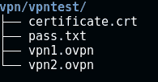
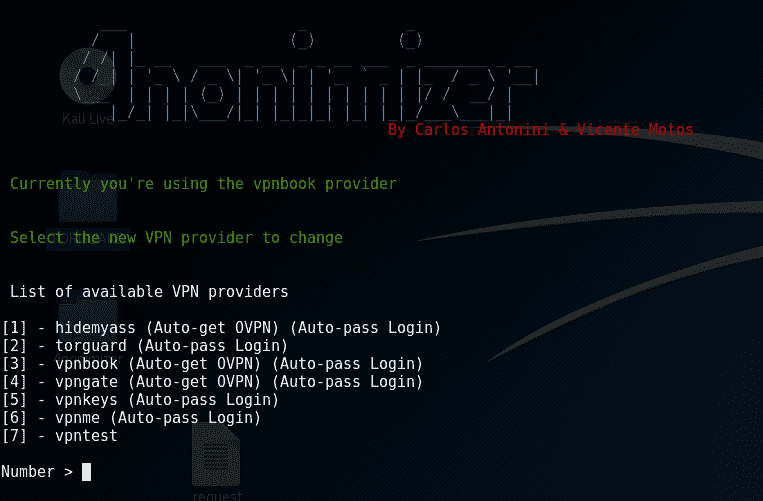
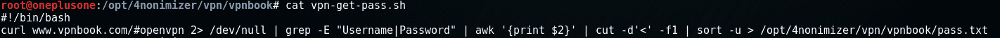
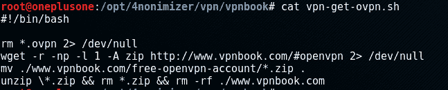
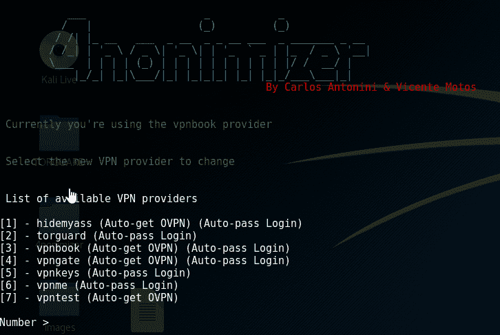

# 4 non mizer–一个 Bash 脚本，用于匿名化用于浏览互联网的公共 IP

> 原文：<https://kalilinuxtutorials.com/4nonimizer/>

4nonimizer 是一个 bash 脚本，用于匿名化用于浏览互联网的公共 IP，管理到 TOR 网络和不同 VPN 提供商(OpenVPN)的连接，无论是免费的还是付费的。默认情况下，它包括到不同对等方的几个预先配置的 VPN 连接。ovpn 文件)并下载凭证(如果相应的提供商支持的话)。此外，它还在日志文件中记录我们每 300 秒使用的每个 IP。

该脚本在 systemd 系统中作为服务启用，并在系统启动时使用默认 vpn (VPNBook)。

从版本 1.06 开始，dns 解析请求通过 DnsCrypt 完成(使用选项 enable_dns 或 disable_dns 启用和禁用)

从版本 1.12 开始，连接 vpn 的日志保存在 sqlite 的/logs/中

**也读作** [**钓鱼狂潮——Ruby on Rails 钓鱼框架**](https://kalilinuxtutorials.com/phishing-frenzy-phishing-framework/)

## **4 非最大化器安装**

使用 git 下载 repo，执行命令**。/4 non mizer 在目录中安装**，并按照屏幕上的说明操作，4 non mizer 将移动到目录 **/opt/** 并作为服务安装。

这个脚本与 Kali Linux 完全兼容，尽管它已经过适当的测试，应该也能在 Debian、Ubuntu 和 Arch (Manjaro)等其他发行版上运行。然而，可能会有一些错误，或意想不到的表现(请评论，如果你发现任何！).

## **选项**

安装 4nonymizer 后，输入命令**4 non mizer help**获取帮助，显示所有可用参数:

```
 `___                   _           _
      /   |                 (_)         (_)
     / /| |_ __   ___  _ __  _ _ __ ___  _ _______ _ __
    / /_| | '_ \ / _ \| '_ \| | '_  ` _ | |_  / _ \ '__|
   \___  | | | | (_) | | | | | | | | | | |/ /  __/ |
        |_/_| |_|\___/|_| |_|_|_| |_| |_|_/___\___|_|
                                       By Carlos Antonini & Vicente Motos
                                       Version: 1.06-beta` 
```

用法:4nonymizer **<参数>**
**安装**:安装运行服务中的脚本
**卸载**:禁用运行服务并删除 app 目录
**change_provider** :更改 VPN Provider
**Change _ ip**:更改 IP from VPN current
**VPN _ status**:检查 IP 和 provider VPN 运行
**Update _ VPN** :停止 4 非移民服务
**stop_nonet** :停止 4 非移民服务并关闭网络接口
**重启**:重启 4 非移民服务
**update_app** :通过 git
**privoxy** 更新此程序:安装并配置 privoxy，端口 8118 (BETA)
可以在 boot
**中禁用服务 enable_dnscrypt** :启用 dnscrypt 服务
**禁用 _dnscrypt** :禁用 dnscrypt 服务

**帮助**:帮助(此画面)

## **可用的 VPN**

目前它支持以下 VPN 提供商:

*   7 个代理人
*   [AirVPN](https://airvpn.org/)
*   [隐风暴](https://cryptostorm.is/)
*   网络幽灵
*   [ExpressVPN](https://www.expressvpn.com)
*   [免费虚拟专用网](https://freevpn.me/)
*   [秀美](https://www.hidemyass.com/)
*   [IP vanish](https://www.ipvanish.com/)
*   [NordVPN](https://nordvpn.com)
*   [PIA](https://www.privateinternetaccess.com/)
*   [原始 VPN](https://protonvpn.com/)
*   [Proxy.sh](https://proxy.sh/)
*   [SlickVPN](https://www.slickvpn.com)
*   [StrongVPN](https://strongvpn.com/)
*   [守门员](https://torguard.net/)
*   隧道熊
*   [VPNBook](http://www.vpnbook.com/)
*   [VPNGate](http://www.vpngate.net/en/)
*   [VPNKeys](https://www.vpnkeys.com/)
*   [VPNMe](https://www.vpnme.me/)
*   [拆下](https://www.goldenfrog.com/es/vyprvpn)

## **安装新的 VPN**

要安装额外的 vpn，我们必须使用以下结构，以便 4nonimizer 能够与它集成并执行操作。

首先，我们必须在 4nonimizer 路径中创建以下目录结构 **/vpn/** :



在我们的示例中，我们创建了文件夹 **/vpntest/** ，并在其中放置了所有的**。我们有 ovpn** 文件。如果 ovpn 文件中没有证书，我们将它们放在同一个文件夹中，如示例 **certificate.crt** 所示。

此外，我们必须放置一个名为 **pass.txt** 的文件，该文件包含两行:第一行包含用户名，第二行包含密码，如下所示:


如果我们在执行命令**4 non mizer change _ provider**时正确执行了所有步骤，菜单将显示我们的 vpn:



如图所示，选项[7]是我们创建的 vpn。

## **自动获取凭证& ovpn 文件**

如果 VPN 提供商允许凭证和/或。ovpn 文件获取，4nonimizer 已经标准化了以下脚本名称和位置:

–/opt/4 non mizer/VPN/provider/**VPN-get-pass . sh**



–/opt/4 non mizer/VPN/provider/**VPN-get-ovpn . sh**



4nonimizer 会自动检测两个脚本是否存在，如果在每个文件的第一行找到表达式“#4uto”或“#m4nual ”,则会根据执行的操作指示(自动通过登录)或(自动获取 OVPN)。



## **附加**

–执行“source 4nonimizer”来激活参数的自动补全。
–复制。加载一个 4nonimizer 模板并执行 conky。

[](https://github.com/Hackplayers/4nonimizer)