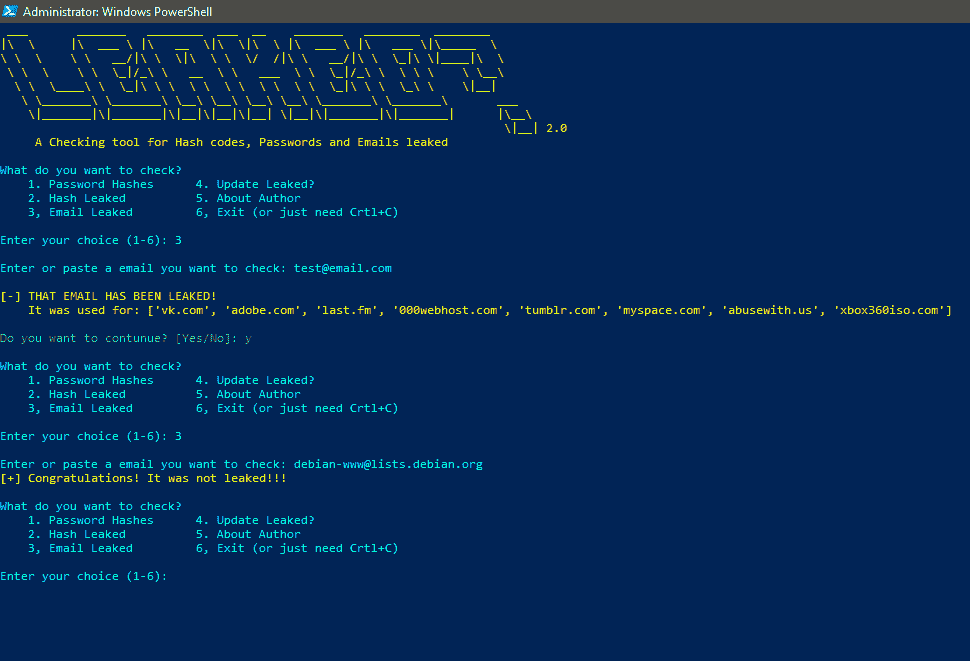

# 泄漏 2.0-一个检查哈希代码，密码和电子邮件泄漏的工具

> 原文：<https://kalilinuxtutorials.com/leaked-2-0-checking-tool-for-hash-codes/>

Leaked 2.0 是一个哈希码和密码以及泄露的邮件的检查工具，使用 Aidan Holland 的 leakz 模块，leakz 模块使用 Aurelius Wendelken 的 API。

泄露？如果他们支持 Python 3 和 2，可以在任何操作系统中工作。

## **泄密 2.0 有什么新功能？**

*   检查泄露的电子邮件
*   更新
*   对用户更友好
*   支持 Python 2 和 3

**也读作**[**droid defense-Advance Android 恶意软件分析框架**](https://kalilinuxtutorials.com/droidefense-android-malware-analysis-framework/)

## **特性**

*   密码泄露
*   哈希代码泄露
*   邮件泄露新！
*   更新新的！
*   出口
*   关于作者

## **在 Linux 中安装并运行**

```
sudo apt update && apt install python3 python3-pip
git clone https://github.com/GitHackTools/Leaked
cd Leaked
pip3 install -r requirements.txt
pip install -r requirements.txt
python3 leaked.py
```

**或`python leaked.py`**

## **在 Windows 中安装并运行**

从 Python.org 下载并运行 Python 3 安装文件。在**安装 Python 3** 中，启用**为所有用户添加 Python 3.7 到路径**和

 **从 Git-scm.com 下载并运行 Git 安装文件，从 Windows 命令 Propmt 中选择**使用 Git。**

完成后，请运行命令 Propmt 或 PowerShell 并输入以下命令:

```
git clone https://github.com/GitHackTools/Leaked
cd Leaked
pip install -r requirements.txt
python leaked.py
```

## **更新泄露了？**

**`git pull -f`**

## **截图**



[ ](https://github.com/GitHackTools/Leaked) **信用:GitHackTools****