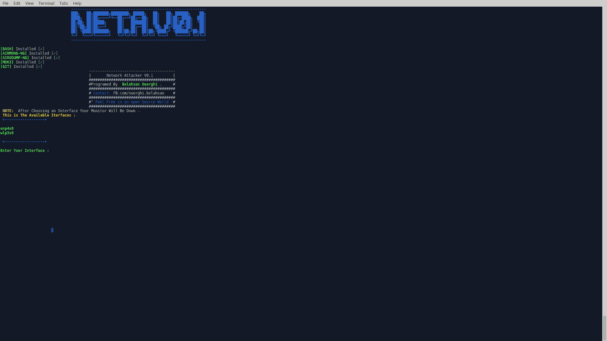

# 网络攻击者:WiFi 压力测试信标泛滥和去认证攻击

> 原文：<https://kalilinuxtutorials.com/network-attacker/>

网络攻击者 V0.1 是一个基于 Mdk3 信标泛洪&解除认证攻击的 Wifi 压力测试 Bash 脚本程序。这是为了帮助初学者，甚至是专业人士应对网络上的 eacon 泛滥或身份验证攻击而创建的。

**也读作 [泄露 2.0——一款针对哈希码、密码、邮件泄露的检查工具](https://kalilinuxtutorials.com/leaked-2-0-checking-tool-for-hash-codes/)**

## **网络攻击者安装**

```
**sudo apt-get install git
sudo git clone https://github.com/TunisianEagles/network-attacker.git
cd network-attacker
sudo chmod +x install.sh
sudo chmod +x network_attacker.sh
./install.sh
./network_attacker.sh**
```

# 测试时间:

*   Backbox linux
*   人的本质
*   一种自由操作系统
*   Kali linux
*   鹦鹉操作系统

## **截图**



[ ](https://github.com/TunisianEagles/network-attacker) **信用:Belahsan Ouerghi**