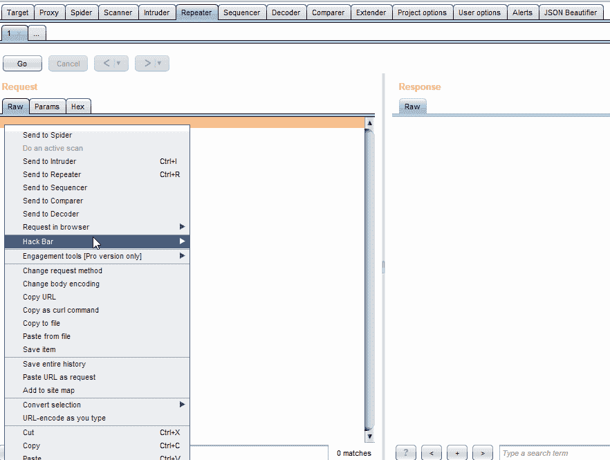
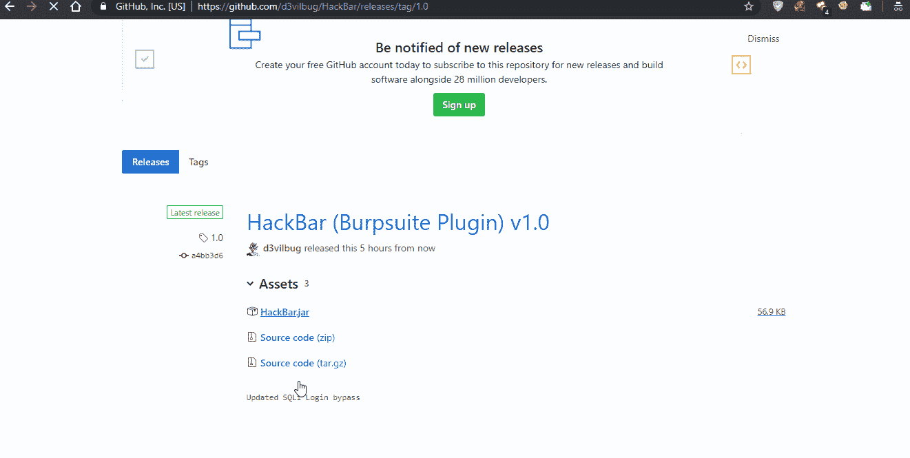

# HackBar:burp suite 1.0 版的 hack bar 插件

> 原文：<https://kalilinuxtutorials.com/hackbar/>

HackBar 是一个基于 java 的[插件。它已经过测试，在 Burpsuite 1.7.36、Windows 10 和 xubuntu 18.04 上运行良好。使用 Hackar 的基本要求是 Burpsuite 和 Java。](https://kalilinuxtutorials.com/burpsuite-extensions/)



## **如何安装 HackBar**

```
`Download Jar 'https://github.com/d3vilbug/HackBar/releases/tag/1.0' and add in burpsuite`
```



## **即将推出的功能/模块**

*   Ctrl + H(快捷键)
*   晶圆旁路(SQLi)
*   解码器/编码器
*   模拟攻击(一次点击自动测试完整的备忘单)

[](https://github.com/d3vilbug/HackBar)