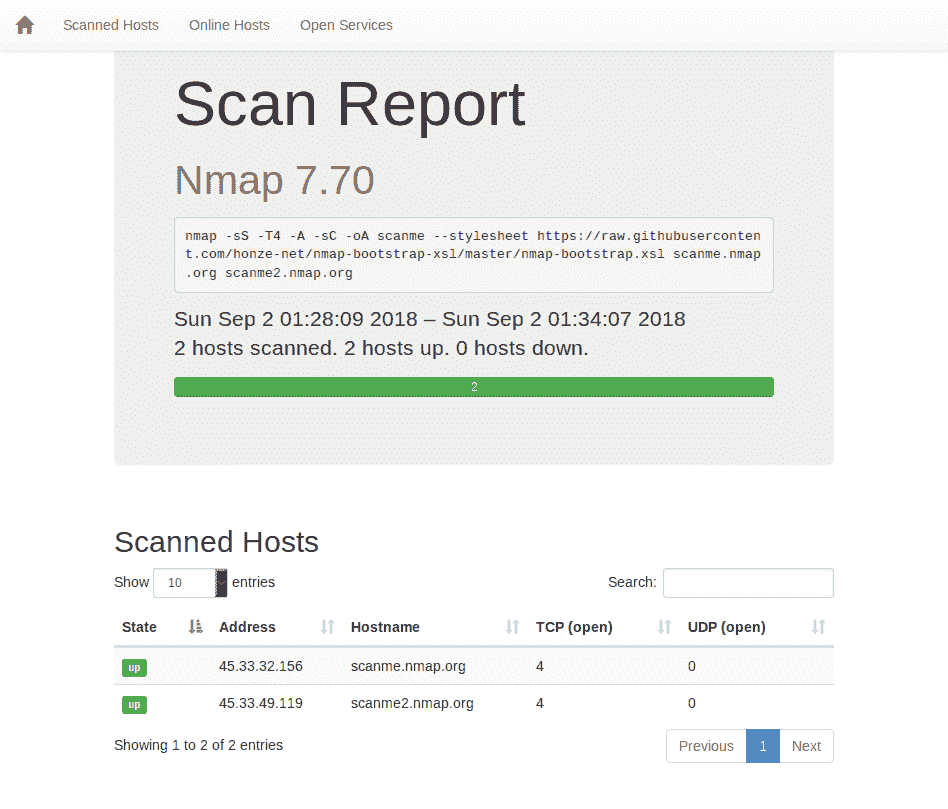
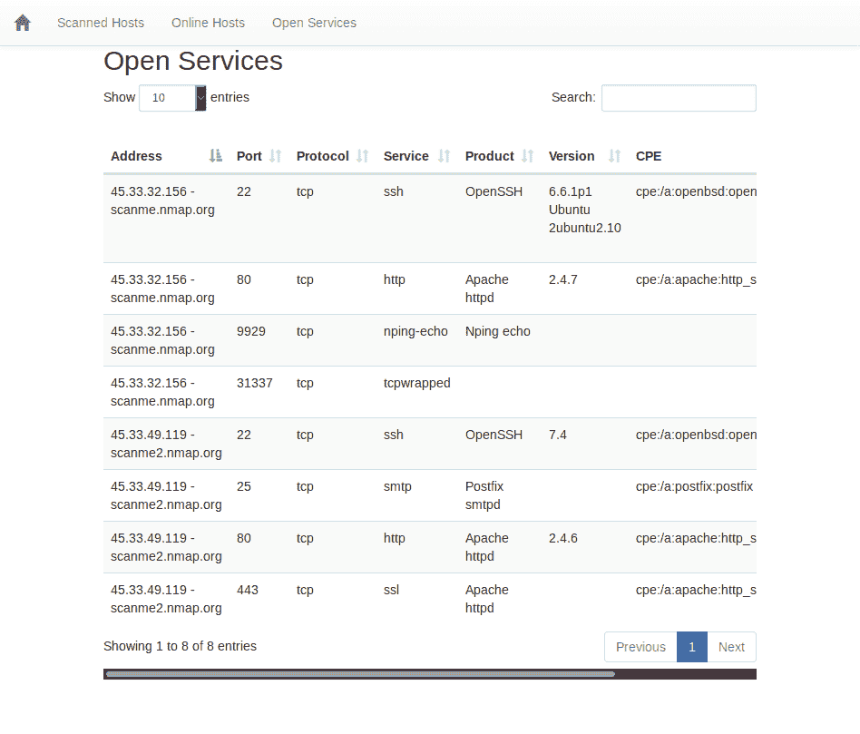

# 一个带有 Bootstrap 的 Nmap XSL 实现

> 原文：<https://kalilinuxtutorials.com/nmap-bootstrap-xsl/>

这是一个带有 Bootstrap 的 Nmap XSL 实现。

## **Nmap-Bootstrap-XSL 用法**

*   将 **`nmap-bootstrap.xsl`** 作为样式表添加到 Nmap 扫描中。
*   示例:

```
nmap -sS -T4 -A -sC -oA scanme --stylesheet https://raw.githubusercontent.com/honze-net/nmap-bootstrap-xsl/master/nmap-bootstrap.xsl scanme.nmap.org scanme2.nmap.org
```

*   用 Web 浏览器打开 scanme.xml。它应该看起来像 **[`scanme.html sample report`](http://htmlpreview.github.io/?https://github.com/honze-net/nmap-bootstrap-xsl/blob/master/scanme.html)** 。
*   或者，您可以用以下方法将 xml 转换成 html

```
xsltproc -o scanme.html nmap-bootstrap.xsl scanme.xml
```

*   您需要事先下载 nmap-bootstrap.xsl。

**也读[4 non mizer——一个 Bash 脚本，用于匿名化用于浏览互联网的公共 IP](https://kalilinuxtutorials.com/4nonimizer/)**

## **旧扫描**

*   您还可以使用 xsl 样式表格式化旧扫描。
*   在 `<!DOCTYPE nmaprun>` 后插入`**<?xml-stylesheet
    href="https://raw.githubusercontent.com/honze-net/nmap-bootstrap-xsl/master/nmap-bootstrap.xsl"
    type="text/xsl"?>**` **。**

## **截图**





[](https://github.com/honze-net/nmap-bootstrap-xsl/)