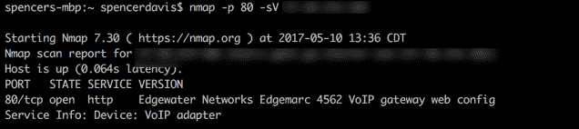
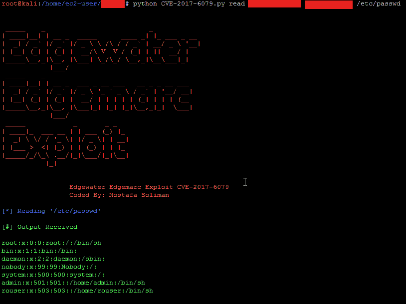
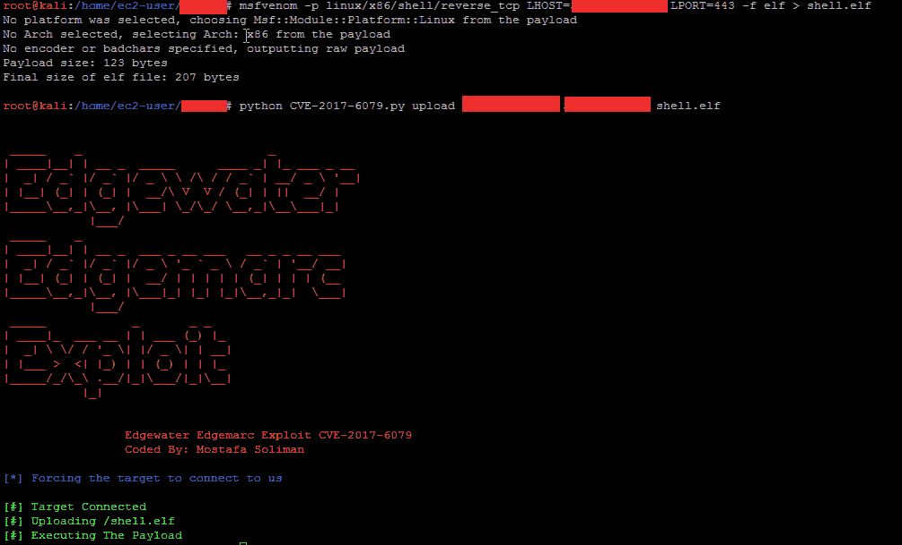

# 利用 CVE-2017-6079-edge water edge Marc 设备利用中的盲命令注入

> 原文：<https://kalilinuxtutorials.com/exploit-injection-edgewater-edgemarc/>

该漏洞是基于`depthsecurity`的技术描述开发的

[https://depth security . com/blog/CVE-2017-6079-blind-command-injection-in-edge water-edge Marc-devices](https://depthsecurity.com/blog/cve-2017-6079-blind-command-injection-in-edgewater-edgemarc-devices)

Edgewater Networks Edgemarc 设备上的 HTTP 网络管理应用程序有一个隐藏页面，允许用户定义命令，如特定的 iptables 路由等。，待定。您可以使用这个页面作为 web shell 来执行命令，尽管您无法从 web 应用程序获得客户端反馈:如果命令有效，它就会执行。wget 命令就是一个例子。允许这一点的页面已经在 2006 年的固件中得到确认。

**也读作**[Vboxdie Cracker——虚拟盒磁盘镜像加密密码破解](https://kalilinuxtutorials.com/vboxdie-cracker-password-cracker/)

Nmap 将从其 web 服务器识别设备，如图所示



# **用途**

```
 `_____    _                          _
| ____|__| | __ _  _____      ____ _| |_ ___ _ __
|  _| / _` |/ _` |/ _ \ \ /\ / / _` | __/ _ \ '__|
| |__| (_| | (_| |  __/\ V  V / (_| | ||  __/ |
|_____\__,_|\__, |\___| \_/\_/ \__,_|\__\___|_|
            |___/
 _____    _
| ____|__| | __ _  ___ _ __ ___   __ _ _ __ ___
|  _| / _` |/ _` |/ _ \ '_ ` _ \ / _` | '__/ __|
| |__| (_| | (_| |  __/ | | | | | (_| | | | (__
|_____\__,_|\__, |\___|_| |_| |_|\__,_|_|  \___|
            |___/
 _____            _       _ _
| ____|_  ___ __ | | ___ (_) |_
|  _| \ \/ / '_ \| |/ _ \| | __|
| |___ >  <| |_) | | (_) | | |_
|_____/_/\_\ .__/|_|\___/|_|\__|
           |_|

               Edgewater Edgemarc Exploit CVE-2017-6079
                 Coded By: Mostafa Soliman

    [USAGE] CVE-2017-6079.py [operation] [TargetIP] [AttackerIP] [FilePath]
    operation: Either read / upload
    AttackerIP: IP address to receive the connection on
    TargetIP: IP address of the target running Edgewater Edgemarc server
    FilePath:  Remote file to download in case of "read" operation
               Local file to upload in case of "upload" operation` 
```

## **利用**

该漏洞假设设备有默认根密码`default`,如果不是这样，您需要替换`Authorization`。该漏洞有两种操作模式:

#### **改为**

这种模式允许攻击者读取易受攻击设备上的任何文件。



#### **上传**

该模式允许攻击者上传 ELF 文件负载到`/tmp/`文件夹并执行。您需要启动 listner 来接收连接。



[](https://github.com/MostafaSoliman/CVE-2017-6079-Blind-Command-Injection-In-Edgewater-Edgemarc-Devices-Exploit)