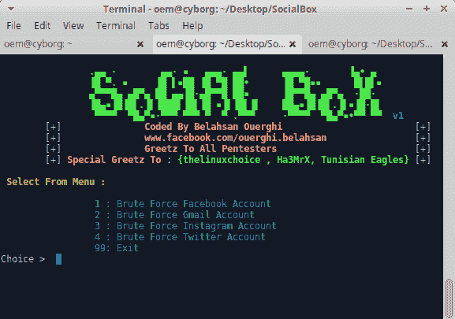
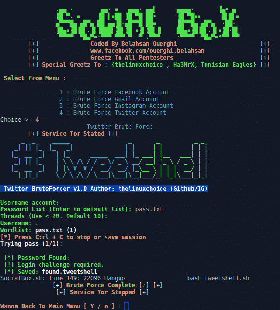

# social box——暴力攻击框架[脸书、Gmail、Instagram、Twitter]

> 原文：<https://kalilinuxtutorials.com/socialbox-bruteforce-attack/>

SocialBox 是一个暴力攻击框架[脸书，Gmail，Instagram，Twitter ]。

## **SocialBox 安装**

```
**sudo apt-get install git
sudo git clone https://github.com/TunisianEagles/SocialBox.git
cd SocialBox
chmod +x SocialBox.sh
chmod +x install-sb.sh
./install-sb.sh
./SocialBox.sh**
```

## **测试于**

*   Backbox linux
*   人的本质
*   Kali linux

**也读[DVR-Exploiter:DVR-Exploiter 一个 Bash 脚本程序利用 DVR 的](https://kalilinuxtutorials.com/dvr-exploiter-script-program-exploit/)**

## **截图**

 

[ ](https://github.com/TunisianEagles/SocialBox#screenshots-) **信用:【Bela hsan ouerghi】**