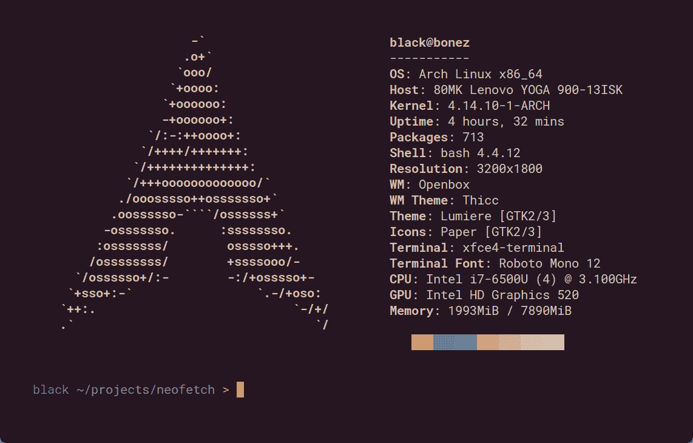

# neo fetch——命令行系统信息工具

> 原文：<https://kalilinuxtutorials.com/neofetch/>

Neofetch 是用 bash 3.2+编写的命令行系统信息工具。Neofetch 以一种美观且视觉愉悦的方式显示关于您的操作系统、软件和硬件的信息。

Neofetch 的总体目的是用于你的系统的屏幕截图。Neofetch 显示了其他人想要看到的信息。还有其他工具可用于正确的系统统计/诊断。

默认情况下，该信息显示在操作系统的徽标旁边。你可以进一步配置 Neofetch 来使用一张图片，一个自定义的 ASCII 文件，你的壁纸或者什么都不用。

您可以进一步配置 Neofetch 来显示您想要它显示的内容。通过使用命令行标志和配置文件，您可以更改现有的信息输出或添加您自己的自定义信息输出。

Neofetch 支持近 150 种不同的操作系统。从 Linux 到 Windows，一直到 Minix、AIX 和 Haiku 等更加晦涩的操作系统。如果你最喜欢的操作系统不受支持:打开一个问题，支持将被添加。

**也可理解为 [邮件安全测试——邮件安全框架&过滤解决方案](https://kalilinuxtutorials.com/mail-security-testing/)**

## **Neofetch 安装**

### **最新发布**

1.  下载最新版本。
    *   [https://github.com/dylanaraps/neofetch/releases/latest](https://github.com/dylanaraps/neofetch/releases/latest)
2.  在脚本目录中运行`make install`来安装脚本。
    *   **埃尔卡皮坦** : `**make PREFIX=/usr/local install**`
    *   **俳句** : `**make PREFIX=/boot/home/config/non-packaged install**`
    *   【打开印第安纳州】T2:`**gmake install**`
    *   **MinGW/MSys**:**`make -i install`**
    *   **注意**:您可能需要以 root 用户身份运行。

### **最新 Git Master(出血边缘)**

1.  Git 克隆回购。
    *   `**git clone https://github.com/dylanaraps/neofetch**`
2.  将工作目录更改为`neofetch`。
    *   `**cd neofetch**`
3.  使用 Makefile 安装 neofetch。
    *   `**make install**`
    *   **埃尔卡皮坦** : `**make PREFIX=/usr/local install**`
    *   **俳句** : `**make PREFIX=/boot/home/config/non-packaged install**`
    *   【打开印第安纳州】T2:`**gmake install**`
    *   **MinGW/MSys** : `**make -i install**`
    *   **注意**:您可能需要以 root 用户身份运行。

**注意:**使用`make uninstall`可以轻松卸载 Neofetch。这将删除系统中的所有文件。

**注意:**您可以从系统上的任何文件夹运行 neofetch，makefile 所做的只是将文件移动到一个“sane”位置。Makefile 是可选的。

## **操作系统/发行包**

本节列出了为特定操作系统/发行版制作的 neofetch 软件包。

### **阿尔卑斯 Linux**

#### **Alpine Linux 3.8 及以上版本**

1.  更新存储库
    *   `apk update`
2.  安装软件包
    *   `apk add neofetch`

### **安卓(** Termux **)**

Neofetch 在 Termux 的默认回购中。

1.  更新存储库
    *   `sudo apt-get update`
2.  安装软件包
    *   `sudo apt-get install neofetch`

### **拱门**

Neofetch 可在官方回购。

*   安装软件包
    *   `pacman -S neofetch`

### **本森实验室**

Neofetch 可在官方回购。

1.  更新存储库
    *   `sudo apt-get update`
2.  安装软件包
    *   `sudo apt-get install neofetch`

### **症结**

1.  安装 git 和 git 端口(8)驱动程序
    *   `sudo prt-get depinst git`
2.  添加`6c36-git`存储库
    *   `sudo wget -O /etc/ports/6c37-git.git "https://raw.githubusercontent.com/6c37/cross/master/git-driver/6c37-git.git"`
3.  同步回购
    *   `sudo ports -u`
4.  使用您选择的文本编辑器将 repo 添加到/etc/prt-get.conf
    *   `prtdir /usr/ports/6c37-git`
5.  安装软件包
    *   `sudo prt-get depinst neofetch`

或者使用[端口](https://raw.githubusercontent.com/6c37/crux-ports-git/3.2/neofetch/Pkgfile):

1.  下载端口
    *   `wget -O ~/work/neofetch/Pkgfile "https://raw.githubusercontent.com/6c37/crux-ports-git/3.2/neofetch/Pkgfile"`
2.  构建包
    *   `fakeroot pkgmk -d`
3.  安装软件包
    *   `sudo pkgadd neofetch#git-*.pkg.tar.gz`

## Debian

#### **拉伸/ Sid(不稳定)**

Neofetch 在 Debian Stretch/Sid 的官方仓库中。

1.  更新存储库
    *   `sudo apt-get update`
2.  安装软件包
    *   `sudo apt-get install neofetch`

注:Debian `stretch` repo 仅包含 2.0.2 版本。

注 2:第三方 bintray repo 已被否决，如果你想在 Debian stable 上保持最新的 neofetch，那么你需要从 unstable 手动安装新的软件包，或者直接从 git 仓库下载 neofetch，因为它包含在一个文件中。

### **费多拉/ RHEL /森托斯/马吉亚**

**注意**:如果你用的是 RHEL/厘斯，把`dnf`改成`yum`。

1.  确保您已经安装了`dnf-plugins-core`
2.  启用 COPR 存储库
    *   `sudo dnf copr enable konimex/neofetch`
3.  安装软件包
    *   `sudo dnf install neofetch`

或者:

1.  如果您使用的是 RHEL/CentOS，请确保您已经安装了`epel-release`
2.  获取回购文件

*   `curl -o /etc/yum.repos.d/konimex-neofetch-epel-7.repo
    https://copr.fedorainfracloud.org/coprs/konimex/neofetch/repo/epel-7/konimex-neofetch-epel-7.repo`
    *   **注意**:如果你用的是 Fedora，分别把`epel-7`改成`fedora-23`或者你的 Fedora 版本。但是，如果你使用的是 RHEL/CentOS 6，请将其更改为`epel-6`。

3.  安装软件包
    *   `sudo dnf install neofetch`

### **云图/磅图**

你可以从 Gentoo/Funtoo 的官方仓库安装`app-misc/neofetch`。

要安装 git 版本的 neofetch，请使用`=app-misc/neofetch-9999`来代替。

### **GoboLinux**

用官方菜谱安装。

*   `sudo Compile neofetch`

### **iOS**

1.  将`http://dylanaraps.com/repo`添加到您的 cydia 资源中。
2.  通过 cydia 安装`neofetch`。

### **苹果电脑(自制)**

1.  用自制软件安装`neofetch`
    *   `brew install neofetch`

### **NixOS**

从官方仓库安装它

*   `sudo nix-env -i neofetch`

### **休闲服**

从 [SlackBuilds](https://slackbuilds.org/repository/14.2/desktop/neofetch/) 下载文件，并按照[他们的指示](https://slackbuilds.org/howto/)去做。

### **解决方案**

您可以在软件中心的系统软件>系统实用程序下找到 neofetch，或者键入`sudo eopkg it neofetch`。

## **Ubuntu**

#### **Ubuntu 17.04 及以上**

从官方仓库安装它。

1.  更新存储库
    *   `sudo apt update`
2.  安装软件包
    *   `sudo apt install neofetch`

#### **Ubuntu 16.10 及以下**

1.  添加 PPA
    *   `sudo add-apt-repository ppa:dawidd0811/neofetch`
2.  更新存储库
    *   `sudo apt update`
3.  安装软件包
    *   `sudo apt install neofetch`

#### **Ubuntu 每日构建**

这个 PPA 包含直接来自 master branch 的 neofetch 的每日构建

1.  添加 PPA
    *   `sudo add-apt-repository ppa:dawidd0811/neofetch-daily`
2.  更新存储库
    *   `sudo apt update`
3.  安装软件包
    *   `sudo apt install neofetch`

### **Void Linux**

从官方仓库安装它

*   `sudo xbps-install -S neofetch`

