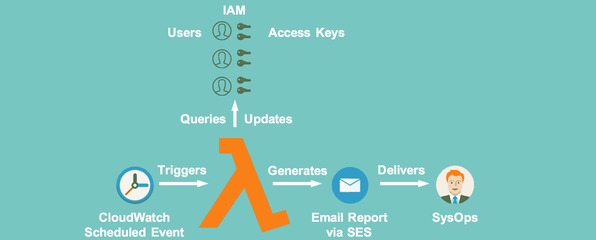
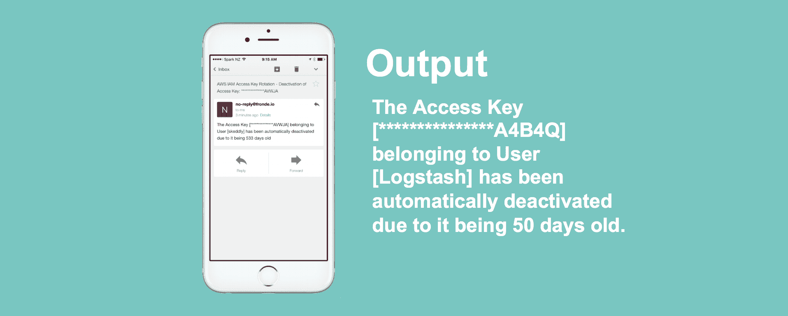
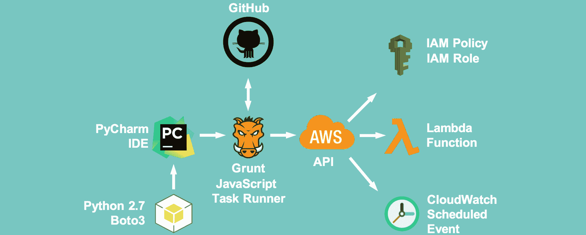

# AWS Key Disabler–Lambda 脚本，将禁用超过给定天数的访问密钥

> 原文：<https://kalilinuxtutorials.com/aws-key-disabler-lambda-script/>

AWS Key disabler 是一个 Lambda 函数，它在一段时间后禁用 AWS IAM 用户访问密钥，以降低与旧访问密钥相关的风险。

## **AWS Lambda 架构**



## **最终用户的系统操作输出**



## **开发者工具链**



**也读 [从公共 WiFi 上网有多安全？](https://kalilinuxtutorials.com/how-to-use-public-wifi/)**

## **AWS 键禁用器电流限制**

*   包含扫描输出(json)的报告将被发送到一个定义的 sysadmin 帐户，请参考`/grunt/package.json`构建配置文件中的`report_to`属性。
*   密钥只能被禁用，不能被删除或替换

## **先决条件**

该脚本需要以下组件才能运行。

*   安装了 NPM 的 node . js[https://nodejs.org/en/](https://nodejs.org/en/)
*   安装了[http://gruntjs.com/](http://gruntjs.com/)
*   AWSCLI 命令行工具已安装[https://aws.amazon.com/cli/](https://aws.amazon.com/cli/)

它还假设您有一个启用 SES 的 AWS 帐户，即域验证和沙盒模式删除。

## **安装** 

这些指示是给 OSX 的。您的里程可能因 Windows 和其他*nix 而异。

1.  给自己拿一份这个脚本的副本
2.  导航到`/grunt`文件夹
3.  设置 Grunt 任务运行程序，例如安装其 deps: `npm install`
4.  在`/grunt/package.json`中填写以下信息
    1.  将`aws_account_number`值设置为您在[https://portal.aws.amazon.com/gp/aws/manageYourAccount](https://portal.aws.amazon.com/gp/aws/manageYourAccount)找到的 AWS 账户 id
    2.  将`first_warning`和`last_warning`设置为密钥触发警告的天数。这些限制触发了向`report_to`发送电子邮件
    3.  将`expiry`设置为密钥过期的天数。在这个年龄，该键被禁用，并且向`report_to`发送电子邮件通知这一变化
    4.  将`serviceaccount`设置为您希望脚本忽略的帐户用户名
    5.  将`exclusiongroup`设置为分配给希望脚本忽略的用户的组的名称。
    6.  将`send_completion_report`值设置为`True`,通过 SES 发送电子邮件
    7.  将`report_to`值设置为您希望接收删除报告的电子邮件地址
    8.  将`report_from`值设置为您希望用作删除报告发件人地址的电子邮件地址。请注意，这需要在 AWS SES 中进行验证。
    9.  将`deployment_region`设置为支持 Lambda 的区域。10 将`email_region`设置为支持 SES 的区域。还要确保该区域禁用了 SES 沙盒模式。
        *   请参见 AWS 地区表以获取支持[https://AWS . Amazon . com/about-AWS/global-infra structure/regional-product-services/](https://aws.amazon.com/about-aws/global-infrastructure/regional-product-services/)
5.  确保您可以从 CLI 成功连接到 AWS，例如运行`aws iam get-user`来验证连接是否成功
6.  从`/grunt`目录运行`grunt bumpup && grunt deployLambda`来提升您的版本号，并对所选区域执行 Lambda 函数的构建/部署

## 使用 AWSCLI 从命令行手动调用 Lambda 函数

按名称`**AccessKeyRotation**`执行 lambda 函数，将扫描的输出记录到一个名为 **`scan.report.log`** 的文件中:

`**aws lambda invoke --function-name AccessKeyRotation scan.report.log --region us-east-1**`

```
{
    "StatusCode": 200
}
```

使用`jq`将`scan.report.log`的内容渲染到控制台:

`**jq '.' scan.report.log**`

```
{
  "reportdate": "2016-06-26 10:37:24.071091",
  "users": [
    {
      "username": "TestS3User",
      "userid": "1",
      "keys": [
        {
          "age": 72,
          "changed": false,
          "state": "key is already in an INACTIVE state",
          "accesskeyid": "**************Q3GA1"
        },
        {
          "age": 12,
          "changed": false,
          "state": "key is still young",
          "accesskeyid": "**************F3AA2"
        }
      ]
    },
    {
      "username": "BlahUser22",
      "userid": "2",
      "keys": []
    },
    {
      "username": "LambdaFake1",
      "userid": "3",
       "keys": [
        {
          "age": 23,
          "changed": false,
          "state": "key is due to expire in 1 week (7 days)",
          "accesskeyid": "**************DFG12"
        },
        {
          "age": 296,
          "changed": false,
          "state": "key is already in an INACTIVE state",
          "accesskeyid": "**************4ZASD"
        }
      ]
    },
    {
      "username": "apiuser49",
      "userid": "4",
       "keys": [
        {
          "age": 30,
          "changed": true,
          "state": "key is now EXPIRED! Changing key to INACTIVE state",
          "accesskeyid": "**************ER2E2"
        },
        {
          "age": 107,
          "changed": false,
          "state": "key is already in an INACTIVE state",
          "accesskeyid": "**************AWQ4K"
        }
      ]
    },
    {
      "username": "UserEMRKinesis",
      "userid": "5",
       "keys": [
        {
          "age": 30,
          "changed": false,
          "state": "key is now EXPIRED! Changing key to INACTIVE state",
          "accesskeyid": "**************MGB41A"
        }
      ]
    },
    {
      "username": "CDN-Drupal",
      "userid": "6",
       "keys": [
        {
          "age": 10,
          "changed": false,
          "state": "key is still young",
          "accesskeyid": "**************ZDSQ5A"
        },
        {
          "age": 5,
          "changed": false,
          "state": "key is still young",
          "accesskeyid": "**************E3ODA"
        }
      ]
    },
    {
      "username": "ChocDonutUser1",
      "userid": "7",
       "keys": [
        {
          "age": 59,
          "changed": false,
          "state": "key is already in an INACTIVE state",
          "accesskeyid": "**************CSA123"
        }
      ]
    },
    {
      "username": "ChocDonut2",
      "userid": "8",
       "keys": [
        {
          "age": 60,
          "changed": false,
          "state": "key is already in an INACTIVE state",
          "accesskeyid": "**************FDGD2"
        }
      ]
    },
    {
      "username": "admin.skynet@cyberdyne.systems.com",
      "userid": "9",
       "keys": [
        {
          "age": 45,
          "changed": false,
          "state": "key is already in an INACTIVE state",
          "accesskeyid": "**************BLQ5GJ"
        },
        {
          "age": 71,
          "changed": false,
          "state": "key is already in an INACTIVE state",
          "accesskeyid": "**************GJFF53"
        }
      ]
    }
  ]
}
```

## **附加配置选项**

*   通过更改`**key_disabler.keystates.<state>.message**`下的值，您可以选择设置用于每个警告和最终禁用的信息
*   您可以在 **`key_disabler.mask_accesskey_length`** 下更改遮罩的长度。访问键的长度为 20 个字符。

## **故障排除**

该脚本按原样提供。我们很乐意在时间允许的情况下回答问题，但不能做出任何承诺。

如果不成功，请确保:

*   您可以使用 AWSCLI 命令行工具针对 AWS 成功进行身份验证
*   SES 不在沙盒模式下，并且发件人域已经过验证
*   所选地区同时提供 Lambda 和 SES[https://AWS . Amazon . com/about-AWS/global-infra structure/regional-product-services/](https://aws.amazon.com/about-aws/global-infrastructure/regional-product-services/)

## **奖励积分**

成功部署 Lambda 功能后，可以执行以下命令:

1.  `**aws lambda list-functions**`
2.  `**openssl dgst -binary -sha256 ..\Releases\AccessKeyRotationPackage.1.0.18.zip | openssl base64**`
3.  `**aws lambda invoke --function-name AccessKeyRotation report.log --region us-east-1**`
4.  `**jq '.' report.log**`
5.  `**jq '.users[] | select(.username=="johndoe")' report.log**`
6.  `**jq '.' report.log | grep age | cut -d':' -f2 | sort -n**`

## **奖励积分**

1.  **`jq 'def maximal_by(f): (map(f) | max) as $mx | .[] | select(f == $mx); .users | maximal_by(.keys[].age)' report.log`**
2.  `**jq 'def minimal_by(f): (map(f) | min) as $mn | .[] | select(f == $mn); .users | minimal_by(.keys[].age)' report.log**`

[](https://github.com/te-papa/aws-key-disabler#bonus-points)