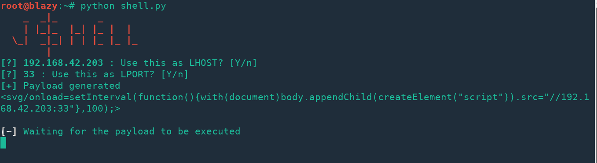
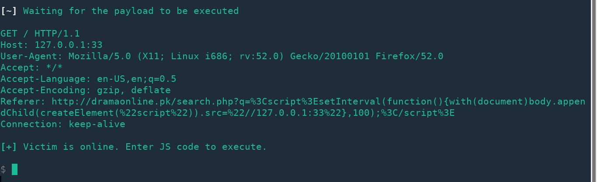

# JShell——用 XSS 获得一个 JavaScript shell

> 原文：<https://kalilinuxtutorials.com/jshell/>

JShell 用 XSS 得到一个 JavaScript 外壳。Java Shell 工具是一个用于学习 Java 编程语言和构建 Java 代码原型的交互式工具。<wbr>

## **JShell 用法**

运行 **shell.py** ，它会自动尝试检测你的 IP 地址，默认 LPORT 是 **33** 。

如您所见，有效载荷已经生成，现在您所要做的就是将有效载荷交付给受害者。

**也可理解为 [UDP2Raw 隧道——将 UDP 流量转换为加密 UDP/FakeTCP/ICMP](https://kalilinuxtutorials.com/udp2raw-tunnel/)** 的隧道

一旦你这样做了，你将得到一个通过 netcat 的 JS shell，一旦注入的页面打开，你就可以在受害者的浏览器中执行你的 JavaScript 代码。
下面是一张截图:

 **功劳:鲁道夫·阿西斯**