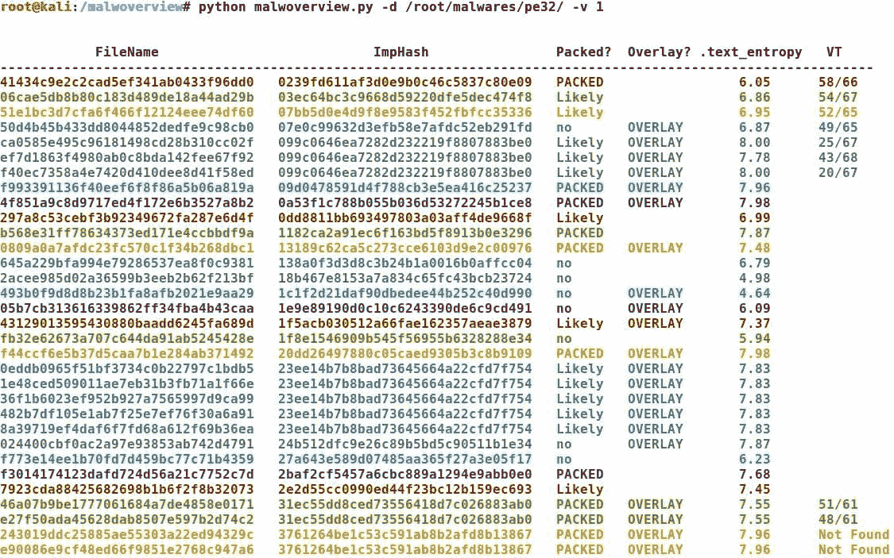
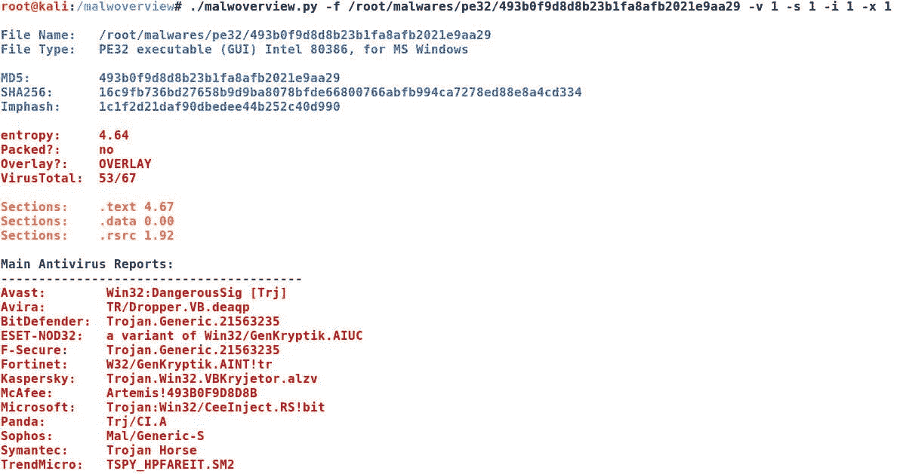
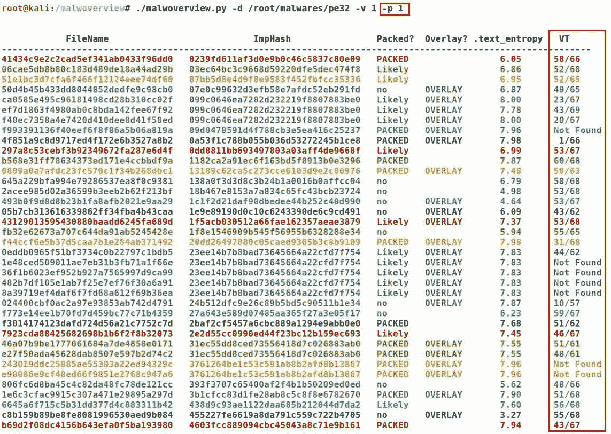
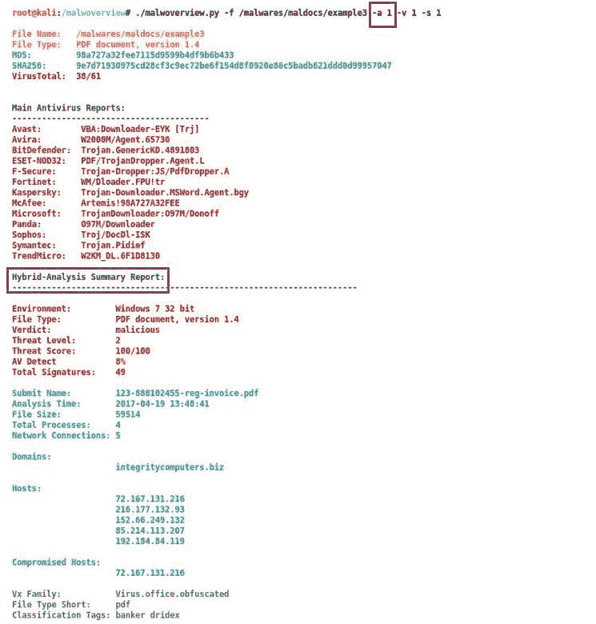
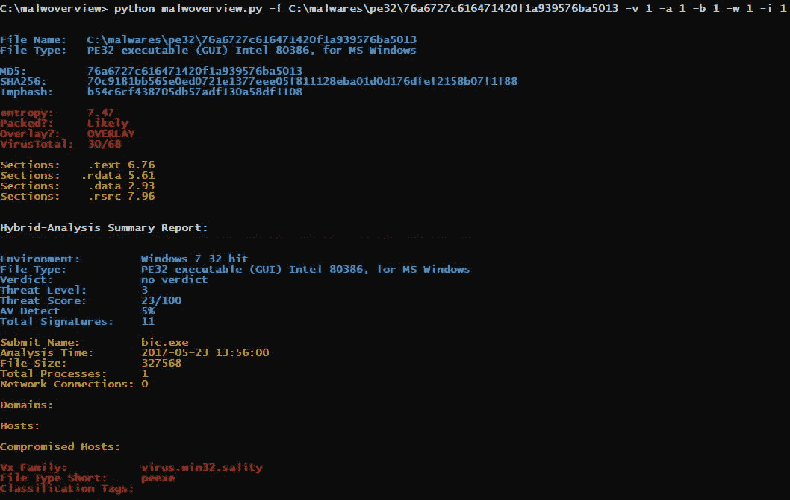
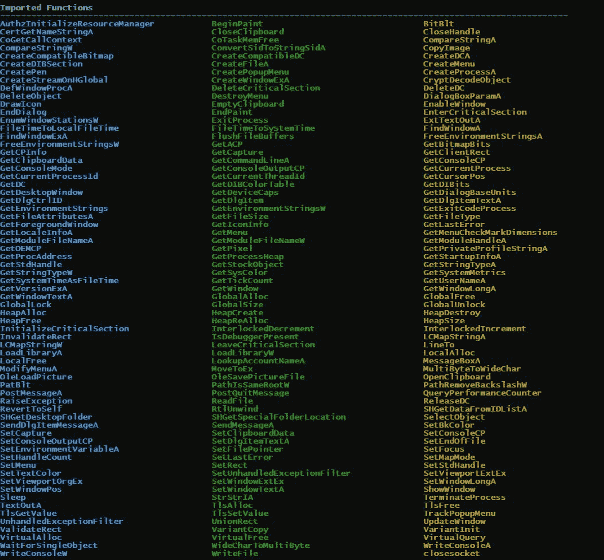

# malwoverview–对包含恶意软件样本的目录执行初始和快速分类的工具

> 原文：<https://kalilinuxtutorials.com/malwoverview/>

Malwoverview 是第一个响应工具，用于对包含恶意软件样本的目录或特定恶意软件样本执行初始快速分类。

该工具旨在:

*   根据导入表(imphash)确定相似的可执行恶意软件样本(PE/PE+)并按不同颜色分组(注意从输出开始的第二列)。因此，颜色很重要！
*   根据以下规则确定可执行恶意软件样本是否被打包:

```
 `2a. Two or more sections with Entropy > 7.0 or < 1.0 ==> Packed.

     2b. One one section with Entropy > 7.0 or two sections with SizeOfRawData ==> Likely packed.

   2c. None section with Entropy > 7.0 or SizeOfRawData ==> not packed.` 
```

*   确定恶意软件样本是否包含覆盖。
*   确定。文本部分熵。

```
 `Malwoverview.py only examines PE/PE+ files, skipping everything else.` 
```

*   对照病毒总数检查每个恶意软件样本。

**又读[node XP——一个服务器端 Javascript 注入工具，能够检测&利用 Node.js 漏洞](https://kalilinuxtutorials.com/nodexp/)**

## **要求**

该工具在 Kali Linux 2018 系统和 Windows 10 上进行了测试。因此，有必要安装:

### **卡莉 Linux**

*   python 2.7 . x 版。

```
**$ apt-get install python** 
```

*   Python-magic。

要安装 python-magic 包，您可以执行以下命令:

```
**$ pip install python-magic** 
```

或者从 github 库编译它:

```
**$ git clone https://github.com/ahupp/python-magic
$ cd python-magic/
$ python setup.py build
$ python setup.py install** 
```

由于现有的两个版本的 python-magic package 存在严重的问题，我的建议是从 github 安装它(上面的第二个过程),并将 magic.py 文件复制到 malwoverview 工具的同一个目录中。

*   Pefile 和 colorama 封装:

```
**$ pip install pefile
$ pip install colorama
$ pip install simple-json
$ pip install requests**
```

### **窗户**

*   从[https://www.python.org/downloads/windows/](https://www.python.org/downloads/windows/)安装 Python 版本 2.7.x
*   Python-magic。

要安装 python-magic 包，您可以执行以下命令:

```
**C:\> pip install python-magic** 
```

或者从 github 库编译它:

```
**C:\> git clone https://github.com/ahupp/python-magic
C:\> cd python-magic/
C:\> python setup.py build
C:\> python setup.py install** 
```

*   Pefile 和 colorama 封装:

```
**C:\> pip install pefile
C:\> pip install colorama
C:\> pip install simple-json
C:\> pip install requests**
```

*   (重要)从 malwoverview 目录中删除 magic.py 文件。
*   通过执行以下命令安装 python-magic dll:

```
**C:\> pip install python-magic-bin==0.4.14** 
```

## **病毒总量和杂交分析**

您必须编辑 malwoverview.py 并插入您的 API 和 secret，以启用病毒总量和混合分析检查:

VT:

```
 **VTAPI = '<----ENTER YOUR API HERE and UNCOMMENT THE LINE---->'** 
```

混合分析:

```
 **HAAPI = '<----ENTER YOUR API HERE and UNCOMMENT THE LINE---->'    
  HASECRET = '<----ENTER YOUR SECRET HERE and UNCOMMENT THE LINE---->'**
```

## **Malwoverview 用法**

要使用 malwoverview，请执行如下所示的命令:

```
 `$ python malwoverview -d <directory> -f <fullpath> -i <0|1> -b <0|1> -v <0|1> -a <0|1> -p <0|1> -s <0|1> -x <0|1>
                       -w <0|1>` 
```

其中:

```
 `<directory> -d is the folder containing malware samples. 
    <fullpath>  -f specifies the full path to a file. Shows general information about the file (any filetype).
    (optional)  -b 1 (optional) adapts the output colors to black window.
    (optional)  -i 1 show imports and exports (it is used with -f option).
    (optional)  -x 1 extracts overlay (it is used with -f option).
    (optional)  -v 1 queries Virus Total database for positives and totals (any filetype).
    (optional)  -a 1 (optional) query Hybrid Analysis database for general report.Thus, you need to edit the 
                      malwoverview.py and insert your HA API and respective secret.
    (optional)  -s 1 shows antivirus reports from the main players. This option is used with 
                     -f option (any filetype). 
    (optional)  -p 1 use this option if you have a public Virus Total API. It forces a one minute wait 
                     every 4 malware samples, but allows obtaining a complete evaluation of the malware repository.
    (optional)  -w 1 used when the OS is Microsoft Windows.

 If you use Virus Total option, so it is necessary to edit the malwoverview.py and insert your VT API. 

    Remember that public VT API only allows 4 searches per second (as shown at the image above). Therefore, if you 
    are willing to wait some minutes, so you can use the -p option, which forces a one minute wait every 4 malware 
    samples, but allows obtaining a complete evaluation of the repository.

    *ATENTION: if the directory contains many malware samples, so malwoverview.py could take some time. :)` 
```

## **历史**

版本 1.4.5

```
 `This versiom:

        * Adds the -w option to use malwoverview in Windows systems.
        * Improves and fixes colors when using -b option with black window.` 
```

版本 1.4:

```
 `This version:

        * Adds the -a option for getting the Hybrid Analysis summary report.
        * Adds the -i option for listing imported and exported functions. Therefore, imported/exported function 
          report was decoupled for a separated option.` 
```

版本 1.3:

```
 **`This version:

      * Adds the -p option for public Virus Total API.`** 
```

版本 1.2:

```
 `This version includes:

      * evaluates a single file (any filetype)
        * shows PE sessions.
        * shows imported functions.
        * shows exported function.
        * extracts overlay.
        * shows AV report from the main players. (any filetype)` 
```

版本 1.1:

```
 **This version:  * Adds the VT checking feature.** 
```

版本 1.0:

```
 **Malwoverview is a tool to perform a first triage of malware samples in a directory and group them according 
  to their import functions (imphash) using colors. This version:

        * Shows the imphash information classified by color. 
        * Checks whether malware samples are packed.  
        * Checks whether malware samples have overlay. 
        * Shows the entropy of the malware samples.** 
```

## **截图**



[](https://github.com/alexandreborges/malwoverview)