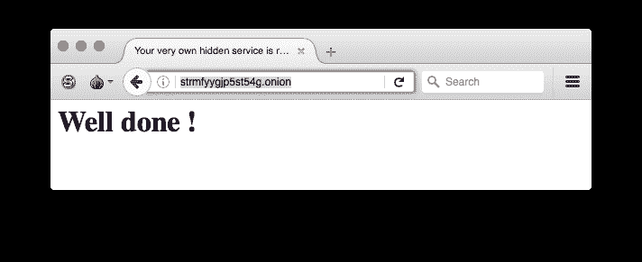

# Docker Tor 隐藏服务 Nginx——在 Tor 网络中轻松设置隐藏服务

> 原文::1230【https://kallinuxolixtauthorities . com/docker-tor-hidden-service-engine/

Docker tor 隐藏服务 nginx 是一款在 tor 网络中轻松设置隐藏服务的工具。

为您的隐藏服务生成框架配置，替换您的隐藏服务模式名称。例如，如果你想让你的隐藏服务包含单词“boss ”,就使用这个单词作为参数。你可以使用正则表达式，比如`^boss`，生成一个以“boss”开头的地址。请注意，模式越大，生成它所需的时间就越长。

```
docker run -it --rm -v $(pwd)/web:/web \
       strm/tor-hiddenservice-nginx generate <pattern>
```

创建一个名为“hiddensite”的容器来提供您生成的隐藏服务

```
docker run -d --restart=always --name hiddensite -v $(pwd)/web:/web \
       strm/tor-hiddenservice-nginx 
```

**也可阅读** [图集–快速 SQLMap 篡改提示器](https://kalilinuxtutorials.com/atlas/)

## **Docker Tor 隐藏服务 Nginx 示例**

让我们创建一个名称以 strm 开头的隐藏服务。

```
docker pull strm/tor-hiddenservice-nginx
```

等待容器映像被下载。然后我们可以生成我们的站点框架:

```
$docker run -it --rm -v $(pwd)/web:/web strm/tor-hiddenservice-nginx generate ^strm
[+] Generating the address with mask: ^strm
[+] Found matching domain after 137072 tries: strmfyygjp5st54g.onion
[+] Generating nginx configuration for site  strmfyygjp5st54g.onion
[+] Creating www folder
[+] Generating index.html template
```

现在我们已经生成了我们的框架，我们可以运行容器:

```
docker run -d --restart=always --name hiddensite \
       -v $(pwd)/web:/web strm/tor-hiddenservice-nginx
```

而且你有服务运行！🙂



## **故障排除**

*   403 nginx 出错，请检查您的目录权限和文件夹权限。Nginx 以“隐藏”用户的身份运行，他的 UID 是 666，只需检查你是否给这个用户访问/web/www 文件夹的权限(在文件夹映射到它的情况下)。

## **建造**

```
docker build -t strm/tor-hiddenservice-nginx .
```

## **运行**

```
**docker run -d --restart=always --name hiddensite** 
**-v $(pwd)/web:/web strm/tor-hiddenservice-nginx**
```

## **外壳**

```
**docker run -it --rm -v $(pwd)/web:/web** 
**--entrypoint /bin/bash strm/tor-hiddenservice-nginx**
```

[](https://github.com/opsxcq/docker-tor-hiddenservice-nginx)