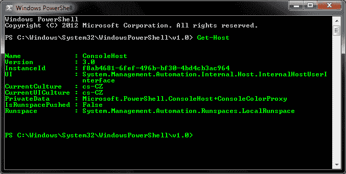

# CLR inject–将 C# EXE 或 DLL 程序集注入到另一个进程的每个 CLR 运行时和 AppDomain 中

> 原文：<https://kalilinuxtutorials.com/clrinject/>

Clrinject 将 C# EXE 或 DLL 程序集注入到另一个进程的任何 CLR 运行库和 AppDomain 中。然后，被注入的程序集可以访问被注入进程的类的静态实例，从而影响它的内部状态。

**又读** [**Docker Tor 隐藏服务 Nginx——轻松在 Tor 网络内部设置一个隐藏服务**](https://kalilinuxtutorials.com/docker-tor-hidden-service-nginx/)

## **Clrinject 用法**

**T2`clrinject-cli.exe -p <processId/processName> -a <assemblyFile>`**

打开 id 为`<processId>`或名称为`<processName>`的进程，注入`<assemblyFile>` EXE 并执行 Main 方法。

### **附加选项**

*   `-e`枚举所有加载的 CLR 运行时和创建的 AppDomains。
*   `-d <#>`只注入第`<#>`个 AppDomain。如果没有指定数字或零，程序集将被注入每个 AppDomain。
*   从名称空间`<namespace>`创建一个类`<className>`的实例。

## **例题**

### **用法举例**

*   `**clrinject-cli.exe -p victim.exe -e**`(列举 victim.exe 的运行时和 AppDomains)
*   `**clrinject-cli.exe -p 1234 -a "C:\Path\To\invader.exe" -d 2**`(将 invader.exe 从 id 为 1234 的进程注入第二个 AppDomain)
*   `**clrinject-cli.exe -p victim.exe -a "C:\Path\To\invader.dll" -i "Invader.Invader"**`(在 victim.exe 的每个 AppDomain 中创建入侵者的实例)
*   `**clrinject-cli64.exe -p victim64.exe -a "C:\Path\To\invader64.exe"**`(将 x64 组件注入 x64 流程)

### **可注射组件示例**

以下代码可以编译成 C#可执行文件，然后注入 PowerShell 进程。这段代码访问内部 PowerShell 类的静态实例，将控制台文本颜色更改为绿色。

```
using System;
using System.Reflection;

using Microsoft.PowerShell;
using System.Management.Automation.Host;

namespace Invader
{
    class Invader
    {
        static void Main(string[] args)
        {
            try
            {
                var powerShellAssembly = typeof(ConsoleShell).Assembly;
                var consoleHostType = powerShellAssembly.GetType("Microsoft.PowerShell.ConsoleHost");
                var consoleHost = consoleHostType.GetProperty("SingletonInstance", BindingFlags.Static | BindingFlags.NonPublic).GetValue(null);

                var ui = (PSHostUserInterface)consoleHostType.GetProperty("UI").GetValue(consoleHost);
                ui.RawUI.ForegroundColor = ConsoleColor.Green;
            }
            catch (Exception e)
            {
                Console.WriteLine(e.ToString());
            }
        }
    }
}
```

注入命令:

`**clrinject-cli64.exe -p powershell.exe -a "C:\Path\To\invader64.exe"**`

结果:



[](https://github.com/jonatan1024/clrinject)