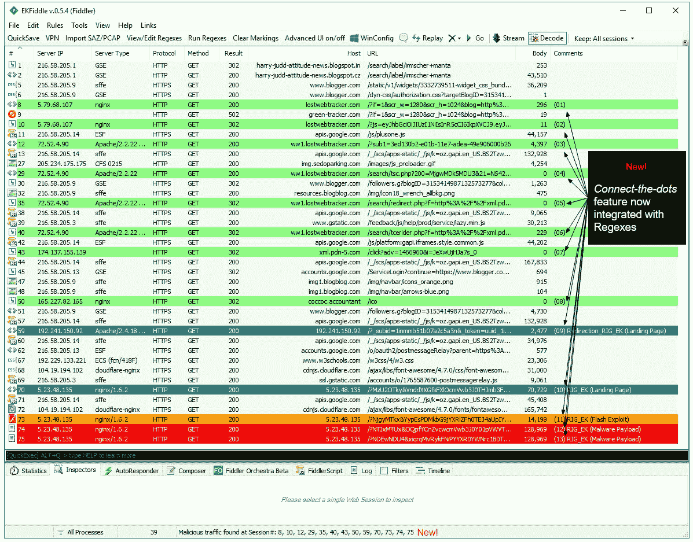

# ek fiddle——一个基于 Fiddler Web 调试器的框架，用于研究一般的漏洞利用工具、恶意广告和恶意流量

> 原文：<https://kalilinuxtutorials.com/ekfiddle/>

EKFiddle 是一个基于 Fiddler web 调试器的框架，用于研究一般的漏洞利用工具、恶意广告和恶意流量。

## **启用 C#脚本(仅限 Windows)**

启动 Fiddler，并转到`Tools -> Options`

在`Scripting`选项卡中，将默认值(JScript.NET)更改为 C#。

## **更改默认文本编辑器(可选)**

在同一个 **`Tools -> Options`** 菜单中，点击`Tools`选项卡。

*   Windows: `**notepad.exe**` **或`notepad++.exe`**
*   Linux:**`gedit`**
*   Mac: **`/Applications/TextEdit.app`** 或`**/Applications/TextWrangler.app**`

关闭小提琴手

## 根据您的操作系统，将 CustomRules.cs 下载或复制到适当的文件夹中:

*   windows(7/10)**`C:\Users\[username]\Documents\Fiddler2\Scripts\`**
*   Ubuntu **`/home/[username]/Fiddler2/Scripts/`**
*   Mac `**/Users/[username]/Fiddler2/Scripts/**`

## **完成安装**

启动 Fiddler，完成 EKFiddle 的安装。就这样，一切就绪！

## **键盘功能**

## **工具栏按钮**

新增的工具栏按钮为您提供了一些主要功能的快捷方式:

## **快速保存**

将当前 web 会话转储到名为(quick save-“MM-DD-yyyy-HH-MM-ss”)的 SAZ 中。saz)到 EKFiddle\Captures。

## **UI 模式**

在默认列视图或具有附加信息(包括时间戳、服务器 IP 和类型、方法等)的额外列之间切换。).

## **虚拟专用网**

VPN GUI 直接内置在 Fiddler 中。它使用带有 ovpn 文件的 Windows 和 Linux 上的 OpenVPN 客户端(可能需要与商业 VPN 提供商签约)。每当通过选定的连接到新服务器时，它将打开一个新的终端/xterm。ovpn 配置文件，删除前面的以确保在任何给定时间只使用一个 TAP 适配器。

*   Windows 操作系统

在默认目录下下载并安装 OpenVPN

把你的。OpenVPN 的`config`文件夹内的 ovpn 文件。

*   Linux(在 Ubuntu 16.04 上测试)

**`sudo apt-get install openvpn`**

把你的。/etc/openvpn 中的 ovpn 文件。

## **代理**

允许您连接到上游代理(HTTP/s 或 SOCKS)。

## **进口南非/PCAP**

加载 SAZ (Fiddler 的原生格式)或 PCAP(即来自 Wireshark)捕获的快捷方式。

## **查看/编辑正则表达式**

查看和创建自定义正则表达式。注意:主列表是通过 GitHub 自动更新的。此外，自定义列表允许您创建自己的规则。

有 4 种类型的指标可以匹配:

*   URI(完全或部分 URI 匹配)
*   IP(单个 IP 地址或 IP 范围)
*   源代码(响应正文)
*   标题(响应标题中的任何值)

语法:

重要！字段用制表符分隔

**`URI My_URI_rule [a-z0-9]{2} Match URI`**

**`IP My_IP_address_rule 5\.154\.191\.67 Match static IP address`**

**`IP My_IP_address_rule 5\.154\.191\.(6[0-9]|70) Match an IP range`**

**`SourceCode My_sourcecode_rule vml=1 Look for specific string`**

**`Headers My_headers_rule nginx Look for specific string`**

## **运行正则表达式**

针对当前 web 会话运行主正则表达式和自定义正则表达式。

## **清晰的标记**

清除当前加载的会话中的任何注释和颜色高亮显示。

## 上下文动作菜单

上下文操作菜单(通过右键单击任何会话来访问)允许您在所选部分执行附加命令。这对于快速查找、计算散列或提取 IOC 非常有帮助。

## **主机名或 IP 地址(谷歌搜索，RiskIQ，URLQuery，RiskIQ)**

查询当前选定会话的主机名。

## **URI**

### **构建正则表达式**

从当前选定的 URI 创建正则表达式。此操作将打开一个正则表达式网站，URI 已经在剪贴板中，准备粘贴到查询字段中。

### **在……Internet Explorer、Chrome、Firefox、Edge 中打开**

这将使用您选择的浏览器打开 URI。

## **响应体**

### **删除编码**

解码当前选定的会话(从它们的基本编码)。

### **构建正则表达式**

从当前选定会话的源代码创建正则表达式。此操作将打开一个正则表达式网站，URI 已经在剪贴板中，准备粘贴到查询字段中。

### **计算 MD5/SHA256 哈希**

获取当前会话的主体并计算其哈希。

### **混合分析/病毒总量查找**

检查当前会话主体的哈希，然后查找该哈希。

### **提取到磁盘**

将当前选择会话的主体下载到磁盘上的“工件”文件夹中。

## **提取 IOC**

将选定会话的基本信息复制到内存中，以便它们可以作为 IOC 共享。提取 Coinhive 站点密钥

## **连点**

允许您确定会话之间的事件顺序。右键单击您感兴趣的课程，追溯您的步骤，然后简单地“连接要点”。它将在 comments 列中标记从 01 到 n 的事件序列。您可以对列进行重新排序，以获得该序列精简视图。

## **爬虫**

从文本文件中加载一个 URL 列表，让浏览器自动访问它们。工具->爬虫(实验)->启动爬虫可能需要在你的浏览器设置中做一些调整，特别是关于崩溃恢复。

### **卸载 ekdild**

删除 CustomRules.cs

