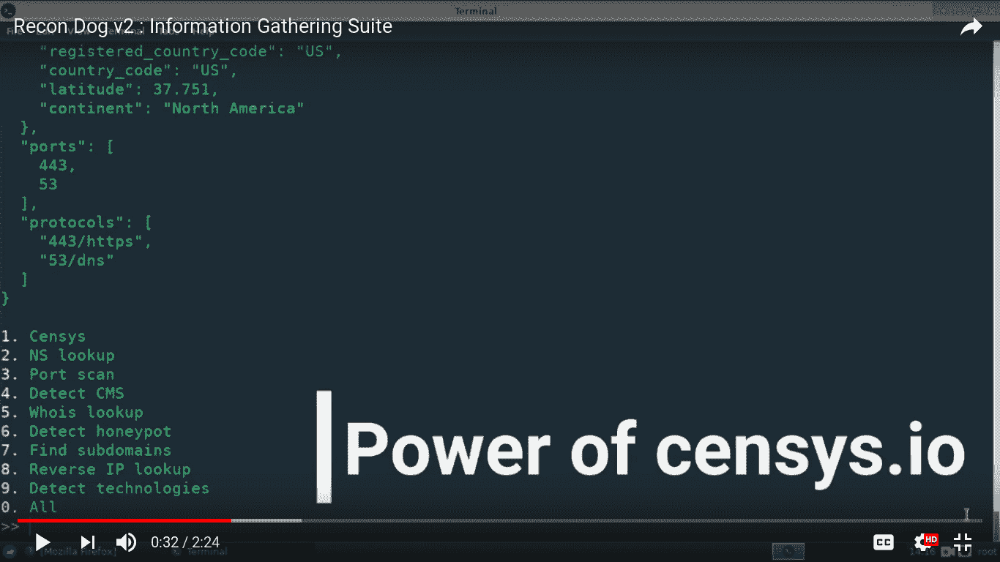

# recordog–侦察瑞士军刀

> 原文：<https://kalilinuxtutorials.com/recondog-swiss-army-knife/>

以下是 ReconDog 的主要功能，

*   向导+ CLA 界面
*   Can 从 STDIN(管道输入)中提取目标并对其进行操作
*   所有信息都是用 API 提取的，不直接联系目标

## **重新识别实用程序**

*   [Censys](https://censys.io/) :使用 censys.io 收集关于 IP 地址的大量信息。
*   [NS 查找](https://hackertarget.com/dns-lookup/):进行名称服务器查找
*   [端口扫描](https://hackertarget.com/tcp-port-scan/):扫描最常见的 TCP 端口
*   [检测内容管理系统](https://whatcms.org):可以检测 400 多个内容管理系统
*   [Whois 查找](https://hackertarget.com/whois-lookup/):执行 Whois 查找
*   [检测蜜罐](https://honeyscore.shodan.io/):使用 shodan.io 检查目标是否是蜜罐
*   [查找子域](https://findsubdomains.com):使用 findsubdomains.com 查找子域
*   [反向 IP 查找](https://hackertarget.com/reverse-ip-lookup/):进行反向 IP 查找，查找与 IP 地址相关的域
*   [检测技术](https://www.wappalyzer.com):使用 wappalyzer.com 检测 1000 多种技术
*   [All](https://github.com/s0md3v/ReconDog) :针对目标运行所有实用程序

**也读作[Sandsifter——x86 处理器 Fuzzer For Hidden Instructions &硬件 bug](https://kalilinuxtutorials.com/sandsifter-x86-processor/)**

## **兼容性**

侦察犬可以在任何安装了 python 解释器的设备上运行。但是，它已经在以下配置上进行了测试:

操作系统:Windows、Linux、Mac
Python 版本:Python2.7、Python 3.6

## **安装**

Recon Dog 不需要手动配置，可以简单地作为普通 python 脚本运行。然而，如果你想安装 debian 软件包，可以从[这里](https://github.com/s0md3v/s0md3v.github.io/blob/master/repo/Recon-Dog_2.0_all.deb?raw=true)下载。

# **用途**

## **向导界面**

向导界面是在中使用侦察犬的最直接的方式。只要运行程序，选择你想做的事情，输入目标，就这么简单。

## **CLA 接口**

侦察犬也有一个 **C** 命令 **L** 线 **A** 证件接口。以下是查找子域的方法:

`**python dog -t marvel.com -c 7**`

还有更多！你有一个程序，可以列举子域，你想扫描端口的所有子域发现？别担心，侦察犬就是为处理这类案件而设计的。您可以简单地这样做:

`**subdomainfinder -t example.com | python dog --domains -c 3**`

如果你只想打印目标，不要使用 **-c** 选项。
此外，其他程序生成什么样的输出并不重要，侦察狗使用正则表达式来寻找目标，这使得它很容易集成几乎所有工具。有两种开关可用:

```
**--domains    extract domains from STDIN
--ips        extract ip addresses from STDIN**
```

## **视频教程**

[](https://camo.githubusercontent.com/fa161fdc8e94f54ab7da01a30ee86f7f04bc923f/68747470733a2f2f696d6167652e6962622e636f2f6931314136392f53637265656e73686f742d323031382d31302d31332d31352d34312d31312e706e67)

[ ](https://github.com/s0md3v/ReconDog) **信用:索姆德夫桑万**