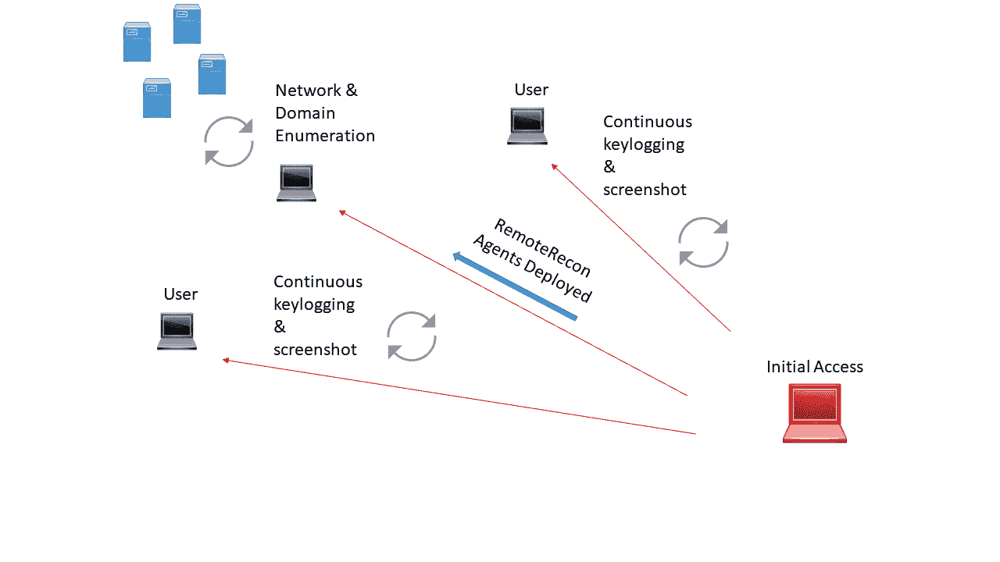

# 远程侦察-远程侦察和收集

> 原文：<https://kalilinuxtutorials.com/remoterecon-remote-recon-collection/>

RemoteRecon 提供了针对远程主机执行漏洞利用后功能的能力，而无需暴露您的完整工具包/代理。

作为操作员，我们经常需要入侵主机，这样我们就可以对感兴趣的人/主机进行键盘记录或截图(或其他一些微小的任务)。为什么你要把灯塔、帝国、影射、米特雷或一只自定义的老鼠推到目标身上呢？

这增加了您在目标环境中的占用空间，公开了您的代理中的功能，并且很可能公开了您的 C2 基础结构。另一种方法是向感兴趣的目标部署二级代理，收集情报。

**也读作[Pentest Machine——通过 Nmap xml 文件](https://kalilinuxtutorials.com/pentest-machine-via-nmap-xml-file/)** 自动化一些 Pentest 作业

然后根据您的判断存储这些数据以供检索。如果这些被入侵的终端被 IR 团队发现，您将失去这些终端和您收集的信息，但仅此而已。下面是我想象中对手会如何利用这一点的直观表示。

RemoteRecon 利用注册表进行数据存储，WMI 作为内部 C2 通道。所有命令都以异步、推拉的方式执行。这意味着您将通过 powershell 控制器发送命令，然后通过注册表检索该命令的结果。所有结果都将显示在本地控制台中。

**信用:ambray、tifkin、mattifestation、subtee & harmj0y**