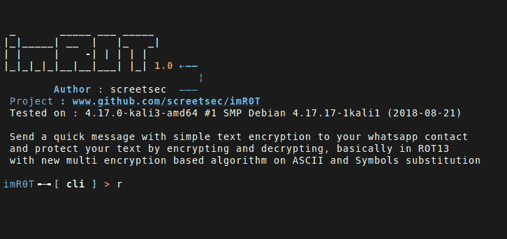

# im r0t–加密您的 Whatsapp 联系人

> 原文：<https://kalilinuxtutorials.com/imr0t-encryption-whatsapp-contact/>

imR0T:向你的 whatsapp 联系人发送简单文本加密的快速消息，基本上是在 ROT13 中，基于 ASCII 和符号替换的新多重加密算法。



## **如何使用 imR0T**

很简单:

```
# Clone this repository
git clone https://github.com/Screetsec/imR0T.git

# Go into the repository
cd imR0T

# Permission Acces
chmod +x imR0T

# Run the app
./imR0T
```

**亦读[AutoRDPwn–影子攻击框架](https://kalilinuxtutorials.com/autordpwn/)**

## **命令行**

帮助:显示帮助的标准命令。

```
imR0T╺─╸[ cli ] > help

 | 
 | 
 |_ 
    Options:[arguments] 

	     help       |:| show this message
	     show       |:| show all modules from this tools
	     list style |:| show list style  
	     use        |:| use a module, ex : use [ID] 
	     options    |:| show module options 
	     run        |:| Execute the module 
	     set        |:| Set a value
	     back       |:| Back to main
	     clear      |:| Clear window
	     ls         |:| list directory content
	     cat        |:| read file/standard input
	     pwd        |:| print name of current/working director
	     exit       |:| Exit program
```

## **配置**

在使用该功能之前，请使用文本加密向您的 whatsapp 联系人发送消息。您必须在 conf/whatsapp . conf 中配置文件并添加 api 密钥

```
# Getting API :
# Register in here https://www.apiwha.com/
# Use your mail or temp mail :P                     

# Setup API KEY
# Example : 
#     - api="CA6DSQ3CLPC6FCQ3CLPC6F"

api=""
```

## **视频教程**

[https://www.youtube.com/watch?v=OQSxM0s8Oj4](https://www.youtube.com/watch?v=OQSxM0s8Oj4)

## **免责声明**

对本源代码的修改、更改或变更是可以接受的，但是，任何使用本代码的公开发布都必须经过本工具的书面批准(Edo maland)。

[](https://github.com/Screetsec/imR0T)