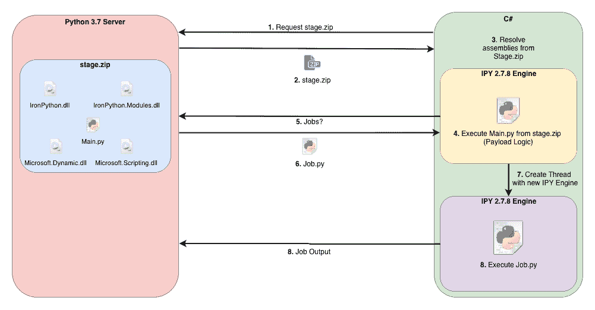

# silent trinity——一个由 Python、IronPython、C#/支持的后开发代理。网

> 原文：<https://kalilinuxtutorials.com/silenttrinity/>

SILENTTRINITY 是一个由 Python、IronPython、C#/.NET 支持的后开发代理。

## **静音三位一体要求**

*   服务器要求 Python >= 3.7
*   SILENTTRINITY C#植入物需要。净值> = 4.5

**亦读[AutoRDPwn–影子攻击框架](https://kalilinuxtutorials.com/autordpwn/)**

## **注释**

### **。NET 运行时支持**

植入物需要。NET 4.5 或更高版本，因为 IronPython DLLs 是针对。NET 4.0，也没有 ZipArchive。移植依赖于 4.5 之前的. NET 库来下载包含 IronPython DLLs 和主要 Python 代码的初始阶段。

阅读 IronPython 编译器的源代码，我们似乎可以通过 IKVM 直接生成 IL 代码来绕过第一个问题(我仍然不明白为什么会这样)。然而，这将需要修改编译器来生成一个全新的 EXE 存根(当然可行，只是需要花费时间来找到正确的 IKVM API 调用)。

### **C2 通讯**

目前，该植入物仅支持 HTTP 1.1 上的 C2。NET 4.5 似乎有一个本地的 WebSocket 库，这使得实现 WS C2 通道变得更加可能。

HTTP/2 客户端支持。NET 的 HttpClient API 正在开发中，只是还没有发布。

植入和服务器设计是非常“面向未来”的，这使得实现这些 C2 通道变得非常简单。

### **Python 标准库**

从技术上讲，我们可以加载/使用 IronPython 的 stdlib 来代替调用。但是这需要编写一些“神奇的”依赖解析代码。

