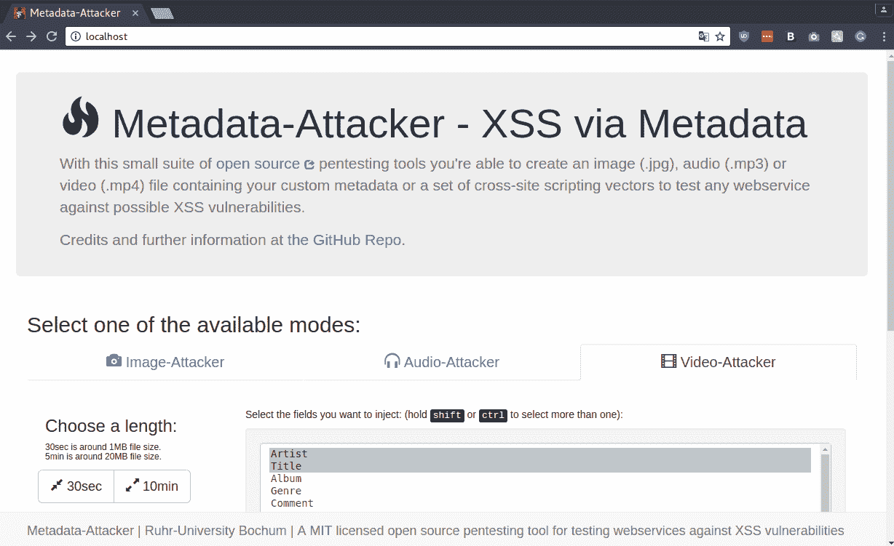

# 元数据攻击者:用恶意元数据生成媒体文件的工具

> 原文：<https://kalilinuxtutorials.com/metadata-attacker/>

元数据攻击者是一个开源的测试工具，你可以创建一个图像。jpg)、音频(. mp3)或视频(. mp4)文件，包含您的自定义元数据或一组跨站点脚本向量，用于测试任何 webservice 在显示未过滤的元数据时是否存在 XSS 漏洞。

## **元数据-攻击者安装/使用**

*   首先在您的主机系统上安装 docker。
*   现在，您可以简单地运行以下命令:

**`sudo docker run -p 80:80 --rm lednerb/metadata-attacker`**

*   完成后，打开你最喜欢的浏览器，切换到 docker ip 或 [http://localhost](http://localhost)

**又读 [Docker Tor 隐藏服务 Nginx——轻松在 Tor 网络内部设置一个隐藏服务](https://kalilinuxtutorials.com/docker-tor-hidden-service-nginx/)**

 **信用:@mniemietz，@derctwr，@Lednerb**