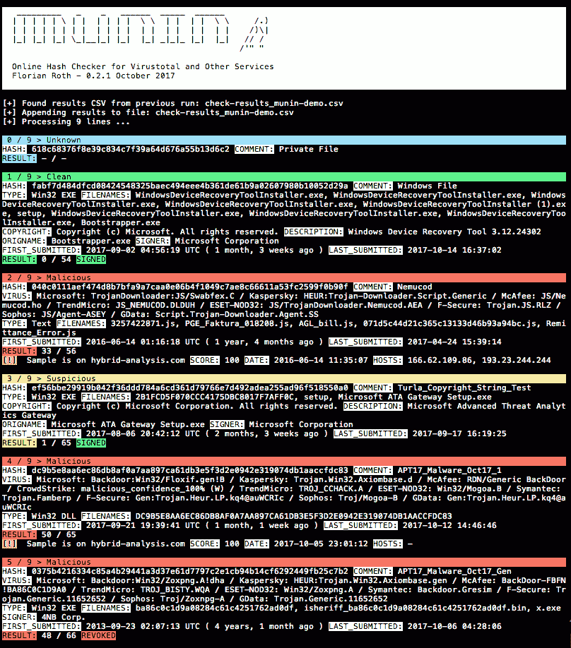

# munin–用于 Virustotal 和其他服务的在线哈希检查器

> 原文：<https://kalilinuxtutorials.com/munin-online-hash-checker/>

Munin 是一个在线哈希校验工具，可以从各种在线资源中检索有价值的信息

当前版本的 Munin 查询以下服务:

*   Virustotal
*   madshare
*   杂交分析

注意:Munin 基于脚本“VT-Checker”，该脚本在 LOKI 存储库中维护。还使用了[抄袭检查器](https://www.plagiarismsoftware.net/)来检查并确保内容的唯一性。

## **Munin 用法**

```
**usage: munin.py [-h] [-f path] [-c cache-db] [-i ini-file] [-s sample-folder]
                [--comment] [-p vt-comment-prefix] [--download]
                [-d download_path] [--nocache] [--intense] [--retroverify]
                [-r num-results] [--nocsv] [--verifycert] [--sort] [--debug]

Online Hash Checker

optional arguments:
  -h, --help            show this help message and exit
  -f path               File to process (hash line by line OR csv with hash in
                        each line - auto-detects position and comment)
  -c cache-db           Name of the cache database file (default: vt-hash-
                        db.pkl)
  -i ini-file           Name of the ini file that holds the API keys
  -s sample-folder      Folder with samples to process
  --comment             Posts a comment for the analysed hash which contains
                        the comment from the log line
  -p vt-comment-prefix  Virustotal comment prefix
  --download            Enables Sample Download from Hybrid Analysis. SHA256
                        of sample needed.
  -d download_path      Output Path for Sample Download from Hybrid Analysis.
                        Folder must exist
  --nocache             Do not use cache database file
 --intense             Do use PhantomJS to parse the permalink (used to
                        extract user comments on samples)
  --retroverify         Check only 40 entries with the same comment and
                        therest at the end of the run (retrohunt verification)
  -r num-results        Number of results to take as verification
  --nocsv               Do not write a CSV with the results
  --verifycert          Verify SSL/TLS certificates
  --sort                Sort the input lines (useful for VT retrohunt results)
  --debug               Debug output** 
```

**也读[silent trinity——由 Python、IronPython、C#/提供动力的后剥削代理。](https://kalilinuxtutorials.com/silenttrinity/)网**

## **特性**

*   模式 A:基于正则表达式从任何文本文件中提取散列
*   模式 B:遍历样本目录并在线检查散列
*   通过 API (JSON 响应)从 Virustotal 检索有价值的信息，并通过 permalink (HTML 解析)检索其他信息
*   保留一个历史记录(缓存),以便只向服务查询一次可能在文本文件中出现多次的散列
*   缓存的对象存储在 JSON 中
*   创建包含调查结果的 CSV 文件，以便于后期处理和报告
*   如果可用，将结果追加到以前的 CSV 中

## **显示**

*   散列和注释(注释是已经提取散列的行的剩余部分)
*   基于用户定义的列表匹配 AV 供应商
*   在野外使用的文件名
*   PE 信息，如描述、原始文件名和版权声明
*   已签名的可移植可执行文件的签名者
*   基于病毒总数比率的结果
*   首次和最后一次提交
*   某些指示器的标签:无害、已签名、过期、已撤销、MSSoftware

## **额外检查**

*   查询 Malshare.com 的样本上传
*   查询 Hybrid-Analysis.com 的当前分析
*   imp hash duplicates in current batch >允许您发现导入表哈希中的重叠

## **典型命令行**

处理 Virustotal Retrohunt 结果，并在检查前对行进行排序，以便按块检查匹配的签名

```
python munin.py -f my.ini -f ~/Downloads/retro_hunt
```

处理一个 IOC 文件，并显示谁在 Virustotal 上对这些样本发表了评论(使用 PhantomJS，更高的 CPU 使用率)

```
python munin.py -f my.ini -f ~/Downloads/misp-event-1234.csv --sort --intense
```

用样本处理一个目录并在线检查它们的散列

```
python munin.py -f my.ini -s ~/malware/case34
```

## **获取 Munin 使用的 API 密钥**

### **Virustotal**

1.  在这里开户[https://www.virustotal.com/#/join-us](https://www.virustotal.com/#/join-us)
2.  检查`**Profile > My API key**`以获得您的公共 API 密钥

### **不做**

在这里注册[https://malshare.com/register.php](https://malshare.com/register.php)

### **混合分析**

1.  在这里开户[https://www.hybrid-analysis.com/signup](https://www.hybrid-analysis.com/signup)
2.  登录后，勾选 **`Profile > API key`**

## **截图**



[](https://github.com/Neo23x0/munin)