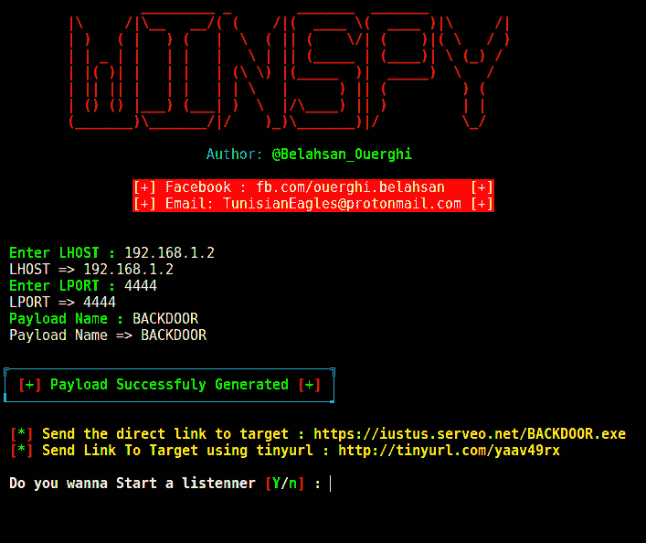

# win spy–带有自动 IP 平衡程序的 Windows 反向外壳后门创建器

> 原文：<https://kalilinuxtutorials.com/winspy-windows-reverse-shell-backdoor/>

WinSpy 是一个带有自动 IP Poisene 的 Windows 反向外壳后门创建程序。

## **依赖关系**

*   metasploit 框架
*   xterm
*   阿帕奇 2

**也可理解为[eviginx 2——用于网络钓鱼登录凭证和会话 Cookies 的独立 MITM 攻击框架，允许绕过双因素认证](https://kalilinuxtutorials.com/evilginx2-mitm-attack/)**

## **Winspy 安装**

```
sudo apt-get install git
git clone https://github.com/TunisianEagles/winspy.git
cd winspy
chmod +x setup.sh
./setup.sh
chmod +x winspy.sh
./winspy.sh
```

## **截图**



## **免责声明**

作者对这个工具的不良使用不承担任何责任，记住未经事先同意攻击目标是违法的，要受到法律的制裁。

[ ](https://github.com/TunisianEagles/winspy) **信用:Belahsan Ouerghi**