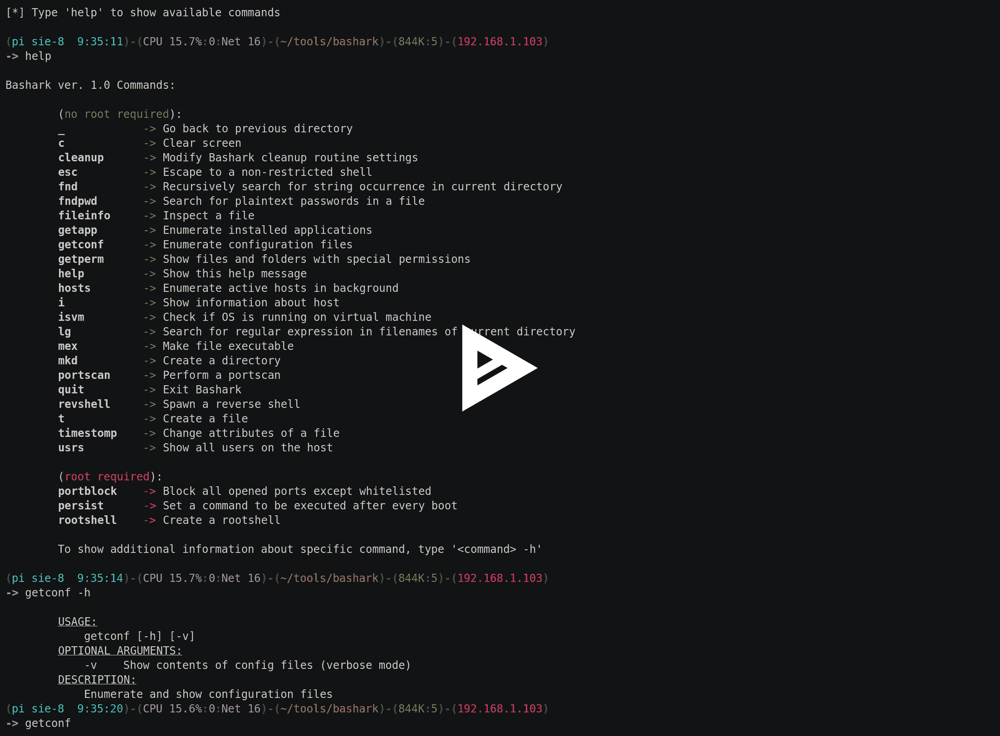

# Bash ark–Bash Pentesters &安全研究人员后期开发工具包

> 原文：<https://kalilinuxtutorials.com/bashark-pentesters-security-researchers/>

Bashark 在安全审计的后期开发阶段为 pentesters 和安全研究人员提供帮助。要在受损主机上启动它，只需从终端`**$ source bashark.sh**`获取`**bashark.sh**`脚本，然后键入`**help**`查看它的帮助菜单。

## **巴沙克特色**

*   单个 Bash 脚本
*   轻巧快速
*   多平台:Unix、OSX、Solaris 等。
*   没有外部依赖性
*   不受启发式和行为分析的影响
*   常用 shell 命令的内置别名
*   用面向开发后的功能扩展系统外壳
*   隐蔽，退出时激活自定义清理程序
*   易于扩展(通过创建 Bash 函数来添加新命令)
*   完整制表符结束

**又读 [元数据-攻击者:一种用恶意元数据生成媒体文件的工具](https://kalilinuxtutorials.com/metadata-attacker/)**

## **视频教程**

 