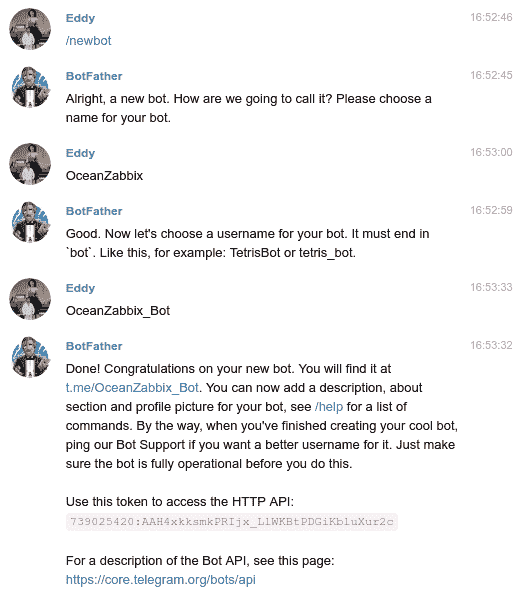
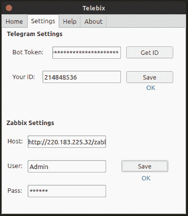
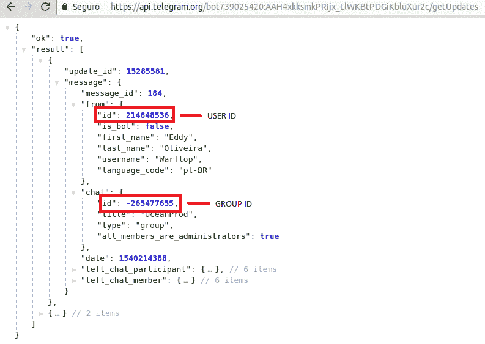

# tele bix–tele bix 是一个应用程序，它通过电报与机器人通信，从 Zabbix 监控的基础设施接收命令和发送信息

> 原文：<https://kalilinuxtutorials.com/telebix-communicates-bot-telegram/>

Telebix 是一个应用程序，它通过电报与机器人通信，从 Zabbix 监控的基础设施接收命令和发送信息，如果基础设施出现任何问题，它还会实时发送消息，它完全是用 Python 和 Shell 脚本编写的，并有一个图形界面来更直观地帮助网络管理员。只要所有凭据都正确发布，该应用程序就可以在任何计算机上运行。

## **如何使用 Telebix？** 

*   创建一个机器人



*   **在 Telegram 上的搜索栏中，键入“BotFather”并发送命令“/newbot”。**
*   机器人父亲会询问你的机器人的名字，之后也会询问用户名。
*   **复制生成的访问令牌。**
*   通过电报向你的机器人发送任何信息。

**也可阅读 [ct-exposer:一款通过搜索证书透明日志发现子域的 OSINT 工具](https://kalilinuxtutorials.com/ct-exposer-certificate-transparency-logs/)**

## **安装**

```
git clone https://github.com/Warflop/Telebix.git
cd Telebix
chmod +x setup.sh
sudo ./setup.sh --install
```

## **视频教程**

[https://player.vimeo.com/video/296483913?dnt=1&app_id=122963](https://player.vimeo.com/video/296483913?dnt=1&app_id=122963)

## **配置**



*   在 Settings 选项卡中，是要用 Zabbix 登录信息、bot 令牌和电报用户 ID(或组 ID)填充的字段。
*   创建 Bot 后您已经拥有的令牌。
*   要获取用户 ID，您可以在与机器人交谈后使用“设置”选项卡中的“获取 ID”按钮或手动添加，通过更改**令牌访问下面的地址此处**通过您复制的令牌，将会有您的用户 ID。
*   您也可以使用您进入的任何组的 ID。https://api.telegram.org/bot**令牌此处**/获取更新



[](https://github.com/Warflop/Telebix)