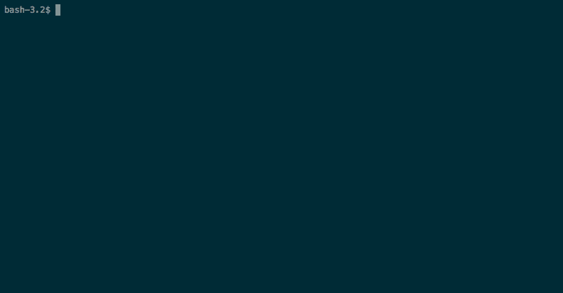
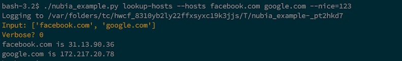

# Python-Nubia:命令行和交互式 Shell 框架

> 原文：<https://kalilinuxtutorials.com/python-nubia/>

Python-Nubia 是一个用 Python 构建命令行应用程序的轻量级框架。它最初是为“logdevice 交互式外壳(aka。`**ldshell**`)”在脸书。从那以后，它被认为是一个可重用的组件，几个内部脸书项目现在依赖它作为一种快速简单的方法来获得一个直观的 shell/cli 应用程序，而没有太多的样板文件。

Nubia 建立在 [python-prompt-toolkit](https://github.com/jonathanslenders/python-prompt-toolkit) 之上，这是一个用于构建交互式命令行应用程序的极好的工具包。

## **Python-Nubia 特性**

*   交互式模式，提供鱼式自动完成
*   从函数和类中生成的 CLI 模式。
*   通过外部实用程序“nubia-complete”实现可选 bash/zsh 完成(实验性)
*   交互模式下可定制的状态栏。
*   一个可选的基于 IPython 的交互式 shell
*   带下划线的参数自动用连字符连接
*   Python3 类型注释用于输入类型验证

**也可理解为**[**Winspy–Windows 反向外壳后门创建者带有自动 IP 平衡程序**](https://kalilinuxtutorials.com/winspy-windows-reverse-shell-backdoor/)

### **互动模式**

努比亚的交互模式是它的独特之处。用零开销为你的程序构建一个独特的外壳是非常容易的。简单形式的交互式 shell 提供了命令、子命令、参数和值的自动完成。它还为开发人员提供了对自动完成的大量控制，即使是不属于典型格式的命令。一个例子是 ldshell 中的“select”命令，它被表示为一个 SQL 查询。我们预计 Nubia 的大多数用例不需要这样的控制，自动命令就足够了，不需要进一步的定制。

如果你在没有命令的情况下启动一个基于 nubia 的程序，它会自动启动一个交互式 shell。交互模式如下所示:



### **非交互模式**

CLI 模式的工作方式与任何传统的基于 unix 的命令行实用程序完全一样。



## **安装努比亚**

如果您正在为您的下一个项目安装 nubia，您应该能够轻松地使用 pip:

```
pip3 install python-nubia
```

## **从源代码构建 Nubia】**

确保安装了 pipenv:

```
pip3 install pipenv
```

您可以使用 setup.py 构建一个 tarball，或者使用 pipenv 安装一个 virtualenv 并安装所有的依赖项。

## **virtualenv 中的运行示例:**

如果您想运行这个示例，那么您需要将源树的根添加到 PYTHONPATH 中。

```
pipenv update --dev
pipenv shell

export PYTHONPATH="$(pwd)"
cd example/
python nubia_example.py
```

运行单元测试:

```
pipenv run nosetests
```

## **例题**

它从这样一个函数开始:

```
import socket
import typing

from termcolor import cprint
from nubia import argument, command, context

@command
@argument("hosts", description="Hostnames to resolve", aliases=["i"])
@argument("bad_name", name="nice", description="testing")
def lookup(hosts: typing.List[str], bad_name: int):
    """
 This will lookup the hostnames and print the corresponding IP addresses
 """
    ctx = context.get_context()
    print(f"hosts: {hosts}")
    cprint(f"Verbose? {ctx.verbose}")

    for host in hosts:
        cprint(f"{host} is {socket.gethostbyname(host)}")

    # optional, by default it's 0
    return 0
```

## **免责声明**

Nubia 是非 ldshell 用例的测试版。一些设计决策听起来可能很奇怪，但是它们非常适合 ldshell 用例。我们在不断地做出改变，使它在 ldshell 用例之外更加一致和通用。在完全稳定的版本发布之前，使用它要自担风险。

[](https://github.com/facebookincubator/python-nubia/#interactive-mode)