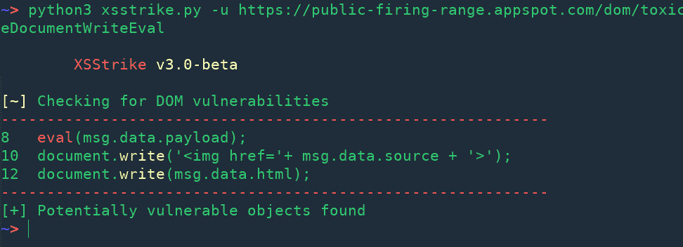
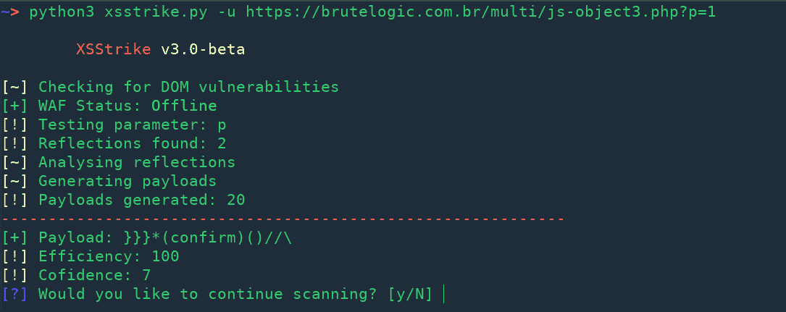
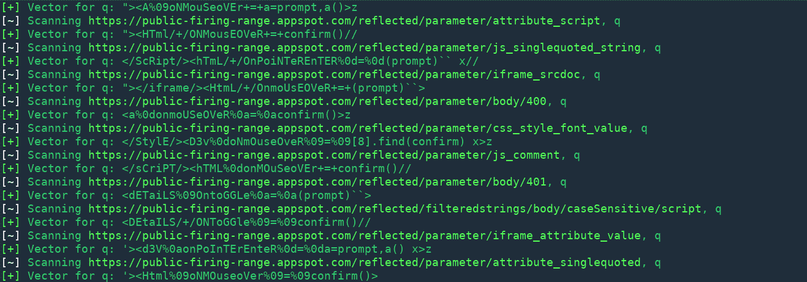
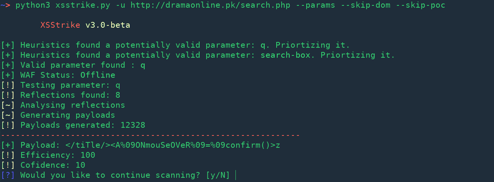

# xs strike–最先进的 XSS 检测套件

> 原文：<https://kalilinuxtutorials.com/xsstrike-xss-detection-suite/>

XSStrike 是一个跨站点脚本检测套件，配备了四个手写解析器、一个智能负载生成器、一个强大的模糊引擎和一个速度惊人的爬虫。

它不像所有其他工具那样注入有效负载并检查其工作情况，而是使用多个解析器分析响应，然后制作有效负载，保证其与模糊引擎集成的上下文分析一起工作。以下是它生成的有效负载的一些示例:

```
}]};(confirm)()//\
<A%0aONMouseOvER%0d=%0d[8].find(confirm)>z
</tiTlE/><a%0donpOintErentER%0d=%0d(prompt)``>z
</SCRiPT/><DETAILs/+/onpoINTERenTEr%0a=%0aa=prompt,a()//
```

除此之外，它还具有爬行、模糊、参数发现和晶片检测功能。它还扫描 DOM XSS 漏洞。

**也读作** [**Python-Nubia:一个命令行&交互外壳框架**](https://kalilinuxtutorials.com/python-nubia/)


## **XSStrike 画廊**

#### 多姆 XSS



#### **映 XSS**



#### **爬行**



#### **隐藏参数发现**



#### **交互式 HTTP 头提示**


[](https://github.com/s0md3v/XSStrike)