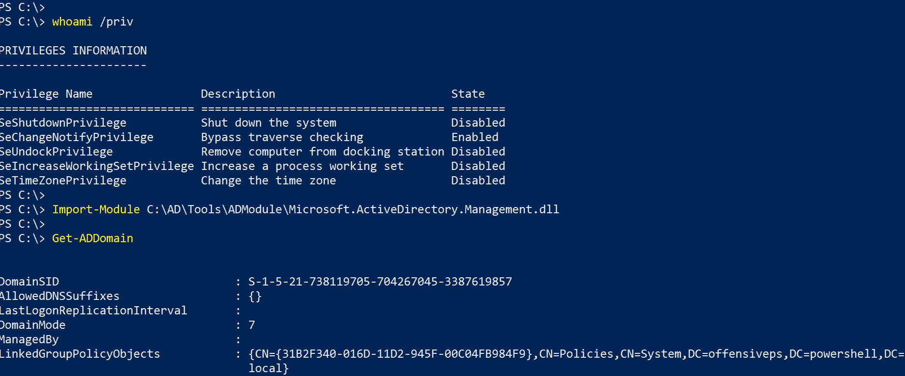
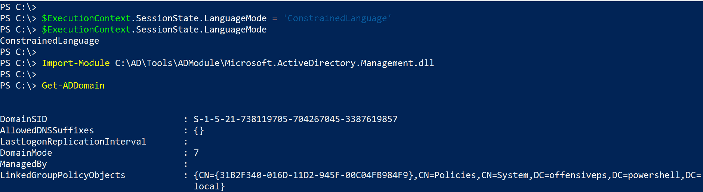

# ad Module–Microsoft 签名的 ActiveDirectory PowerShell 模块

> 原文：<https://kalilinuxtutorials.com/admodule-microsoft-signed-activedirectory/>

ADModule 是用于 ActiveDirectory PowerShell 模块的 Microsoft 签名 DLL。

只是安装了 RSAT 和模块的 Server 2016 中的微软 ActiveDirectory PowerShell 模块的备份。DLL 通常位于以下路径: **C:\Windows\Microsoft。NET\assembly\GAC_64\Microsoft。ActiveDirectory . Management**及其余模块文件路径:**C:\ Windows \ System32 \ Windows powershell \ v 1.0 \ Modules \ ActiveDirectory \**

**亦读 [Killshot:信息搜集工具](https://kalilinuxtutorials.com/killshot-information-gathering-tool/)**

## **admmodule 用法**

您可以将此 DLL 复制到您的计算机上，并使用它来枚举 Active Directory，而无需安装 RSAT，也无需拥有管理特权。

```
PS C:> Import-Module C:\ADModule\Microsoft.ActiveDirectory.Management.dll -Verbose
```



为了能够列出模块中的所有 cmdlets，也要导入该模块。记得先导入 DLL。

```
PS C:> Import-Module C:\ADModule\Microsoft.ActiveDirectory.Management.dll -Verbose
PS C:> Import-Module C:\AD\Tools\ADModule\ActiveDirectory\ActiveDirectory.psd1
PS C:> Get-Command -Module ActiveDirectory
```

## **好处**

有许多好处，如非常低的机会检测到反病毒，非常广泛的覆盖范围的 cmdlet，良好的过滤器的 cmdlet，签署了微软等。然而，最有用的一点是，这个模块可以在 PowerShell 的受限语言模式下完美地工作。



[](https://github.com/samratashok/ADModule)