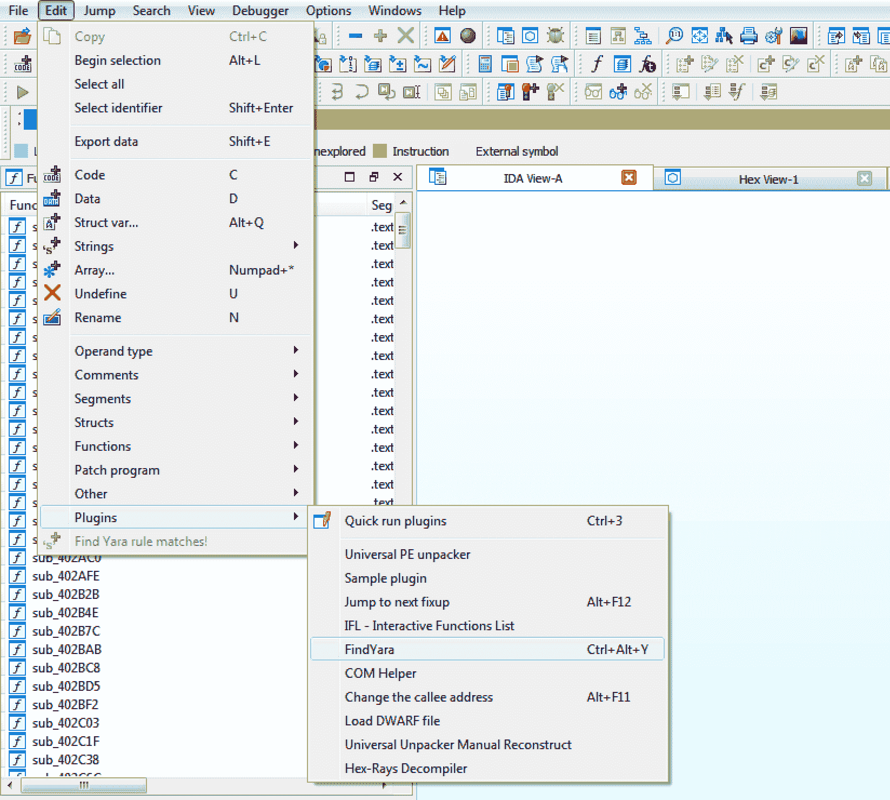
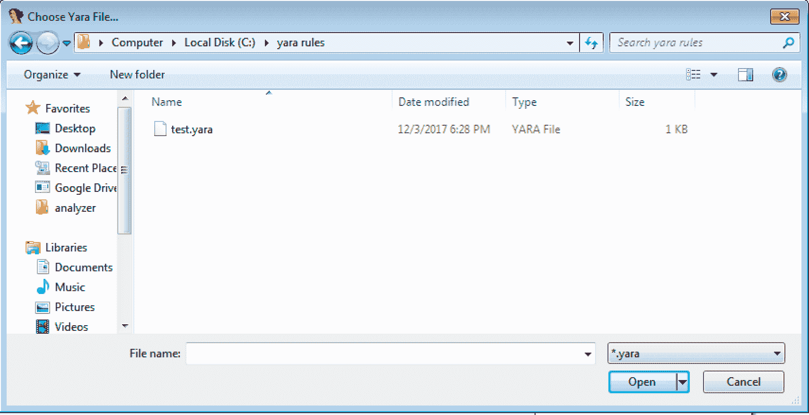
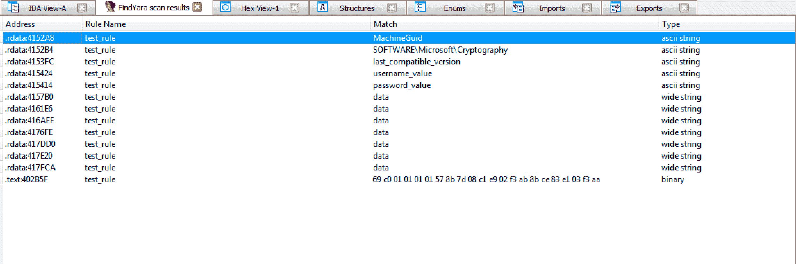

# 用 Yara 规则扫描二进制文件的 IDA Python 插件

> 原文：<https://kalilinuxtutorials.com/findyara-ida-python-plugin/>

FindYara 使用 IDA python 插件，用 Yara 规则扫描你的二进制文件。所有 yara 规则匹配都将列出它们的偏移量，以便您可以快速跳转到它们！

## **FindYara 安装**

*   安装 yara-python
    *   使用画中画:`**pip install yara-python**`
    *   其他方法:[https://pypi.python.org/pypi/yara-python](https://pypi.python.org/pypi/yara-python)
*   将 FindYara.py 复制到您的 IDA“插件”目录中

**又读 [DarkSpiritz:一个针对 Linux、MacOS、Windows 系统的渗透测试框架](https://kalilinuxtutorials.com/darkspiritz-penetration-testing-2/)**

## **视频教程**

[https://www.youtube.com/embed/zAKi9KWYyfM?feature=oembed](https://www.youtube.com/embed/zAKi9KWYyfM?feature=oembed)

## **用途**

#### **启动插件**

可以使用`**Edit->Plugins->FindYara**`从菜单中启动插件。或者可以使用热键组合`**ctl-alt-y**`快速启动插件。

#### **用**选择要扫描的 Yara 文件

当插件启动时，它会打开一个文件选择对话框。你需要用它来选择你想要扫描的 yara 文件。

#### **查看匹配项**

yara 规则中与二进制匹配的所有字符串将与匹配位置一起显示。

 **鸣谢:大卫·贝拉德**