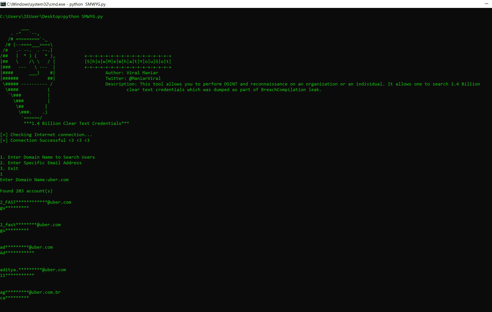

# SMWYG (Show-Me-What-You-Got):对组织或个人进行监视和侦察的工具

> 原文：<https://kalilinuxtutorials.com/smwyg/>

SMWYG 工具允许你对一个组织或个人进行侦察。它允许人们搜索 14 亿个明文凭据，这些凭据是作为 BreachCompilation 泄漏的一部分被丢弃的。这个数据库使寻找密码比以往任何时候都更快更容易。

## **SMWYG 要求**

确保您已经安装了以下软件:

```
`- Python 3.0 or later.` `- pip3 (sudo apt-get install python3-pip)`
```

**也读作 [强盗:查找容易发生 DLL 劫持的可执行文件的工具](https://kalilinuxtutorials.com/robber-dll-hijacking/)**

## **安装**

```
git clone https://github.com/Viralmaniar/SMWYG-Show-Me-What-You-Got.git
cd SMWYG-Show-Me-What-You-Got
pip3 install -r requirements.txt
```

## 我如何使用这个？

*   **按 1:** 这将允许用户根据域名搜索凭证。
*   **按 2:** 这将允许用户搜索特定电子邮件地址的凭证。
*   **按 3:** 退出程序。

# **保持安全的技巧**

*   每隔几个月更换一次密码
*   对不同的帐户使用不同的密码
*   使用密码管理器生成随机密码
*   开始使用多因素身份认证

## **截图**

[](Above image search the credentials for uber.com and have found 203 accounts.) 上图搜索凭据为 **`uber.com`** ，已经找到 203 个账号。

[ ](https://github.com/Viralmaniar/SMWYG-Show-Me-What-You-Got) **信用:** [**gotcha.pw**](http://gotcha.pw)